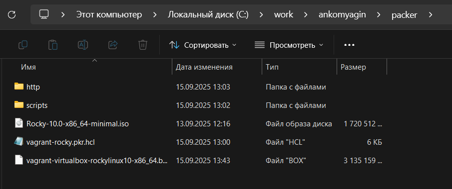
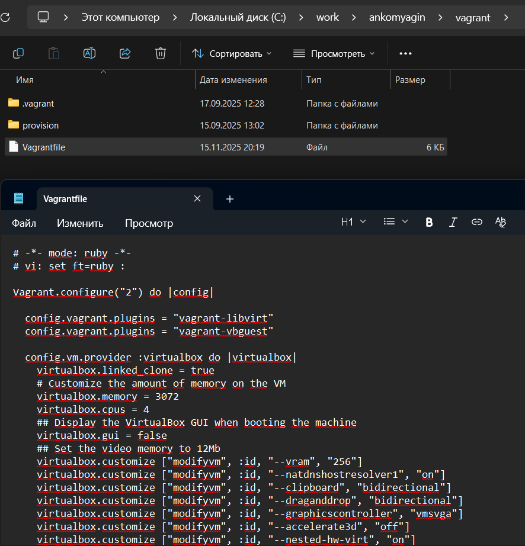
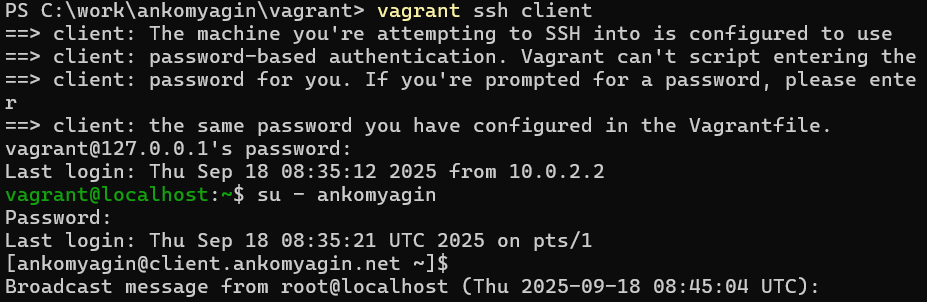

---
## Front matter
lang: ru-RU
title: Лабораторная работа №1
subtitle: Подготовка лабораторного стенда
author:
 - Комягин А.Н.
institute:
 - Российский университет дружбы народов, Москва, Россия

## i18n babel
babel-lang: russian
babel-otherlangs: english

## Formatting pdf
toc: false
toc-title: Содержание
slide_level: 2
aspectratio: 169
section-titles: true
theme: metropolis
header-includes:
 - \metroset{progressbar=frametitle,sectionpage=progressbar,numbering=fraction}
---

# Цель работы

## Цель

Приобретение практических навыков установки Rocky Linux на виртуальную машину с помощью инструмента Vagrant и подготовки лабораторного стенда для администрирования сетевых подсистем.

# Задачи работы

## Основные задачи

1. Установка программного обеспечения (Vagrant, VirtualBox, Packer).

2. Формирование box-файла Rocky Linux.

3. Регистрация образа в Vagrant.

4. Развертывание виртуальных машин server и client.

5. Применение provisioning скриптов.

# Выполнение работы

## Подготовка и создание box-файла

Установка необходимого ПО (VirtualBox, Vagrant, Packer) и размещение ISO-образа Rocky Linux в каталоге `packer`.

Запуск Packer для автоматической сборки:

```
packer.exe init vagrant-rocky.pkr.hcl
packer.exe build vagrant-rocky.pkr.hcl
```


## Регистрация box-файла в Vagrant

Скопирование сформированного box-файла в каталог `vagrant` и регистрация образа:

```
vagrant box add rocky10 vagrant-virtualbox-rocky-10-x86_64.box
```

Проверка регистрации командой `vagrant box list`.



## Подготовка скриптов provisioning

Создание структуры каталогов `provision\default\`, `provision\server\`, `provision\client\` со скриптами для:

- создания пользователя `ankomyagin`;

- установки hostname `*.ankomyagin.net`;

- настройки маршрутизации на сервере;

- настройки gateway на клиенте.



## Запуск виртуальных машин

Развертывание машин server и client из каталога `vagrant`:

```
vagrant up server
vagrant up client
```

Подключение к серверу и переход под пользователем `ankomyagin`:

```
vagrant ssh server
su - ankomyagin
```


## Применение provisioning и проверка

Проверка корректности настроек: приглашение терминала `ankomyagin@server.ankomyagin.net` на сервере и `ankomyagin@client.ankomyagin.net` на клиенте.



# Контрольные вопросы

## Вопрос 1 и 2

**Что такое Vagrant?**

Инструмент для управления виртуальными машинами, позволяющий описывать конфигурацию в Vagrantfile и автоматически развертывать ВМ в VirtualBox.

**Box-файл**

Образ виртуальной машины с установленной ОС, используется как шаблон для создания новых ВМ.

## Вопрос 3 и 4

**Vagrantfile**

Конфигурационный файл на Ruby, в котором задаются параметры ВМ, сеть, provisioning.

**Packer и HCL-файл**

Packer создает box-файлы. HCL описывает процесс установки ОС, размер диска и инсталляцию пакетов.

## Вопрос 5 и 6

**ks.cfg**

Файл параметров автоматической установки (язык, раскладка, сеть, пользователи).

**Provisioning скрипты**

Автоматически настраивают внутреннее окружение ВМ (пользователя, hostname, маршрутизацию).

# Выводы

## Итоги

- Установлено необходимое ПО и создан box-файл Rocky Linux 10.

- Развернуты и настроены ВМ server и client с пользователем `ankomyagin`.

- Реализована полная автоматизация через Vagrant и provisioning скрипты.

- Подготовлен лабораторный стенд для дальнейших работ.
