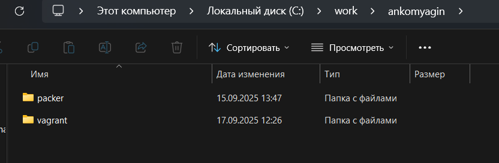
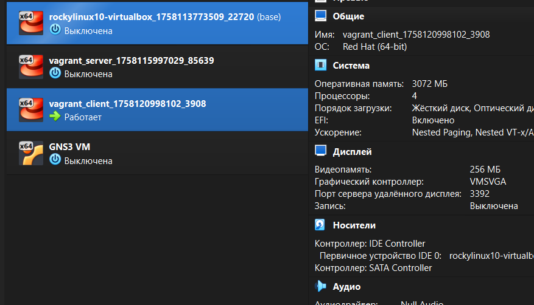

---
# Front matter
title: "Лабораторная работа №1"
subtitle: "Дисциплина: Администрирование сетевых подсистем"
author: "Комягин Андрей Николаевич"

# Generic options
lang: ru-RU
toc-title: "Содержание"

# Bibliography
bibliography: bib/cite.bib
csl: pandoc/csl/gost-r-7-0-5-2008-numeric.csl

# Pdf output format
toc: true # Table of contents
toc-depth: 2
lof: true # List of figures
lot: true # List of tables
fontsize: 12pt
linestretch: 1.5
papersize: a4
documentclass: scrreprt

# I18n polyglossia
polyglossia-lang:
  name: russian
  options:
  - spelling=modern
  - babelshorthands=true
polyglossia-otherlangs:
  name: english

# I18n babel
babel-lang: russian
babel-otherlangs: english

# Fonts
mainfont: IBM Plex Serif
romanfont: IBM Plex Serif
sansfont: IBM Plex Sans
monofont: IBM Plex Mono
mathfont: STIX Two Math
mainfontoptions: Ligatures=Common,Ligatures=TeX,Scale=0.94
romanfontoptions: Ligatures=Common,Ligatures=TeX,Scale=0.94
sansfontoptions: Ligatures=Common,Ligatures=TeX,Scale=MatchLowercase,Scale=0.94
monofontoptions: Scale=MatchLowercase,Scale=0.94,FakeStretch=0.9
mathfontoptions: []

# Biblatex
biblatex: true
biblio-style: gost-numeric
biblatexoptions:
  - parentracker=true
  - backend=biber
  - hyperref=auto
  - language=auto
  - autolang=other*
  - citestyle=gost-numeric

# Pandoc-crossref LaTeX customization
figureTitle: "Рис."
tableTitle: "Таблица"
listingTitle: "Листинг"
lofTitle: "Список иллюстраций"
lotTitle: "Список таблиц"
lolTitle: "Листинги"

# Misc options
indent: true
header-includes:
  - \usepackage{indentfirst}
  - \usepackage{float}
  - \floatplacement{figure}{H}
---

# Цель работы

Приобретение практических навыков установки Rocky Linux на виртуальную машину с помощью инструмента Vagrant в операционной системе Windows, а также подготовки лабораторного стенда для последующих лабораторных работ по администрированию сетевых подсистем. 

# Выполнение лабораторной работы

## Подготовка программного окружения

Работа выполнялась на персональном компьютере под управлением ОС Windows, в которой были установлены VirtualBox, Vagrant, Packer и файловый менеджер FAR для удобной работы в терминале. 
После установки программного обеспечения была выполнена перезагрузка системы для корректной инициализации всех компонентов виртуализации. 

## Структура рабочих каталогов

Для организации проекта был создан каталог `C:\work\ankomyagin\` с двумя подкаталогами: `packer` и `vagrant`. 
В каталоге `packer` размещались ISO-образ Rocky Linux и файлы конфигурации Packer, а в каталоге `vagrant` — файлы `Vagrantfile`, `Makefile` и подкаталоги `provision\default`, `provision\server`, `provision\client` со скриптами настройки. 

Основные команды создания структуры каталогов (в PowerShell или CMD):

```
mkdir C:\work\ankomyagin\packer
mkdir C:\work\ankomyagin\vagrant
mkdir C:\work\ankomyagin\vagrant\provision
mkdir C:\work\ankomyagin\vagrant\provision\default
mkdir C:\work\ankomyagin\vagrant\provision\server
mkdir C:\work\ankomyagin\vagrant\provision\client
```

На рис. [-@fig:001] показана структура каталогов проекта и размещение основных файлов конфигурации. 

{#fig:001 width=70%}

## Формирование box-файла Rocky Linux

В каталоге `C:\work\ankomyagin\packer` был размещён ISO-образ `Rocky-10.4-x86_64-minimal.iso` и файл конфигурации Packer `vagrant-rocky.pkr.hcl`.
С помощью Packer был сформирован box-файл для дальнейшего использования в Vagrant. 

Команды формирования box-файла:

```
cd C:\work\ankomyagin\packer

packer.exe init vagrant-rocky.pkr.hcl
packer.exe build vagrant-rocky.pkr.hcl
```

По завершении работы Packer был получен файл `vagrant-virtualbox-rocky-10-x86_64.box` в рабочем каталоге.
На рис. [-@fig:002] показан процесс автоматической установки и формирования образа Rocky Linux. 

{#fig:002 width=70%}

## Регистрация box-файла в Vagrant


Сформированный box-файл был скопирован в каталог `C:\work\ankomyagin\vagrant`.
Далее образ был зарегистрирован в Vagrant под именем `rocky10`, что позволило использовать его в конфигурации Vagrantfile. 

Команда регистрации:

```
cd C:\work\ankomyagin\vagrant

vagrant box add rocky10 vagrant-virtualbox-rocky-10-x86_64.box
```

После регистрации командой `vagrant box list` была проверена доступность образа `rocky10` в списке box-файлов.
На рис. [-@fig:003] приведён пример вывода регистрации box-файла в Vagrant в среде Windows. 

{#fig:003 width=70%}

## Подготовка скриптов provisioning

Для автоматизации настройки виртуальных машин были подготовлены скрипты provisioning в каталоге `C:\work\ankomyagin\vagrant\provision\`.
В подкаталоге `default` были размещены скрипты: заглушка `01-dummy.sh`, скрипт создания пользователя `ankomyagin` и скрипт `01-hostname.sh` для установки имени хоста в домене `ankomyagin.net`. 

Пример логики скрипта создания пользователя `ankomyagin`:

```
username=ankomyagin
userpassword=123456
encpassword=`openssl passwd -1 ${userpassword}`
id -u $username
if [[ $? ]]
then
  adduser -G wheel -p ${encpassword} ${username}
  homedir=`getent passwd ${username} | cut -d: -f6`
  echo "export PS1='[\u@\H \W]\\$ '" >> ${homedir}/.bashrc
fi
```

В подкаталоге `server` размещался скрипт `02-forward.sh`, включающий пересылку IP-пакетов и маскарадинг, а в подкаталоге `client` — скрипт `01-routing.sh` для настройки маршрутизации клиента.
На рис. [-@fig:004] показано содержимое каталогов `default`, `server` и `client` со скриптами автоматизации. 

{#fig:004 width=70%}

## Запуск и первичная проверка виртуальных машин

После подготовки конфигурационных файлов и регистрации box-файла были развернуты виртуальные машины server и client.
Запуск выполнялся из каталога `C:\work\ankomyagin\vagrant` с помощью команд:

```
cd C:\work\ankomyagin\vagrant

vagrant up server
vagrant up client
```

Подключение к серверу выполнялось командой:

```
vagrant ssh server
```

После входа под пользователем `vagrant` выполнялся переход к пользователю `ankomyagin` командой `su - ankomyagin`.
На этом этапе проверялась общая работоспособность стенда и корректность базовой конфигурации виртуальных машин. 

На рис. [-@fig:005] показан пример запуска виртуальных машин и подключения к установленной системе. 

{#fig:005 width=70%}

## Применение provisioning и проверка настроек

Для применения скриптов provisioning к уже созданным виртуальным машинам использовались команды:

```
cd C:\work\ankomyagin\vagrant

vagrant up server --provision
vagrant up client --provision
```


После выполнения provisioning были автоматически созданы учётные записи, настроен hostname и параметры сети.
При подключении к серверу приглашение командной строки отображалось как `ankomyagin@server.ankomyagin.net`, а на клиенте — `ankomyagin@client.ankomyagin.net`, что подтверждало корректную работу скриптов. 

## Завершение работы

После проверки работоспособности стенда виртуальные машины были корректно остановлены.
Для этого использовались команды:

```
cd C:\work\ankomyagin\vagrant

vagrant halt server
vagrant halt client
```

При повторном запуске стенда с помощью `vagrant up` сохраняются все выполненные ранее настройки (пользователь `ankomyagin`, hostname, сетевые параметры и маршрутизация). 

# Контрольные вопросы

1. **Для чего используется Vagrant в данной лабораторной работе?**

   Vagrant используется для автоматизации развёртывания и управления виртуальными машинами server и client на основе заранее подготовленного box-файла Rocky Linux. 

2. **Что такое box-файл и какова его роль?**

   Box-файл представляет собой образ виртуальной машины с установленной операционной системой, который используется как шаблон для быстрого создания новых виртуальных машин с одинаковой конфигурацией. 

3. **Какую функцию выполняет Packer в процессе подготовки лабораторного стенда?**

   Packer автоматизирует установку Rocky Linux в VirtualBox и создание box-файла, который затем можно использовать в Vagrant для развёртывания стенда на разных машинах. 

4. **Какова роль файлов `vagrant-rocky.pkr.hcl` и `ks.cfg`?**

   Файл `vagrant-rocky.pkr.hcl` описывает процесс сборки образа с помощью Packer, а файл `ks.cfg` задаёт параметры автоматической установки операционной системы (язык, сеть, разметка диска, пользователи). 

5. **Для чего используются скрипты provisioning в каталогах `default`, `server` и `client`?**

   Скрипты provisioning автоматически настраивают внутреннее окружение виртуальных машин: создают пользователя `ankomyagin`, задают hostname, включают маршрутизацию и настраивают сетевые параметры для сервера и клиента. 

# Выводы

В ходе выполнения лабораторной работы были приобретены практические навыки развёртывания Rocky Linux в виртуальной среде VirtualBox с использованием Packer и Vagrant в ОС Windows. 
Был сформирован и зарегистрирован box-файл, настроены конфигурационные файлы Vagrant и подготовлены скрипты provisioning для автоматизации настройки виртуальных машин server и client под пользователя `ankomyagin`.
Полученный лабораторный стенд может быть повторно развернут на других рабочих местах и использован для дальнейших лабораторных работ по администрированию сетевых подсистем. 

