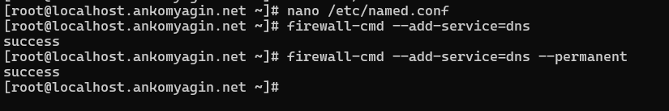

---
## Front matter
lang: ru-RU
title: Лабораторная работа №2
subtitle: Настройка DNS-сервера
author:
 - Комягин А.А.
institute:
 - Российский университет дружбы народов, Москва, Россия

## i18n babel
babel-lang: russian
babel-otherlangs: english

## Formatting pdf
toc: false
toc-title: Содержание
slide_level: 2
aspectratio: 169
section-titles: true
theme: metropolis
header-includes:
 - \metroset{progressbar=frametitle,sectionpage=progressbar,numbering=fraction}
---

# Цель работы

## Цель

Приобретение практических навыков по установке и конфигурированию DNS-сервера (BIND), а также усвоение принципов работы системы доменных имён.

# Задачи работы

## Основные задачи

1. Подготовка виртуального окружения.

2. Установка программного обеспечения (BIND).

3. Настройка кэширующего DNS-сервера.

4. Настройка первичного (Master) DNS-сервера.

5. Автоматизация настройки (Provisioning).

# Выполнение работы

## Подготовка и установка

Вход на сервер и установка пакетов `bind` и `bind-utils`.


## Диагностика до настройки

Проверка работы DNS с помощью утилиты `dig`. Обращение к локальному серверу (`@127.0.0.1`) до настройки не дает результата.


## Настройка сети

Настройка сетевого интерфейса через `nmcli` для использования локального адреса `127.0.0.1` в качестве DNS-сервера.


## Настройка службы и Firewall

- Редактирование `/etc/named.conf` (разрешение прослушивания порта и запросов из локальной сети).

- Настройка `firewalld` для открытия порта 53 (TCP/UDP).



# Конфигурирование зон

## Создание зон

1. В `named.conf` добавлены описания прямой зоны (например, `ankomyagin.net`) и обратной зоны.

2. В каталоге `/var/named/` созданы файлы зон на основе шаблонов.

3. Настроены записи SOA, NS, A.

## Права доступа

Назначение прав пользователю `named` и восстановление контекста безопасности SELinux:

```bash
chown -R named:named /var/named
restorecon -vR /var/named
```

# Автоматизация

## Скрипт Provisioning

Создан скрипт `dns.sh`, который:

- Устанавливает пакеты.

- Копирует конфигурационные файлы.

- Настраивает права доступа и SELinux.

- Настраивает Firewall и NetworkManager.

- Запускает службу `named`.

# Контрольные вопросы

## Вопрос 1 и 2

**Что такое DNS?**

Распределенная система для преобразования доменных имен в IP-адреса и наоборот.

**Кэширующий сервер**

Выполняет рекурсивные запросы за клиента и сохраняет ответы в памяти для ускорения повторных обращений.

## Вопрос 3 и 6

**Типы зон**

- Прямая: Имя -> IP (запись A).

- Обратная: IP -> Имя (запись PTR, домен `in-addr.arpa`).

**Основные записи**

- `A`: IPv4 адрес.

- `NS`: DNS-сервер зоны.

- `SOA`: Начальная запись зоны (параметры).

- `MX`: Почтовый сервер.

# Выводы

## Итоги

- Установлен и настроен DNS-сервер BIND.

- Сконфигурирован кэширующий сервер для локальной сети.

- Создана конфигурация для первичной зоны.

- Настроена автоматизация развертывания через Vagrant.

