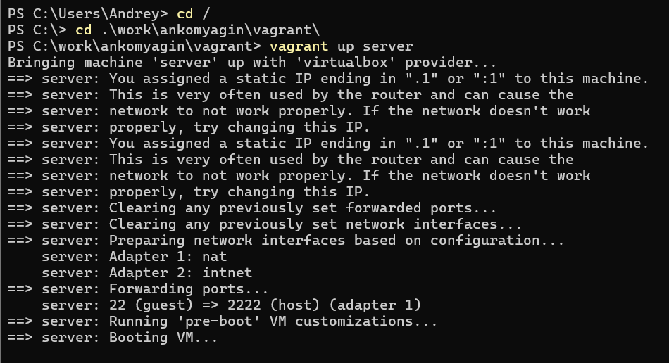
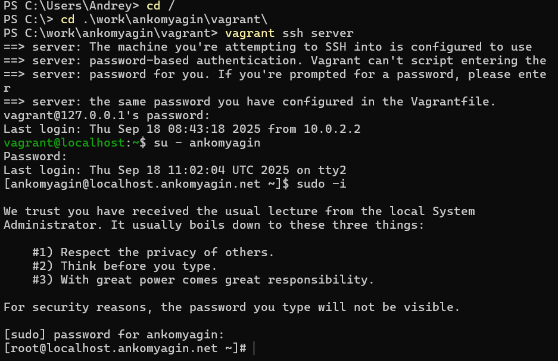
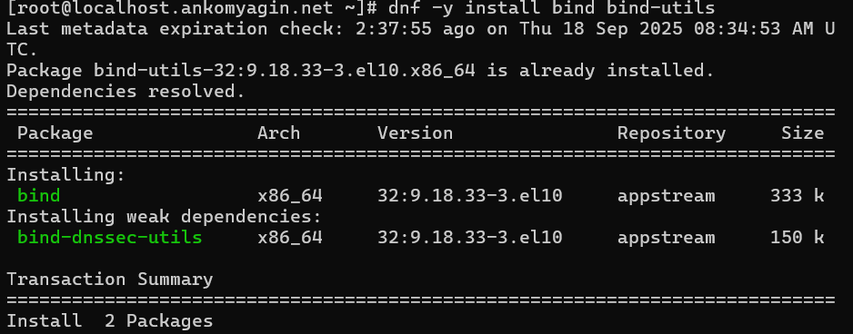
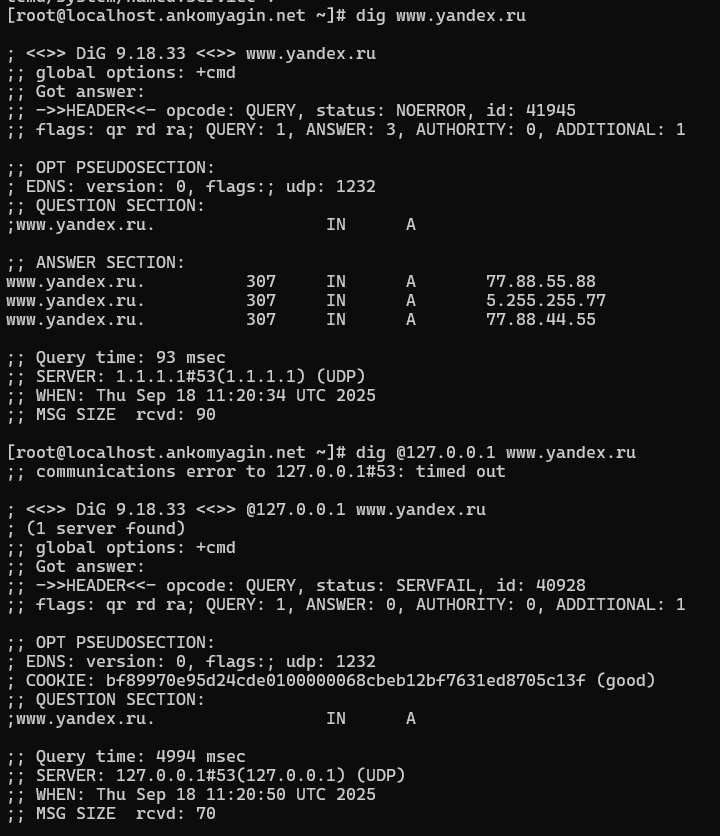
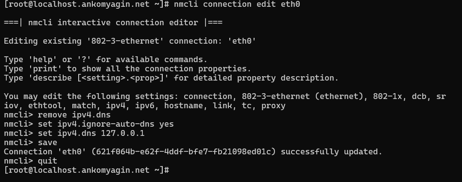

---
# Front matter
title: "Лабораторная работа №2"
subtitle: "Дисциплина: Администрирование сетевых подсистем"
author: "Комягин Андрей Николаевич"

# Generic options
lang: ru-RU
toc-title: "Содержание"

# Bibliography
bibliography: bib/cite.bib
csl: pandoc/csl/gost-r-7-0-5-2008-numeric.csl

# Pdf output format
toc: true # Table of contents
toc-depth: 2
lof: true # List of figures
lot: true # List of tables
fontsize: 12pt
linestretch: 1.5
papersize: a4
documentclass: scrreprt

# I18n polyglossia
polyglossia-lang:
  name: russian
  options:
  - spelling=modern
  - babelshorthands=true
polyglossia-otherlangs:
  name: english

# I18n babel
babel-lang: russian
babel-otherlangs: english

# Fonts
mainfont: IBM Plex Serif
romanfont: IBM Plex Serif
sansfont: IBM Plex Sans
monofont: IBM Plex Mono
mathfont: STIX Two Math
mainfontoptions: Ligatures=Common,Ligatures=TeX,Scale=0.94
romanfontoptions: Ligatures=Common,Ligatures=TeX,Scale=0.94
sansfontoptions: Ligatures=Common,Ligatures=TeX,Scale=MatchLowercase,Scale=0.94
monofontoptions: Scale=MatchLowercase,Scale=0.94,FakeStretch=0.9
mathfontoptions: []

# Biblatex
biblatex: true
biblio-style: gost-numeric
biblatexoptions:
  - parentracker=true
  - backend=biber
  - hyperref=auto
  - language=auto
  - autolang=other*
  - citestyle=gost-numeric

# Pandoc-crossref LaTeX customization
figureTitle: "Рис."
tableTitle: "Таблица"
listingTitle: "Листинг"
lofTitle: "Список иллюстраций"
lotTitle: "Список таблиц"
lolTitle: "Листинги"

# Misc options
indent: true
header-includes:
  - \usepackage{indentfirst}
  - \usepackage{float} # keep figures where they are in the text
  - \floatplacement{figure}{H}
---

# Цель работы

Приобретение практических навыков по установке и конфигурированию DNS-сервера, усвоение принципов работы системы доменных имён.

# Выполнение лабораторной работы

## Подготовка среды

Работа выполняется на виртуальной машине `server`.
Был произведен запуск виртуальной машины и вход в систему (рис. [-@fig:001], [-@fig:002]).

{#fig:001 width=70%}

{#fig:002 width=70%}

## Установка DNS-сервера

На сервере были установлены пакеты `bind` и `bind-utils`, необходимые для работы DNS-сервера и утилит диагностики (рис. [-@fig:003]).

Команда установки:

```bash
dnf -y install bind bind-utils
```

{#fig:003 width=70%}

## Конфигурирование кэширующего DNS-сервера

Для анализа работы DNS были выполнены запросы к внешнему узлу (yandex.ru) и к локальному серверу.
На этапе до настройки локальный сервер (127.0.0.1) не отвечал на запросы или возвращал ошибку (рис. [-@fig:004]).

Использованные команды:

```bash
dig www.yandex.ru
dig @127.0.0.1 www.yandex.ru
```

{#fig:004 width=70%}

Далее был настроен сетевой интерфейс `eth0` через `nmcli` для использования локального DNS-сервера (127.0.0.1) в качестве основного (рис. [-@fig:005]).

Команды настройки:

```bash
nmcli connection edit eth0
remove ipv4.dns
set ipv4.ignore-auto-dns yes
set ipv4.dns 127.0.0.1
save
quit
systemctl restart NetworkManager
```

{#fig:005 width=70%}

В файл конфигурации `/etc/named.conf` были внесены изменения:

1.  В директиве `listen-on port 53` добавлен адрес `any` или `127.0.0.1; 192.168.0.1;`.

2.  В директиве `allow-query` разрешены запросы из локальной сети (`192.168.0.0/16`).

Также был настроен межсетевой экран (`firewalld`) для разрешения работы службы DNS (рис. [-@fig:006]).

Команды настройки firewall:

```bash
firewall-cmd --add-service=dns
firewall-cmd --add-service=dns --permanent
```

{#fig:006 width=70%}

## Конфигурирование первичного DNS-сервера

Согласно заданию, была создана прямая зона `ankomyagin.net` (в примере методички `user.net`) и обратная зона.

1.  В `named.conf` добавлено включение файла зон.
2.  Созданы файлы зон в каталоге `/var/named/`:
    *   Скопирован шаблон `named.localhost` для прямой зоны.
    *   Скопирован шаблон `named.loopback` для обратной зоны.
3.  В файлах зон настроены SOA-записи, NS-записи и A-записи, указывающие на IP-адрес сервера (192.168.x.x).
4.  Выставлены корректные права доступа и метки SELinux:
    
```bash
    chown -R named:named /var/named
    restorecon -vR /var/named
    ```

## Автоматизация настройки (Provisioning)

Для автоматизации процесса настройки создан скрипт `dns.sh` для Vagrant.

Листинг скрипта `dns.sh`:

```bash
#!/bin/bash

echo "Provisioning script $0"

echo "Install needed packages"
dnf -y install bind bind-utils

echo "Copy configuration files"
# Копирование заранее подготовленных конфигов
cp -R /vagrant/provision/server/dns/etc/* /etc
cp -R /vagrant/provision/server/dns/var/named/* /var/named

chown -R named:named /etc/named
chown -R named:named /var/named

restorecon -vR /etc
restorecon -vR /var/named

echo "Configure firewall"
firewall-cmd --add-service=dns
firewall-cmd --add-service=dns --permanent

echo "Tuning SELinux"
setsebool named_write_master_zones 1
setsebool -P named_write_master_zones 1

echo "Change dns server address"
nmcli connection edit "System eth0" <<EOF
remove ipv4.dns
set ipv4.ignore-auto-dns yes
set ipv4.dns 127.0.0.1
save
quit
EOF

systemctl restart NetworkManager

echo "Start named service"
systemctl enable named
systemctl start named
```

В `Vagrantfile` добавлена секция запуска скрипта:

```ruby
server.vm.provision "server dns",
  type: "shell",
  preserve_order: true,
  path: "provision/server/dns.sh"
```

# Контрольные вопросы

1.  **Что такое DNS?**

    DNS (Domain Name System) — распределённая система для получения информации о доменах. Чаще всего используется для получения IP-адреса по имени хоста (компьютера или устройства), получения информации о маршрутизации почты и/или обслуживающих узлах для протоколов в домене.

2.  **Каково назначение кэширующего DNS-сервера?**

    Кэширующий DNS-сервер получает рекурсивные запросы от клиентов, выполняет их (обращаясь к авторитетным серверам) и сохраняет ответы в локальном кэше для ускорения обработки последующих запросов к тем же именам.

3.  **Чем отличается прямая DNS-зона от обратной?**

    Прямая зона служит для преобразования доменных имен в IP-адреса (A, AAAA записи). Обратная зона (обычно в домене `in-addr.arpa`) служит для преобразования IP-адресов в доменные имена (PTR записи).

4.  **В каких каталогах и файлах располагаются настройки DNS-сервера?**

    Основной файл конфигурации: `/etc/named.conf`.
    Файлы зон обычно располагаются в `/var/named/`.

5.  **Что указывается в файле resolv.conf?**

    В файле `/etc/resolv.conf` указываются адреса DNS-серверов, к которым должна обращаться система для разрешения имен (`nameserver`), а также домен поиска по умолчанию (`search`, `domain`).

6.  **Какие типы записи описания ресурсов есть в DNS и для чего они используются?**

    *   **A**: сопоставление имени IPv4-адресу.

    *   **AAAA**: сопоставление имени IPv6-адресу.

    *   **NS**: указывает на авторитетный DNS-сервер для зоны.

    *   **SOA**: начальная запись зоны (параметры зоны, email администратора, серийный номер).

    *   **CNAME**: каноническое имя (псевдоним).

    *   **MX**: почтовый шлюз для домена.

    *   **PTR**: обратное соответствие (IP -> имя).

7.  **Для чего используется домен in-addr.arpa?**

    Специальный домен верхнего уровня, используемый для обратного разрешения DNS (поиск имени по IPv4-адресу).

8.  **Для чего нужен демон named?**

    `named` (Name Daemon) — это исполняемый файл сервера BIND, который обеспечивает работу службы DNS, прослушивает порт 53 и обрабатывает запросы.

9.  **В чём заключаются основные функции slave-сервера и master-сервера?**

    *   **Master (Primary)**: хранит оригинальные файлы зон, на нем вносятся изменения.

    *   **Slave (Secondary)**: загружает данные зон с Master-сервера (transfer zone) для обеспечения отказоустойчивости и распределения нагрузки.

# Выводы

В ходе выполнения лабораторной работы были приобретены практические навыки по установке и настройке DNS-сервера BIND. Был настроен кэширующий сервер, а также сконфигурирована первичная (master) зона для локального домена и соответствующая ей обратная зона. Изучены утилиты диагностики `dig`, `nmcli`, а также принципы работы с конфигурационными файлами `named.conf` и файлами зон. Создан скрипт для автоматического развертывания конфигурации.
