---
---
# Front matter
lang: ru-RU
title: "Лабораторная №3"
subtitle: 
  - "Администрирование сетевых подсистем"
  - "Комягин А.Н."
institute:
  - "Российский университет дружбы народов, Москва, Россия"

# i18n babel
babel-lang: russian
babel-otherlangs: english

# Formatting pdf
toc: false
toc-title: "Содержание"
slide_level: 2
aspectratio: 169
section-titles: true

# Standard theme and fonts
documentclass: beamer
theme: "default"

# Fonts 
mainfont: "Times New Roman"
sansfont: "Times New Roman"
monofont: "Courier New"
mathfont: "Latin Modern Math"

# Header includes:
header-includes: []

---

# Цель

## Цель работы

- Изучение принципов работы DHCP, приобретение навыков по установке и конфигурированию DHCP-сервера

# Ход работы 

## Подготовка
:::::::::::::: {.columns align=center}
::: {.column width="50%"}

:::
::: {.column width="50%"}

:::
::::::::::::::

## Настройка файла
:::::::::::::: {.columns align=center}
::: {.column width="50%"}

На всякий случай сохраняем файл конфигурации(копируем его), открываем на редактирование и меняем шаблон. Указываем имя, адрес подсети, диапазон адресов для распределения клиентам, адрес маршрутизатора и broadcast-адрес. Также настраиваем привязку dhcpd к интерфейсу eth1
:::
::: {.column width="50%"}

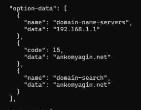
:::
::::::::::::::

## Настройка файла
:::::::::::::: {.columns align=center}
::: {.column width="50%"}

:::
::: {.column width="50%"}

:::
::::::::::::::

## Перезапуск
:::::::::::::: {.columns align=center}
::: {.column width="50%"}

Проверяем правильность командой "kea-dhcp4 -t /etc/kea/kea-dhcp4.conf" и перезапускаем конфигурацию, разрешаем загрузку при запуске
:::
::: {.column width="50%"}

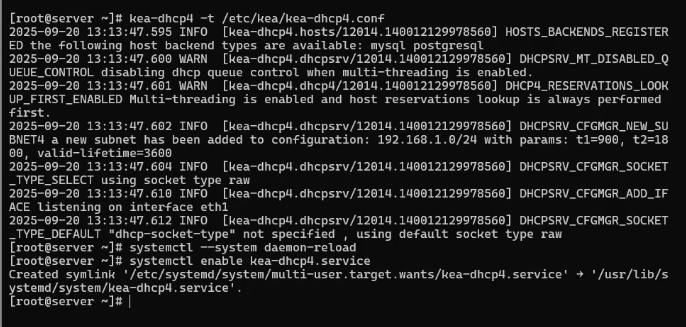
:::
::::::::::::::

## Файлы прямой и обратной зоны  DNS
:::::::::::::: {.columns align=center}
::: {.column width="50%"}

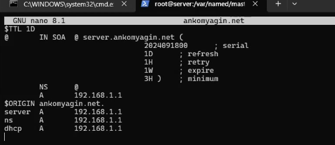
:::
::: {.column width="50%"}

:::
::::::::::::::

## Перезапуск. Проверка ping
:::::::::::::: {.columns align=center}
::: {.column width="50%"}

:::
::: {.column width="50%"}

Перезапускаем named, проверяем, что обращение по имени возможно
:::
::::::::::::::

## Изменение настроек
:::::::::::::: {.columns align=center}
::: {.column width="50%"}
Затем вносим изменения в настройки межсетевого экрана узла server, разрешив работу с DHC  и восстанавливаем контекст безопасности в SELinux
:::
::: {.column width="50%"}

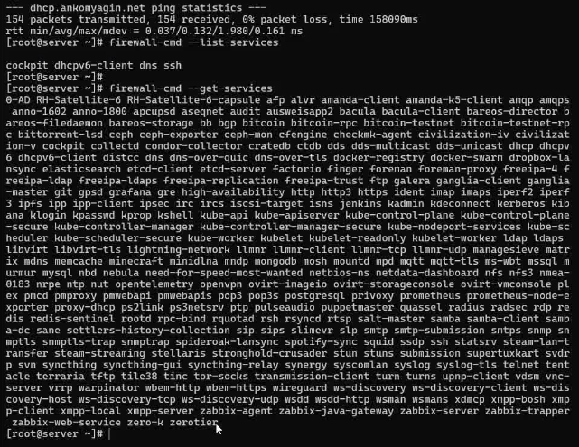
:::
::::::::::::::

## Изменение настроек
:::::::::::::: {.columns align=center}
::: {.column width="50%"}

:::
::: {.column width="50%"}

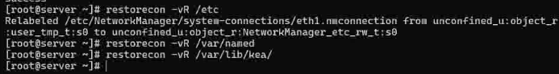

:::
::::::::::::::

## Создание скриптов
:::::::::::::: {.columns align=center}
::: {.column width="70%"}

Перед запуском виртуальной машины client в каталоге с проектом подкаталоге client создаем файл 01-routing.sh, добавляем скрипт настройки NetworkManager, чтобы весь трафик client шёл по умолчанию через eth1. Добавляем соответствущий скрипт в Vagrantfile.
:::
::::::::::::::

## Скрипты
:::::::::::::: {.columns align=center}
::: {.column width="50%"}

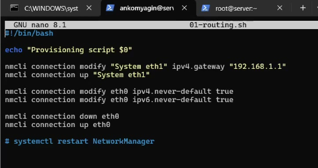
:::
::: {.column width="50%"}

:::
::::::::::::::

## Запуск машины
:::::::::::::: {.columns align=center}
::: {.column width="50%"}
Запускаем машину client с внесенными изменениями. На машине server на терминале с мониторингом можно увидеть записи о подключении к виртуальной внутренней сети узла client и выдачи ему IP-адреса из соответствующего диапазона адресов.
:::
::: {.column width="50%"}

:::
::::::::::::::

## Просмотр информации
:::::::::::::: {.columns align=center}
::: {.column width="50%"}

:::
::: {.column width="50%"}

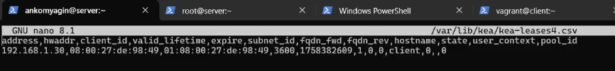

:::
::::::::::::::

## Настройки обновления DNS-зоны
:::::::::::::: {.columns align=center}
::: {.column width="50%"}

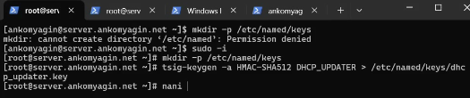
:::
::: {.column width="50%"}

:::
::::::::::::::

## Настройки обновления DNS-зоны
:::::::::::::: {.columns align=center}
::: {.column width="45%"}

:::
::: {.column width="50%"}

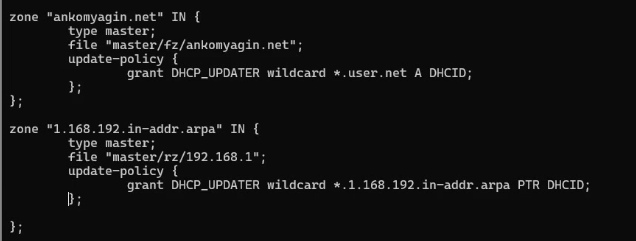
:::
::::::::::::::

## Настройки обновления DNS-зоны
:::::::::::::: {.columns align=center}
::: {.column width="50%"}

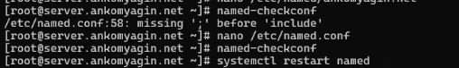
:::
::: {.column width="50%"}

Проверяем на наличие опечаток, исправялем и перезапускаем named
:::
::::::::::::::

## Ключ
:::::::::::::: {.columns align=center}
::: {.column width="50%"}

Далее формируем ключ. Меням владельца и поправляем права доступа.
:::
::: {.column width="50%"}

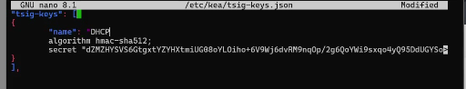
:::
::::::::::::::

## Файл /etc/kea/kea-dhcp-ddns.conf 
:::::::::::::: {.columns align=center}
::: {.column width="50%"}

:::
::: {.column width="50%"}

В файле /etc/kea/kea-dhcp-ddns.conf прописываем все настройки
:::
::::::::::::::

## Запуск службы
:::::::::::::: {.columns align=center}
::: {.column width="50%"}

Проверяем на наличие ошибок, меняем владельца "chown kea:kea /etc/kea/kea-dhcp-ddns.conf" и запускаем службу
:::
::: {.column width="50%"}

:::
::::::::::::::

##  Изменения /etc/kea/kea-dhcp4.conf
:::::::::::::: {.columns align=center}
::: {.column width="50%"}

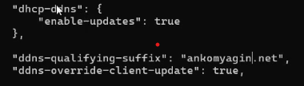
:::
::: {.column width="50%"}

:::
::::::::::::::

## Работа с client. Журнал
:::::::::::::: {.columns align=center}
::: {.column width="50%"}

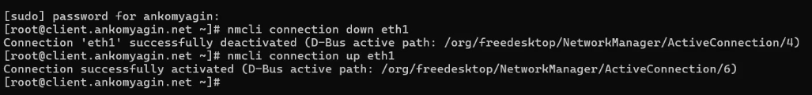
:::
::: {.column width="50%"}

:::
::::::::::::::

## Анализ работы
:::::::::::::: {.columns align=center}
::: {.column width="50%"}

На машине client с помощью утилиты dig убедимся в наличии DNS-записи о клиенте в прямой DNS-зоне
:::
::: {.column width="40%"}

:::
::::::::::::::

## Сохранение изменений
:::::::::::::: {.columns align=center}
::: {.column width="50%"}
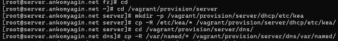
:::
::: {.column width="50%"}

:::
::::::::::::::

## Сохранение изменений
:::::::::::::: {.columns align=center}
::: {.column width="50%"}

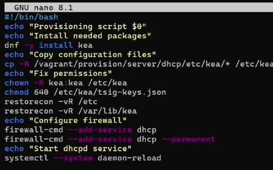
:::
::: {.column width="50%"}

:::
::::::::::::::

## Завершение работы
:::::::::::::: {.columns align=center}
::: {.column width="50%"}

:::
::::::::::::::

# Вывод

## Выводы

- В ходе работы были изучены принципы работы DHCP и приобретены навыки по установке и конфигурированию DHCP-сервера

