---
# Front matter
title: "Лабораторная работа №3"
subtitle: "Дисциплина: Администрирование сетевых подсистем"
author: "Комягин Андрей Николаевич"

# Generic options
lang: ru-RU
toc-title: "Содержание"

# Bibliography
bibliography: bib/cite.bib
csl: pandoc/csl/gost-r-7-0-5-2008-numeric.csl

# Pdf output format
toc: true                # Table of contents
toc-depth: 2
lof: true                # List of figures
lot: true                # List of tables
fontsize: 12pt
linestretch: 1.5
papersize: a4
documentclass: scrreprt

# I18n polyglossia
polyglossia-lang:
  name: russian
  options:
    - spelling=modern
    - babelshorthands=true
polyglossia-otherlangs:
  name: english

# I18n babel
babel-lang: russian
babel-otherlangs: english

# Fonts
mainfont: IBM Plex Serif
romanfont: IBM Plex Serif
sansfont: IBM Plex Sans
monofont: IBM Plex Mono
mathfont: STIX Two Math
mainfontoptions: Ligatures=Common,Ligatures=TeX,Scale=0.94
romanfontoptions: Ligatures=Common,Ligatures=TeX,Scale=0.94
sansfontoptions: Ligatures=Common,Ligatures=TeX,Scale=MatchLowercase,Scale=0.94
monofontoptions: Scale=MatchLowercase,Scale=0.94,FakeStretch=0.9
mathfontoptions: []

# Biblatex
biblatex: true
biblio-style: gost-numeric
biblatexoptions:
  - parentracker=true
  - backend=biber
  - hyperref=auto
  - language=auto
  - autolang=other*
  - citestyle=gost-numeric

# Pandoc-crossref LaTeX customization
figureTitle: "Рис."
tableTitle: "Таблица"
listingTitle: "Листинг"
lofTitle: "Список иллюстраций"
lotTitle: "Список таблиц"
lolTitle: "Листинги"

# Misc options
indent: true
header-includes:
  - \usepackage{indentfirst}
  - \usepackage{float}        # keep figures where they are in the text
  - \floatplacement{figure}{H}
---

# Цель работы

Изучение принципов работы DHCP, приобретение навыков по установке и конфигурированию DHCP-сервера.

# Выполнение лабораторной работы

Загружaем операционну систему с помощью Vagrant. После загрузки устанавливаем Kea(рис. [-@fig:001] и рис. [-@fig:002]).

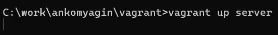{#fig:001 width=70%}

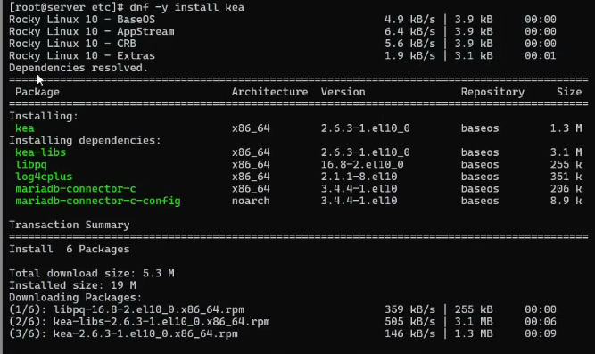{#fig:002 width=70%}

На всякий случай сохраняем файл конфигурации(копируем его), открываем на редактирование и меняем шаблон. Указываем имя, адрес подсети, диапазон адресов для распределения клиентам, адрес маршрутизатора и broadcast-адрес. Также настраиваем привязку dhcpd к интерфейсу eth1 (рис. [-@fig:003], рис. [-@fig:004] и рис. [-@fig:005]).

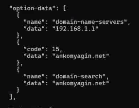{#fig:003 width=70%}

{#fig:004 width=70%}

{#fig:005 width=70%}

Проверяем правильность командой "kea-dhcp4 -t /etc/kea/kea-dhcp4.conf" и перезапускаем конфигурацию, разрешаем загрузку при запуске (рис. [-@fig:006]).

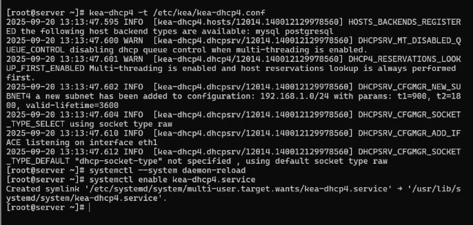{#fig:006 width=70%}

Редактируем файлы прямой DNS-зоны и обратной, добавляем запись для DHCP-сервер(рис. [-@fig:007] и рис. [-@fig:008]).

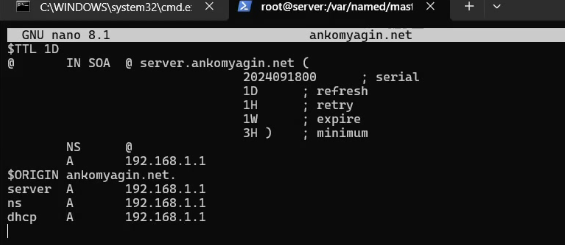{#fig:007 width=70%}

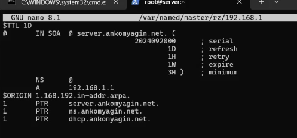{#fig:008 width=70%}

Перезапускаем named, проверяем, что обращение по имени возможно(рис. [-@fig:009]).

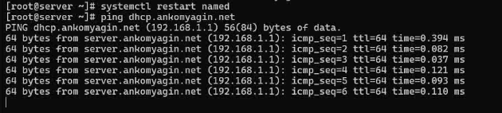{#fig:009 width=70%}

Затем вносим изменения в настройки межсетевого экрана узла server, разрешив работу с DHCP(рис. [-@fig:010] и рис. [-@fig:011])  и восстанавливаем контекст безопасности в SELinux(рис. [-@fig:012])

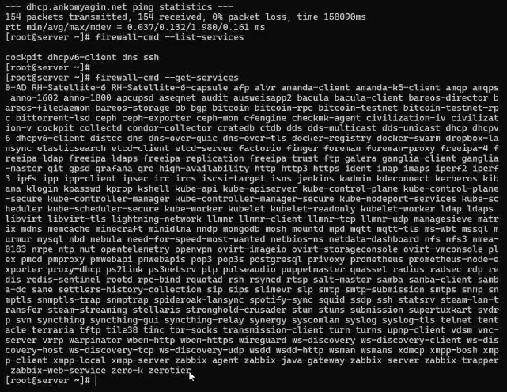{#fig:010 width=70%}

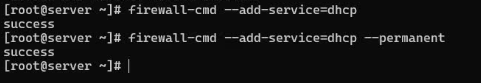{#fig:011 width=70%}

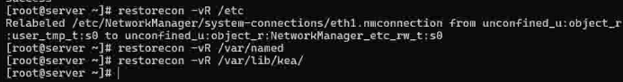{#fig:012 width=70%}

Наконец, в еще одном терминале запускаем просмотр лога ошибок, а в основонм терминале запускаем сам сервис(рис. [-@fig:013]).

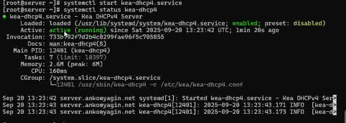{#fig:013 width=70%}

Переходим к анализу работы сервера.

Перед запуском виртуальной машины client в каталоге с проектом подкаталоге client создаем файл 01-routing.sh, добавляем скрипт настройки NetworkManager, чтобы весь трафик client шёл по умолчанию через eth1(рис. [-@fig:014]). Добавляем соответствущий скрипт в Vagrantfile(рис. [-@fig:015]).

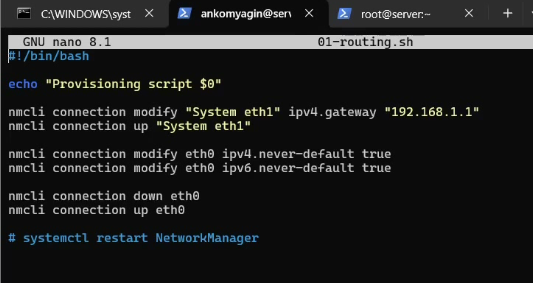{#fig:014 width=70%}

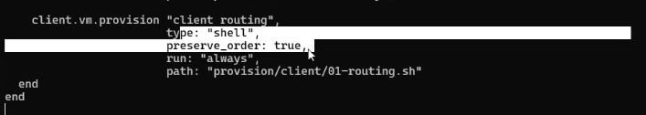{#fig:015 width=70%}

Запускаем машину client с внесенными изменениями(рис. [-@fig:016]). На машине server на терминале с мониторингом можно увидеть записи о подключении к виртуальной внутренней сети узла client и выдачи ему
IP-адреса из соответствующего диапазона адресов.

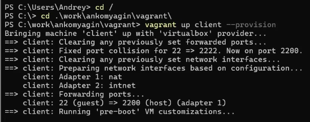{#fig:016 width=70%}

В терминале запущенной машины смотрим информацию об имеющихся интерфейсах(рис. [-@fig:017]), а на сервере смотрим список адресов(рис. [-@fig:018]). Файл  хранит информацию о выделенных  DHCP адресах.  Записи включают в себя IP-адрес, который был выделен клиенту, информацию о том кому и на какой срок выдан адрес, дату начала и окончания, MAC-адрес сетевого интерфейса, который был использован при получении IP-адреса, идентификатор клиента  и имя хоста.

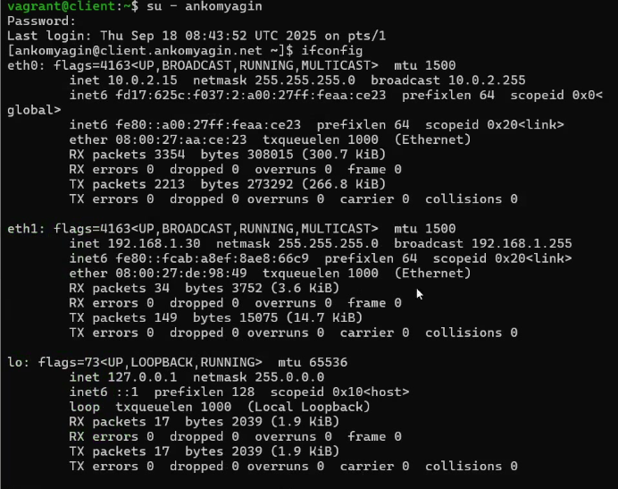{#fig:017 width=70%}

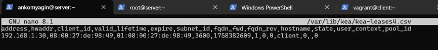{#fig:018 width=70%}

Перейдем к настройке обновления DNS-зоны.

Создаем ключ на сервере с Bind9(рис. [-@fig:019]). Поправим права доступа и подкючим ключ в файле(рис. [-@fig:020] и рис. [-@fig:021]).

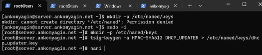{#fig:019 width=70%}

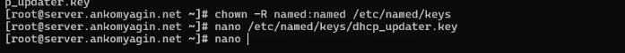{#fig:020 width=70%}

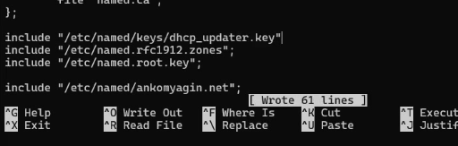{#fig:021 width=70%} 

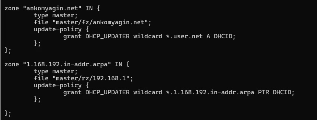{#fig:022 width=70%}

Проверяем на наличие опечаток, исправялем и перезапускаем named (рис. [-@fig:023]).

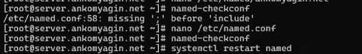{#fig:023 width=70%}

Далее формируем ключ(рис. [-@fig:024]). Меням владельца и поправляем права доступа.

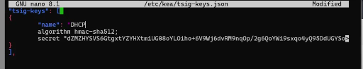{#fig:024 width=70%}

В файле /etc/kea/kea-dhcp-ddns.conf прописываем все настройки(рис. [-@fig:025]). 

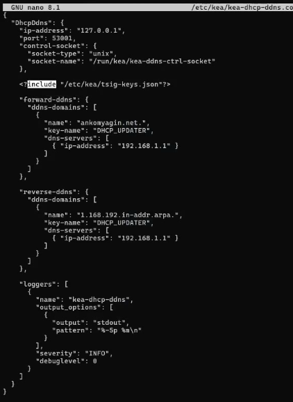{#fig:025 width=70%}

Проверяем на наличие ошибок, меняем владельца "chown kea:kea /etc/kea/kea-dhcp-ddns.conf" и запускаем службу(рис. [-@fig:026]). 

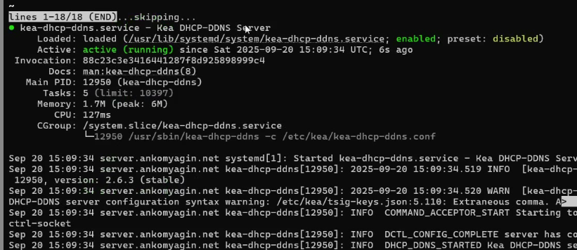{#fig:026 width=70%}

Кроме того добавляем изменения в конфигурационный файл /etc/kea/kea-dhcp4.conf(рис. [-@fig:027]). Проверяем на наличие ошибок и запускаем сервер(рис. [-@fig:028]). 

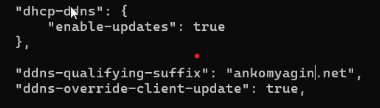{#fig:027 width=70%}

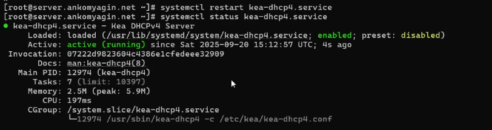{#fig:028 width=70%}

На машине client переполучаем адрес, в  каталоге прямой DNS-зоны появляется файл ankomyagin.net.jnl, в котором  автоматически вносятся изменения записей зоны(рис. [-@fig:029] и рис. [-@fig:030]). 

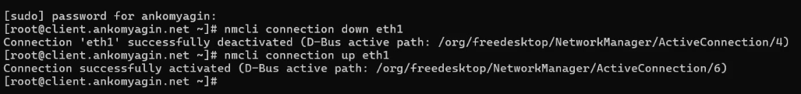{#fig:029 width=70%}

{#fig:030 width=70%}

Анализируем работу DHCP-сервера после настройки обновлений.

На машине client с помощью утилиты dig убедимся в наличии DNS-записи о клиенте в прямой DNS-зоне( рис. [-@fig:031]). 

{#fig:031 width=70%}

Наконец  внесем изменения в настройки окружения.

На виртуальной машине server  в каталог для внесения изменений
в настройки внутреннего окружения /vagrant/provision/server/, создаем  каталог dhcp, в который помещяем  соответствующие подкаталоги конфигурационные файлы DHCP( рис. [-@fig:032]). 

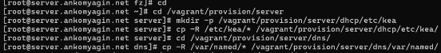{#fig:032 width=70%}

Затем заменим файл сервера( рис. [-@fig:033]). 

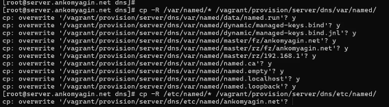{#fig:033 width=70%}

Далее создаем файл и добавляем туда скрипт( рис. [-@fig:034] и рис. [-@fig:035]). 

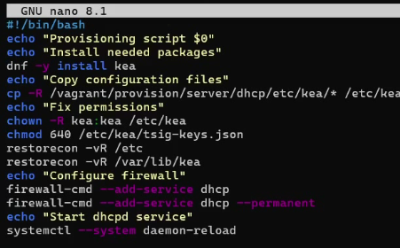{#fig:034 width=70%}

{#fig:035 width=70%} 

Завершаем работу(рис. [-@fig:036]). 

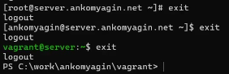{#fig:036 width=70%}

# Контрольные вопросы

- В каких файлах хранятся настройки сетевых подключений?

/etc/NetworkManager/system-connections/ (управляется через NetworkManager)

-  За что отвечает протокол DHCP?

DHCP (Dynamic Host Configuration Protocol) отвечает за автоматическую выдачу клиентам сетевых настроек: IP-адреса, маски подсети, шлюза по умолчанию и адресов DNS-серверов.

-  Поясните принцип работы протокола DHCP. Какими сообщениями обмениваются клиент и сервер, используя протокол DHCP?

Он выделяет каждому компьютеру произвольный свободный IP-адрес из определённого администратором диапазона

- В каких файлах обычно находятся настройки DHCP-сервера? За что отвечает каждый из файлов?

/etc/dhcp/dhcpd.conf-  содержит все настройки — объявление подсетей, пулы адресов, шлюзы, DNS-серверы, время аренды и т.д.

/var/lib/dhcp/dhcpd.leases - автоматически ведется демоном dhcpd, хранит историю выданных адресов, кому и на какой срок.

-  Что такое DDNS? Для чего применяется DDNS?

Это технология, позволяющая автоматически обновлять записи на DNS-сервере в реальном времени

-  Какую информацию можно получить, используя утилиту ifconfig? Приведите примеры с использованием различных опций.

Показывает конфигурацию сетевых интерфейсов (IP-адрес, маску, MAC-адрес), статистику по приему/передаче данных (RX/TX).

ifconfig – показать все активные интерфейсы.

ifconfig eth0 – показать информацию только для интерфейса eth0.

ifconfig eth0 up – включить (up) интерфейс eth0.

- Какую информацию можно получить, используя утилиту ping?

Проверяет доступность узла в сети и качество соединения (время отклика, потерю пакетов).

# Выводы

В ходе работы были изучены принципы работы DHCP и приобретены навыки по установке и конфигурированию DHCP-сервера.

# Список литературы{.unnumbered}

[ТУИС] (https://esystem.rudn.ru/pluginfile.php/2854738/mod_resource/content/8/003-dhcp.pdf)

