---
## Front matter
lang: ru-RU
title: Лабораторная №4
subtitle: Администрирование сетевых подсистем
  - Комягин А.Н.
institute:
  - Российский университет дружбы народов, Москва, Россия

## i18n babel
babel-lang: russian
babel-otherlangs: english

## Formatting pdf
toc: false
toc-title: Содержание
slide_level: 2
aspectratio: 169
section-titles: true
theme: metropolis
header-includes:
 - \metroset{progressbar=frametitle,sectionpage=progressbar,numbering=fraction}
 

## Fonts
mainfont: IBM Plex Serif
romanfont: IBM Plex Serif
sansfont: IBM Plex Sans
monofont: IBM Plex Mono
mathfont: STIX Two Math
mainfontoptions: Ligatures=Common,Ligatures=TeX,Scale=0.94
romanfontoptions: Ligatures=Common,Ligatures=TeX,Scale=0.94
sansfontoptions: Ligatures=Common,Ligatures=TeX,Scale=MatchLowercase,Scale=0.94
monofontoptions: Scale=MatchLowercase,Scale=0.94,FakeStretch=0.9
 
---

# Цель

## Цель работы

Приобретение практических навыков по установке и базовому конфигурированию HTTP-сервера Apache.

# Ход работы 

## Установка HTTP-сервера

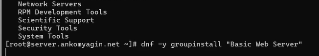

# Базовое конфигурирование HTTP-сервера

## Конфигурационные файлы

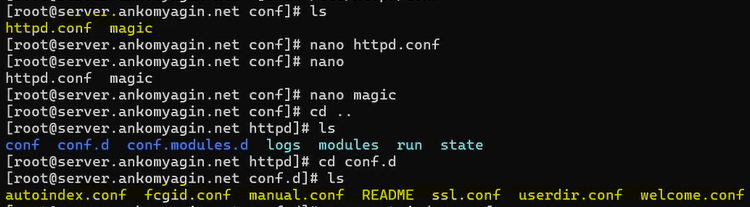

## Конфигурационные файлы

1. Каталог **/etc/httpd/conf** содержит основной файл конфигурации веб-сервера Apache.

Основной файл: **httpd.conf**.

Содержание и назначение:

Содержит директивы, управляющие работой сервера.
В этом файле прописываются глобальные настройки, такие как:
Главный порт, который прослушивает сервер (по умолчанию 80).
Пользователь и группа, под которыми работает сервер (в данном случае apache).

Путь к каталогу с веб-контентом по умолчанию (/var/www/html).
Настройки модулей, логирования ошибок и доступа по умолчанию.

## Конфигурационные файлы

2. Каталог **/etc/httpd/conf.d**

Этот каталог предназначен для дополнительных, модульных конфигурационных файлов Apache.

Содержание: Содержит файлы с расширением .conf (например, server.user.net.conf и www.user.net.conf), а также другие конфигурации, которые автоматически подгружаются основным файлом httpd.conf .

Назначение:

Используется для разделения настроек по функциональному признаку (например, конфигурация отдельных модулей) или по веб-сайтам (виртуальным хостам).

## разрешение работы с http

Внесём изменения в настройки межсетевого экрана узла server, разрешив работу с http

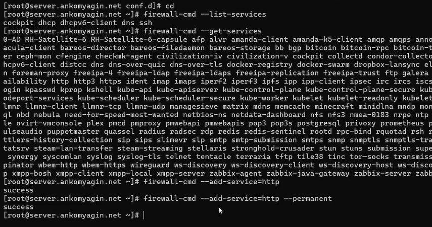{width=70%}

## Запуск http сервера

Активируем и запустим http сервер с systemctl просмотрим лог системных сообщений в отдельном терминале. Ошибок нет, сервер успешно запустился

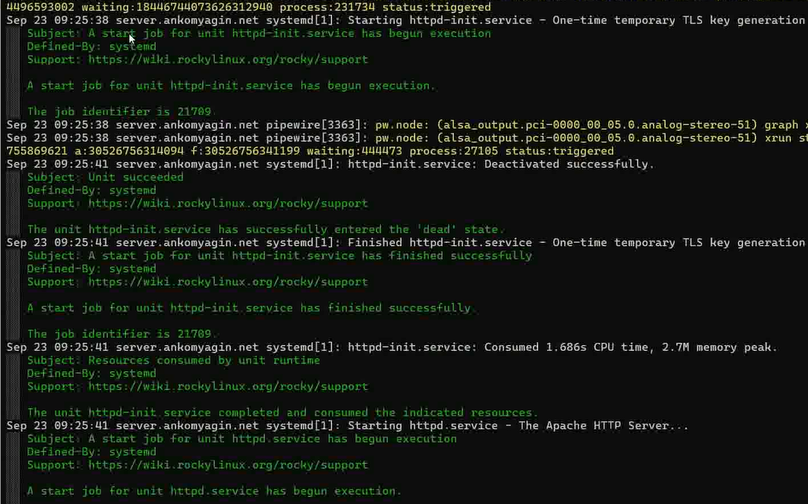{width=70%}

# Анализ работы HTTP-сервера

## работa http сервера

Проанализируем работу http сервера. На виртуальной машине client обратимся к адресу 192.168.1.1 с помощью curl

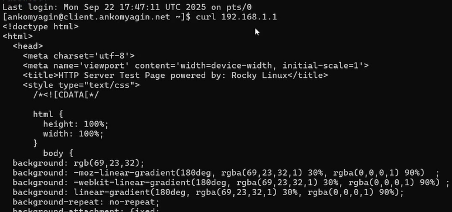{width=80%}

## Информация из мониторинга

Проанализируем информацию, которая отразилась при мониторинге в машине server

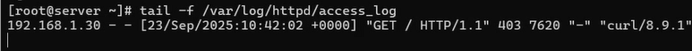

# Настройка виртуального хостинга для HTTP-сервера

## внесём изменения в файлы конфигурации

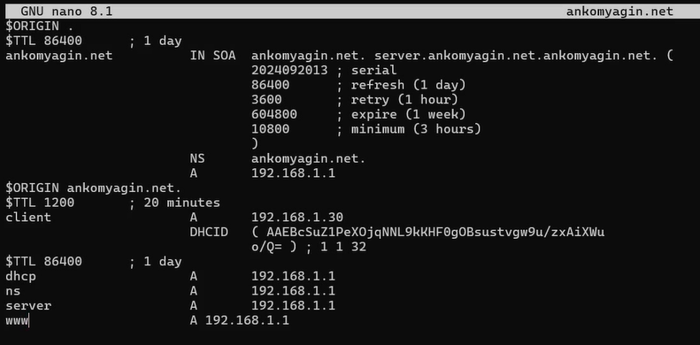{width=80%}

## внесём изменения в файлы конфигурации

{width=80%}

## В каталоге /etc/httpd/conf.d создадим файлы

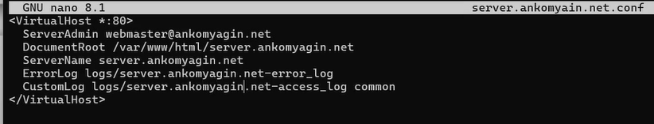

## В каталоге /etc/httpd/conf.d создадим файлы

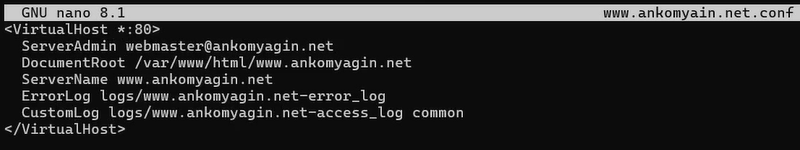

## страницы веб-серверов

В каталоге /var/www/html создадим тестовые страницы для виртуальных веб-серверов. Затем скорректируем права доступа в каталог с веб-контентом. Восстановим контекст безопасности в SELinux и перезапустим HTTP-сервер

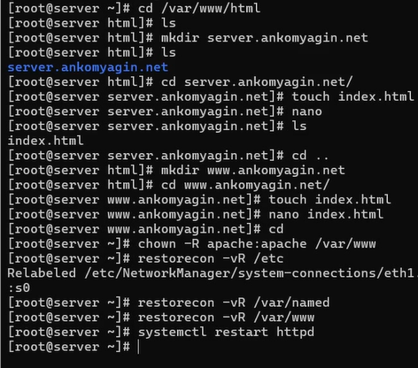{width=60%}

## демонстрация работы веб-сервера

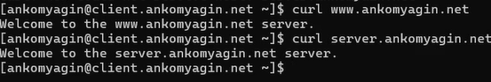

# Контрольные вопросы

## Через какой порт по умолчанию работает Apache?

Kонфигурация виртуального хоста использует порт 80, который является стандартным портом по умолчанию для HTTP (HyperText Transfer Protocol).

## Под каким пользователем запускается Apache и к какой группе относится этот пользователь?

Согласно скрипту http.sh и команде изменения владельца, Apache запускается под пользователем apache и принадлежит группе apache. Команда, используемая для корректировки прав доступа, явно указывает это: 

**chown -R apache:apache /var/www**

## Где располагаются лог-файлы веб-сервера? Что можно по ним отслеживать?

Лог-файлы веб-сервера располагаются в каталоге 

**/var/log/httpd/**

**/var/log/httpd/error_log**: Используется для просмотра лога ошибок работы веб-сервера.

**/var/log/httpd/access_log**: Используется для мониторинга доступа к веб-серверу.

Кроме того, при настройке виртуального хостинга, лог-файлы для каждого виртуального хоста (например, logs/server.user.net-error_log и logs/server.user.net-access_log) также создаются для отслеживания ошибок и доступа, специфичных для этого хоста.

## Где по умолчанию содержится контент веб-серверов?

Контент веб-серверов (файлы с содержимым) по умолчанию содержится в каталоге /var/www/html. В этом каталоге создаются подкаталоги для каждого виртуального хоста.

## Каким образом реализуется виртуальный хостинг? Что он даёт?

Реализация: Виртуальный хостинг для Apache реализуется через добавление файлов конфигурации виртуальных хостов (например, server.ankomyagin.net.conf и www.ankomyagin.net.conf) в каталоге /etc/httpd/conf.d. Эти файлы содержат директивы 

<VirtualHost *:80>...</VirtualHost> , где указываются 

ServerName (DNS-имя хоста) и DocumentRoot (путь к контенту хоста). Настройка также включает добавление соответствующих 

DNS-записей для сопоставления имени хоста с IP-адресом .

Преимущества: Виртуальный хостинг позволяет размещать несколько независимых веб-сайтов (доступных по разным DNS-адресам, как server.ankomyagin.net и www.ankomyagin.net) на одном и том же физическом веб-сервере с общим IP-адресом.

# Вывод

## Выводы

В ходе работы я приобрел практические навыки по установке и базовому конфигурированию HTTP-сервера Apache.

