---
# Front matter
title: "Лабораторная работа №4"
subtitle: "Дисциплина: Администрирование сетевых подсистем"
author: "Комягин Андрей Николаевич"

# Generic options
lang: ru-RU
toc-title: "Содержание"

# Bibliography
bibliography: bib/cite.bib
csl: pandoc/csl/gost-r-7-0-5-2008-numeric.csl

# Pdf output format
toc: true                # Table of contents
toc-depth: 2
lof: true                # List of figures
lot: true                # List of tables
fontsize: 12pt
linestretch: 1.5
papersize: a4
documentclass: scrreprt

# I18n polyglossia
polyglossia-lang:
  name: russian
  options:
    - spelling=modern
    - babelshorthands=true
polyglossia-otherlangs:
  name: english

# I18n babel
babel-lang: russian
babel-otherlangs: english

# Fonts
mainfont: IBM Plex Serif
romanfont: IBM Plex Serif
sansfont: IBM Plex Sans
monofont: IBM Plex Mono
mathfont: STIX Two Math
mainfontoptions: Ligatures=Common,Ligatures=TeX,Scale=0.94
romanfontoptions: Ligatures=Common,Ligatures=TeX,Scale=0.94
sansfontoptions: Ligatures=Common,Ligatures=TeX,Scale=MatchLowercase,Scale=0.94
monofontoptions: Scale=MatchLowercase,Scale=0.94,FakeStretch=0.9
mathfontoptions: []

# Biblatex
biblatex: true
biblio-style: gost-numeric
biblatexoptions:
  - parentracker=true
  - backend=biber
  - hyperref=auto
  - language=auto
  - autolang=other*
  - citestyle=gost-numeric

# Pandoc-crossref LaTeX customization
figureTitle: "Рис."
tableTitle: "Таблица"
listingTitle: "Листинг"
lofTitle: "Список иллюстраций"
lotTitle: "Список таблиц"
lolTitle: "Листинги"

# Misc options
indent: true
header-includes:
  - \usepackage{indentfirst}
  - \usepackage{float}        # keep figures where they are in the text
  - \floatplacement{figure}{H}
---

# Цель работы

Приобретение практических навыков по установке и базовому конфигурированию HTTP-сервера Apache.

# Выполнение лабораторной работы

## Установка HTTP-сервера

Загружaем операционну систему с помощью Vagrant и входим в терминал под именем ankomyagin.

Установим из репозитория стандартный веб-сервер (HTTP-сервер и утилиты httpd, криптоутилиты и пр.(рис. [-@fig:001]).

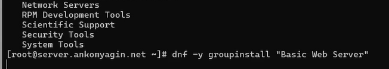{#fig:001 width=70%}

## Базовое конфигурирование HTTP-сервера

Конфигурационные файлы в каталогах /etc/httpd/conf и /etc/httpd/conf.d (рис. [-@fig:002])

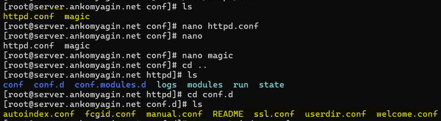{#fig:002 width=70%}

1. Каталог **/etc/httpd/conf** содержит основной файл конфигурации веб-сервера Apache.

Основной файл: **httpd.conf**.

Содержание и назначение:

Содержит директивы, управляющие работой сервера.
В этом файле прописываются глобальные настройки, такие как:
Главный порт, который прослушивает сервер (по умолчанию 80).
Пользователь и группа, под которыми работает сервер (в данном случае apache).

Путь к каталогу с веб-контентом по умолчанию (/var/www/html).
Настройки модулей, логирования ошибок и доступа по умолчанию.

2. Каталог **/etc/httpd/conf.d**

Этот каталог предназначен для дополнительных, модульных конфигурационных файлов Apache.

Содержание: Содержит файлы с расширением .conf (например, server.user.net.conf и www.user.net.conf), а также другие конфигурации, которые автоматически подгружаются основным файлом httpd.conf .

Назначение:

Используется для разделения настроек по функциональному признаку (например, конфигурация отдельных модулей) или по веб-сайтам (виртуальным хостам).

Внесём изменения в настройки межсетевого экрана узла server, разрешив работу с http (рис. [-@fig:003]).

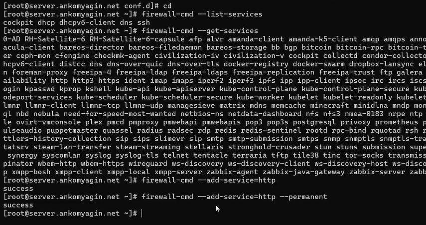{#fig:003 width=70%}

Активируем и запустим http сервер с systemctl просмотрим лог системных сообщений в отдельном терминале. Ошибок нет, сервер успешно запустился (рис. [-@fig:004]).

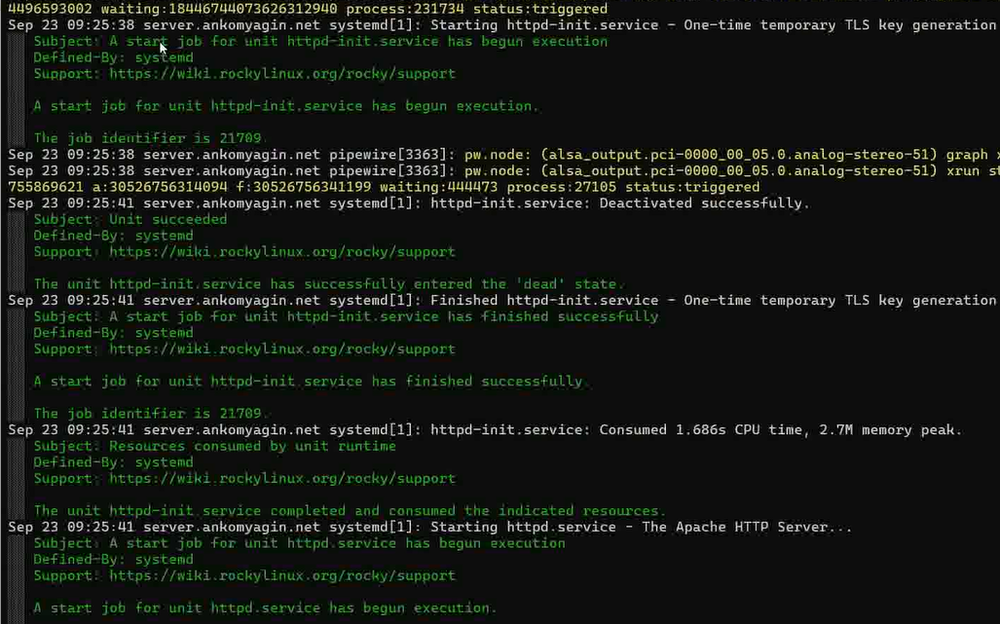{#fig:004 width=70%}

## Анализ работы HTTP-сервера

Проанализируем работу http сервера. На виртуальной машине client обратимся к адресу 192.168.1.1 с помощью curl(рис. [-@fig:005]).

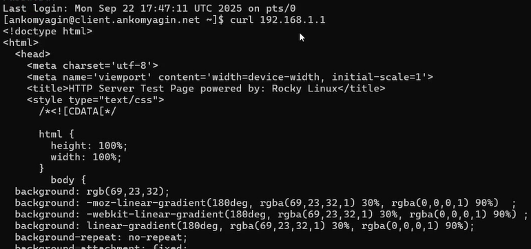{#fig:005 width=70%}

Проанализируем информацию, которая отразилась при мониторинге в машине server (рис. [-@fig:006])

В строке мы видим адрес устройства, которое подключилось, дату подключения, тип запроса get, браузер (curl)

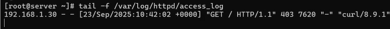{#fig:006 width=70%}

## Настройка виртуального хостинга для HTTP-сервера

Далее необходимо настроить виртуальный хостинг по двум DNS адресам: прямому и обратному.
Для этого остановим работу DNS сервера и внесём изменения в файлы конфигурации (добивим записи для HTTP сервера). (рис. [-@fig:007] и рис. [-@fig:008]). При этом удалим файлы журналов DNS.

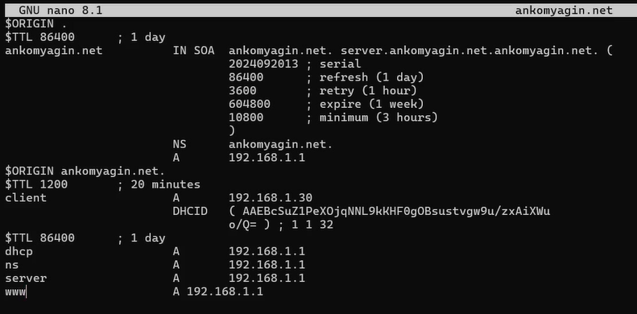{#fig:007 width=70%}

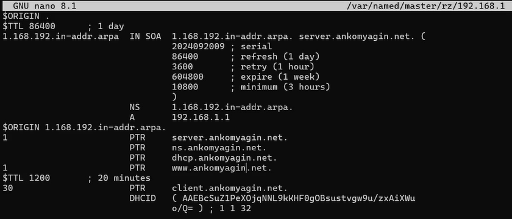{#fig:008 width=70%}

Перезапустим DNS сервер. В каталоге /etc/httpd/conf.d создадим файлы (рис. [-@fig:009] и рис. [-@fig:010])

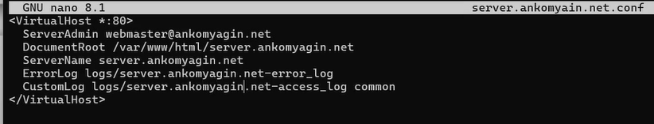{#fig:009 width=70%}
 
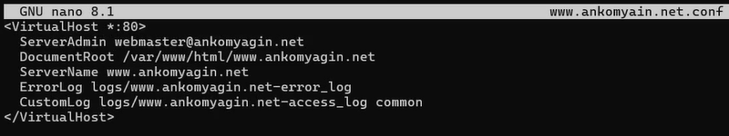{#fig:010 width=70%}

В каталоге /var/www/html создадим тестовые страницы для виртуальных веб-серверов. Затем скорректируем права доступа в каталог с веб-контентом. Восстановим контекст безопасности в SELinux и перезапустим HTTP-сервер (рис. [-@fig:011])

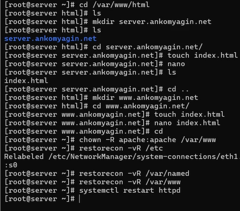{#fig:011 width=70%}

На виртуальной машине client убедитесь в корректном доступе к веб-серверу по двум адресам(рис. [-@fig:012])

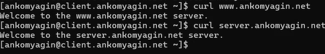{#fig:012 width=70%}

## Внесение изменений в настройки внутреннего окружения виртуальной машины

По аналогии с прошлыми лабораторными работами внесём изменения в настройки внутреннего окружения. Создадим 

/vagrant/provision/server/http/etc/httpd/conf.d

/vagrant/provision/server/http/var/www/html

Заменим различные конфигурационные файлы

Добавим скрипт http.sh, который повторит действия по установке и настройке HTTP-сервера. Также добавим выполнение этого скрипта в Vagrantfile.

# Контрольные вопросы

1. Через какой порт по умолчанию работает Apache?

Kонфигурация виртуального хоста использует порт 80, который является стандартным портом по умолчанию для HTTP (HyperText Transfer Protocol).

2. Под каким пользователем запускается Apache и к какой группе относится этот пользователь?

Согласно скрипту http.sh и команде изменения владельца, Apache запускается под пользователем apache и принадлежит группе apache. Команда, используемая для корректировки прав доступа, явно указывает это: 

**chown -R apache:apache /var/www**

3. Где располагаются лог-файлы веб-сервера? Что можно по ним отслеживать?

Лог-файлы веб-сервера располагаются в каталоге 

**/var/log/httpd/**

**/var/log/httpd/error_log**: Используется для просмотра лога ошибок работы веб-сервера.

**/var/log/httpd/access_log**: Используется для мониторинга доступа к веб-серверу.

Кроме того, при настройке виртуального хостинга, лог-файлы для каждого виртуального хоста (например, logs/server.user.net-error_log и logs/server.user.net-access_log) также создаются для отслеживания ошибок и доступа, специфичных для этого хоста.

4. Где по умолчанию содержится контент веб-серверов?

Контент веб-серверов (файлы с содержимым) по умолчанию содержится в каталоге /var/www/html. В этом каталоге создаются подкаталоги для каждого виртуального хоста.

5. Каким образом реализуется виртуальный хостинг? Что он даёт?

Реализация: Виртуальный хостинг для Apache реализуется через добавление файлов конфигурации виртуальных хостов (например, server.ankomyagin.net.conf и www.ankomyagin.net.conf) в каталоге /etc/httpd/conf.d. Эти файлы содержат директивы 

<VirtualHost *:80>...</VirtualHost> , где указываются 

ServerName (DNS-имя хоста) и DocumentRoot (путь к контенту хоста). Настройка также включает добавление соответствующих 

DNS-записей для сопоставления имени хоста с IP-адресом .

Преимущества: Виртуальный хостинг позволяет размещать несколько независимых веб-сайтов (доступных по разным DNS-адресам, как server.ankomyagin.net и www.ankomyagin.net) на одном и том же физическом веб-сервере с общим IP-адресом.

# Выводы

В ходе работы я приобрел практические навыки по установке и базовому конфигурированию HTTP-сервера Apache.

# Список литературы{.unnumbered}

[ТУИС] (https://esystem.rudn.ru/pluginfile.php/2854738/mod_resource/content/8/003-dhcp.pdf)

