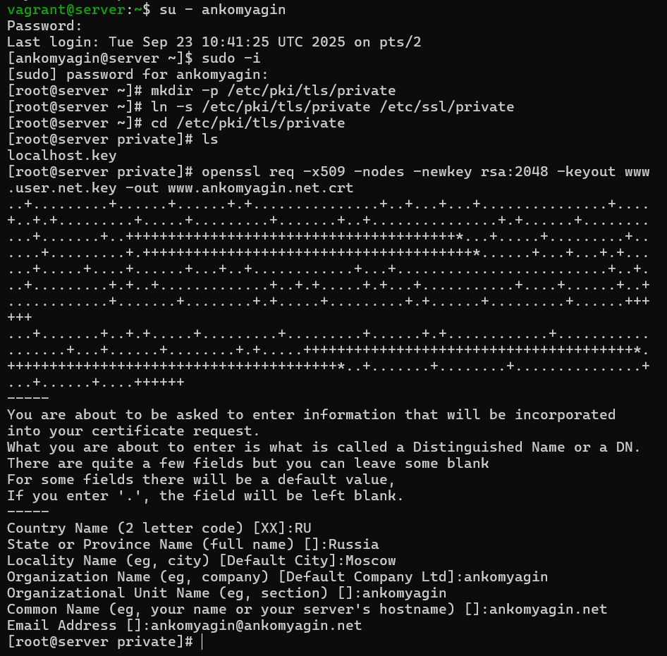
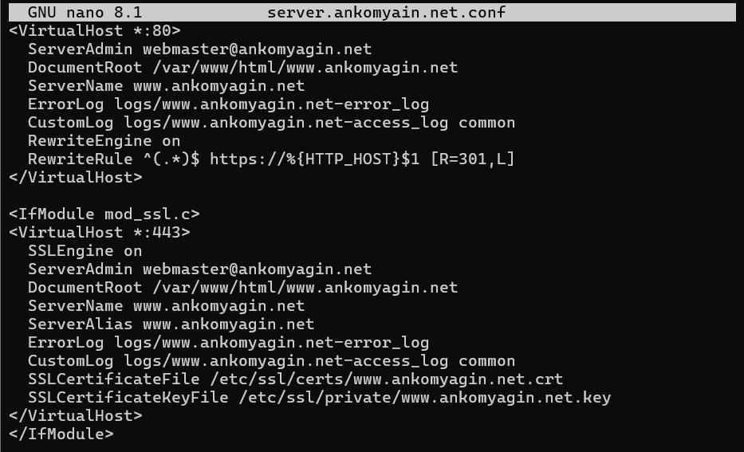
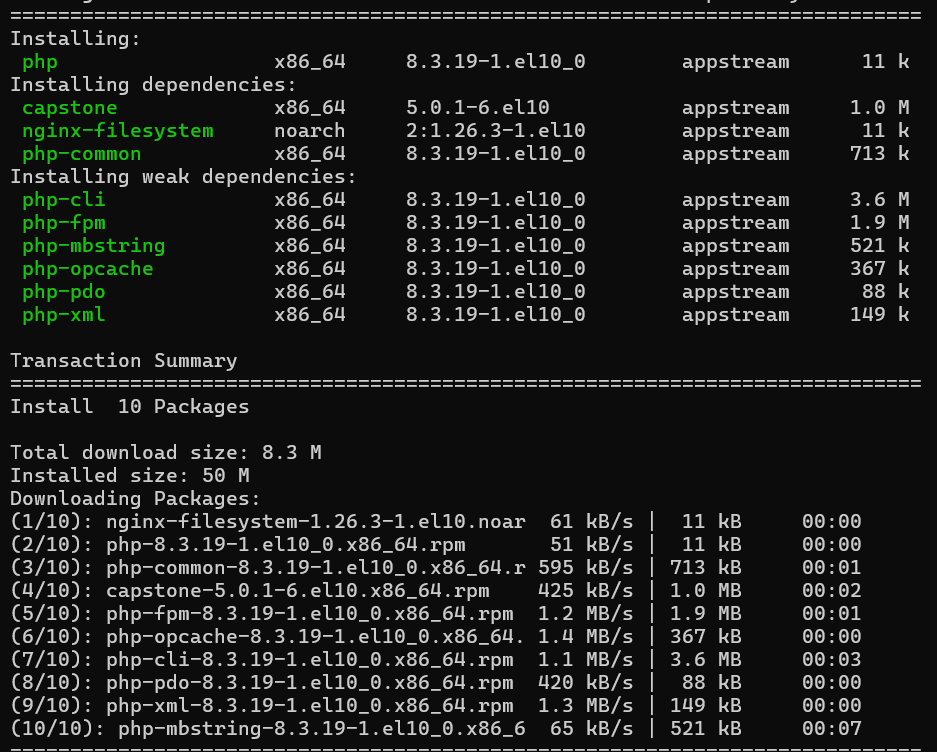
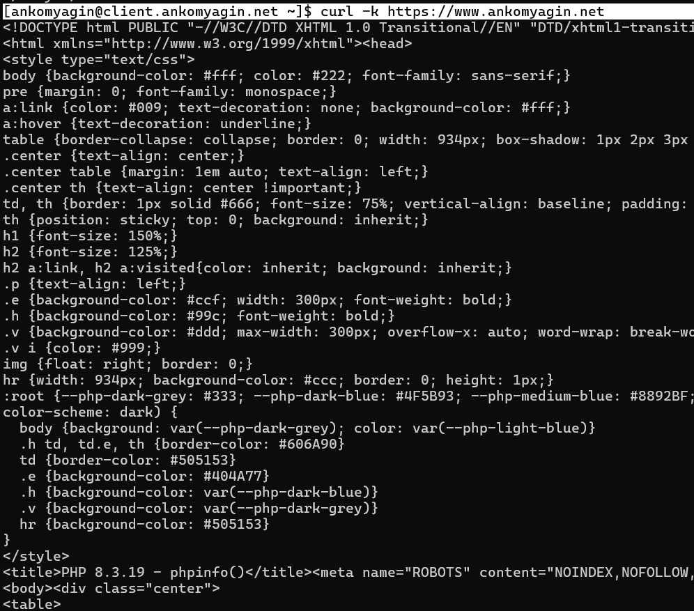
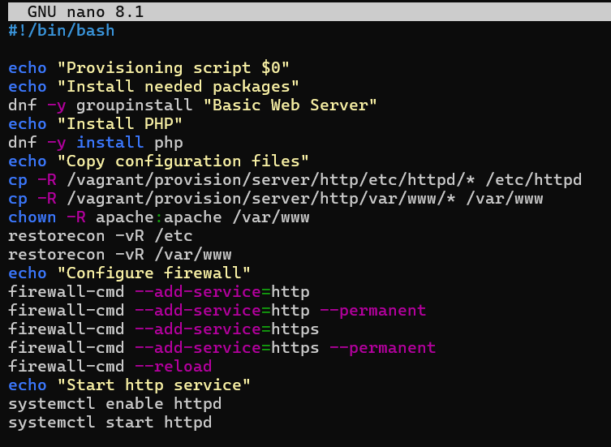

---
## Front matter
lang: ru-RU
title: Лабораторная №5
subtitle: Администрирование сетевых подсистем
  - Комягин А.Н.
institute:
  - Российский университет дружбы народов, Москва, Россия

## i18n babel
babel-lang: russian
babel-otherlangs: english

## Formatting pdf
toc: false
toc-title: Содержание
slide_level: 2
aspectratio: 169
section-titles: true
theme: metropolis
header-includes:
 - \metroset{progressbar=frametitle,sectionpage=progressbar,numbering=fraction}
 

## Fonts
mainfont: IBM Plex Serif
romanfont: IBM Plex Serif
sansfont: IBM Plex Sans
monofont: IBM Plex Mono
mathfont: STIX Two Math
mainfontoptions: Ligatures=Common,Ligatures=TeX,Scale=0.94
romanfontoptions: Ligatures=Common,Ligatures=TeX,Scale=0.94
sansfontoptions: Ligatures=Common,Ligatures=TeX,Scale=MatchLowercase,Scale=0.94
monofontoptions: Scale=MatchLowercase,Scale=0.94,FakeStretch=0.9
 
---

# Цель

## Цель работы

Приобретение практических навыков по расширенному конфигурированию HTTP-сервера  в части безопасности и возможности использования PHP.

# Ход работы 

## ключ и сертификат

# Базовое конфигурирование HTTP-сервера

## Конфигурационный файл

## Конфигурационный файл

<VirtualHost *:80>

Создание виртуального хоста на порту 80 (HTTP) - обрабатывает все входящие HTTP-запросы

ServerAdmin webmaster@ankomyagin.net
Email администратора - указывается в ошибках для связи

    DocumentRoot /var/www/html/www.ankomyagin.net
Корневая директория сайта - путь к файлам веб-сайта

## Конфигурационный файл

ServerName www.ankomyagin.net
Основное доменное имя - имя, по которому доступен сайт

    ServerAlias www.ankomyagin.net
Псевдонимы домена - дополнительные имена для этого же сайта

    ErrorLog logs/www.ankomyagin.net-error_log
Файл логов ошибок - куда записывать ошибки сервера

    CustomLog logs/www.ankomyagin.net-access_log common
Файл логов доступа - журнал всех запросов к сайту

## Конфигурационный файл

RewriteEngine on
Включение механизма перенаправлений - активация модуля mod_rewrite

    RewriteRule ^(.*)$ https://%{HTTP_HOST}$1 [R=301,L]
Правило перенаправления:

^(.*)$ - захватывает весь URL-путь

https://%{HTTP_HOST}$1 - формирует HTTPS-URL с тем же хостом и путём

R=301 - код ответа "постоянное перенаправление"

L - последнее правило (stop processing)

## Конфигурационный файл

</VirtualHost>
Конец виртуального хоста на порту 80

<IfModule mod_ssl.c>
Проверка наличия SSL модуля - выполнять только если модуль SSL загружен

<VirtualHost *:443>
Создание виртуального хоста на порту 443 (HTTPS) - обрабатывает защищённые соединения

    SSLEngine on
Включение SSL/TLS - активация шифрования для этого виртуального хоста

## Конфигурационный файл

ServerAdmin webmaster@ankomyagin.net
    DocumentRoot /var/www/html/www.ankomyagin.net
    ServerName www.ankomyagin.net
    ServerAlias www.ankomyagin.net
    ErrorLog logs/www.ankomyagin.net-error_log
    CustomLog logs/www.ankomyagin.net-access_log common
Те же настройки, что и для порта 80, но для HTTPS

    SSLCertificateFile /etc/ssl/certs/www.ankomyagin.net.crt
Путь к SSL-сертификату - файл с публичным сертификатом

    SSLCertificateKeyFile /etc/ssl/private/www.ankomyagin.net.key
Путь к приватному ключу - файл с закрытым ключом для шифрования

## разрешение работы с https

Внесём изменения в настройки межсетевого экрана узла server, разрешив работу с http

{width=70%}

## Работа https сервера

{width=70%}

## установка php

{width=80%}

## Изменение  веб-контента

Проанализируем информацию, которая отразилась при мониторинге в машине server

## php-info

{width=80%}

## http.sh

{width=80%}

# Контрольные вопросы

## В чём отличие HTTP от HTTPS?

HTTP передаёт данные в открытом виде, HTTPS шифрует трафик

HTTPS использует SSL/TLS сертификаты для аутентификации и шифрования

HTTPS работает на порту 443, HTTP на порту 80

## Каким образом обеспечивается безопасность контента веб-сервера при работе через HTTPS?

Шифрование данных (симметричное шифрование)

Аутентификация сервера (асимметричное шифрование, сертификаты)

Защита целостности данных (коды аутентичности)

Предотвращение прослушивания и подмены данных

## Что такое сертификационный центр? Приведите пример.

Организация, выпускающая и управляющая цифровыми сертификатами

Подтверждает подлинность владельцев сертификатов

Примеры: Let's Encrypt, Comodo, Symantec, GlobalSign

В работе использовался самоподписанный сертификат (эмуляция ЦС)

# Вывод

## Выводы

В ходе работы я приобрел практические навыки по расширенному конфигурированию HTTP-сервера  в части безопасности и возможности использования PHP.

