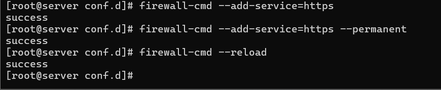
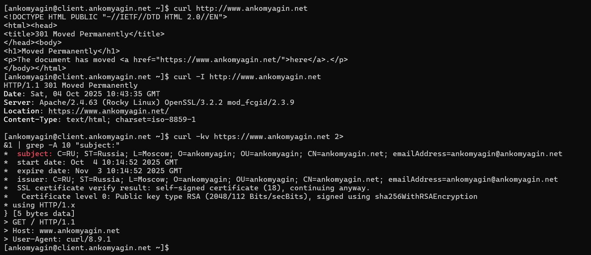
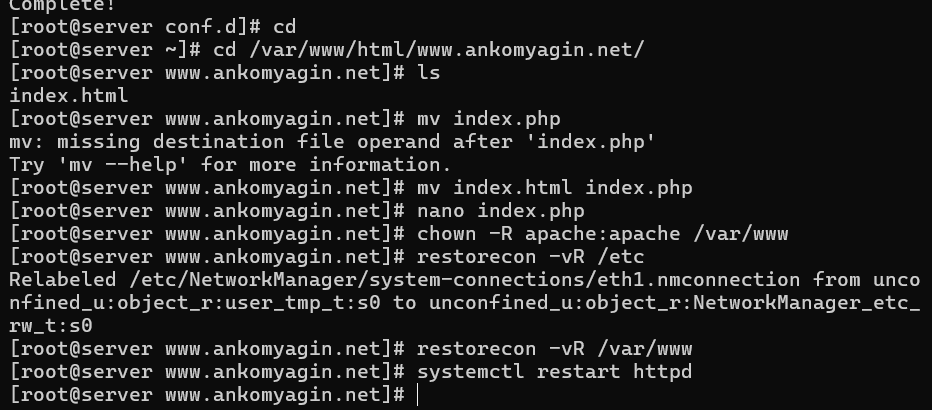

---
# Front matter
title: "Лабораторная работа №5"
subtitle: "Дисциплина: Администрирование сетевых подсистем"
author: "Комягин Андрей Николаевич"

# Generic options
lang: ru-RU
toc-title: "Содержание"

# Bibliography
bibliography: bib/cite.bib
csl: pandoc/csl/gost-r-7-0-5-2008-numeric.csl

# Pdf output format
toc: true                # Table of contents
toc-depth: 2
lof: true                # List of figures
lot: true                # List of tables
fontsize: 12pt
linestretch: 1.5
papersize: a4
documentclass: scrreprt

# I18n polyglossia
polyglossia-lang:
  name: russian
  options:
    - spelling=modern
    - babelshorthands=true
polyglossia-otherlangs:
  name: english

# I18n babel
babel-lang: russian
babel-otherlangs: english

# Fonts
mainfont: IBM Plex Serif
romanfont: IBM Plex Serif
sansfont: IBM Plex Sans
monofont: IBM Plex Mono
mathfont: STIX Two Math
mainfontoptions: Ligatures=Common,Ligatures=TeX,Scale=0.94
romanfontoptions: Ligatures=Common,Ligatures=TeX,Scale=0.94
sansfontoptions: Ligatures=Common,Ligatures=TeX,Scale=MatchLowercase,Scale=0.94
monofontoptions: Scale=MatchLowercase,Scale=0.94,FakeStretch=0.9
mathfontoptions: []

# Biblatex
biblatex: true
biblio-style: gost-numeric
biblatexoptions:
  - parentracker=true
  - backend=biber
  - hyperref=auto
  - language=auto
  - autolang=other*
  - citestyle=gost-numeric

# Pandoc-crossref LaTeX customization
figureTitle: "Рис."
tableTitle: "Таблица"
listingTitle: "Листинг"
lofTitle: "Список иллюстраций"
lotTitle: "Список таблиц"
lolTitle: "Листинги"

# Misc options
indent: true
header-includes:
  - \usepackage{indentfirst}
  - \usepackage{float}        # keep figures where they are in the text
  - \floatplacement{figure}{H}
---

# Цель работы

Приобретение практических навыков по расширенному конфигурированию HTTP-сервера  в части безопасности и возможности использования PHP.

# Выполнение лабораторной работы

## Конфигурирование HTTP-сервера для работы через протокол HTTPS

Загружaем операционну систему с помощью Vagrant и входим в терминал под именем ankomyagin.

Создадим каталог private, сгенерируем ключ и сертификат, заполним сертификат(рис. [-@fig:001]).

{#fig:001 width=70%}

Изменим конфигурационный файл http так, чтобы он работал с https (рис. [-@fig:002])

{#fig:002 width=70%}

<VirtualHost *:80>

Создание виртуального хоста на порту 80 (HTTP) - обрабатывает все входящие HTTP-запросы

ServerAdmin webmaster@ankomyagin.net
Email администратора - указывается в ошибках для связи

    DocumentRoot /var/www/html/www.ankomyagin.net
Корневая директория сайта - путь к файлам веб-сайта

    ServerName www.ankomyagin.net
Основное доменное имя - имя, по которому доступен сайт

    ServerAlias www.ankomyagin.net
Псевдонимы домена - дополнительные имена для этого же сайта

    ErrorLog logs/www.ankomyagin.net-error_log
Файл логов ошибок - куда записывать ошибки сервера

    CustomLog logs/www.ankomyagin.net-access_log common
Файл логов доступа - журнал всех запросов к сайту

    RewriteEngine on
Включение механизма перенаправлений - активация модуля mod_rewrite

    RewriteRule ^(.*)$ https://%{HTTP_HOST}$1 [R=301,L]
Правило перенаправления:

^(.*)$ - захватывает весь URL-путь

https://%{HTTP_HOST}$1 - формирует HTTPS-URL с тем же хостом и путём

R=301 - код ответа "постоянное перенаправление"

L - последнее правило (stop processing)

</VirtualHost>
Конец виртуального хоста на порту 80

<IfModule mod_ssl.c>
Проверка наличия SSL модуля - выполнять только если модуль SSL загружен

<VirtualHost *:443>
Создание виртуального хоста на порту 443 (HTTPS) - обрабатывает защищённые соединения

    SSLEngine on
Включение SSL/TLS - активация шифрования для этого виртуального хоста

    ServerAdmin webmaster@ankomyagin.net
    DocumentRoot /var/www/html/www.ankomyagin.net
    ServerName www.ankomyagin.net
    ServerAlias www.ankomyagin.net
    ErrorLog logs/www.ankomyagin.net-error_log
    CustomLog logs/www.ankomyagin.net-access_log common
Те же настройки, что и для порта 80, но для HTTPS

    SSLCertificateFile /etc/ssl/certs/www.ankomyagin.net.crt
Путь к SSL-сертификату - файл с публичным сертификатом

    SSLCertificateKeyFile /etc/ssl/private/www.ankomyagin.net.key
Путь к приватному ключу - файл с закрытым ключом для шифрования

</VirtualHost>
Конец виртуального хоста на порту 443

</IfModule>
Конец проверки модуля SSL

**Дальше внесём изменения в настройке межсетевого экрана для работы с https** (рис. [-@fig:003]).

{#fig:003 width=70%}

На виртуальной машине клиент проверим переключение на https (рис. [-@fig:004]).

{#fig:004 width=70%}

## Конфигурирование HTTP-сервера для работы с PHP

Установим php (рис. [-@fig:005]).

{#fig:005 width=70%}

Заменим файл index.html на index.php в каталоге /var/www/html/www.ankomyagin.net. Затем скорректируем права доступа в каталог с веб-контентом, восстановим контекст безопасности и перезапустим сервер(рис. [-@fig:006])

{#fig:006 width=70%}

Проверим, выведется ли информация о php-сервере. Отмечу, что мы видим php код страницы в виде текста, так как обратились через curl. В браузере будет выведена страница информации о php(рис. [-@fig:007]).

{#fig:007 width=70%}

## Внесение изменений в настройки внутреннего окружения виртуальной машины

По аналогии с прошлыми лабораторными работами внесём изменения в настройки внутреннего окружения. 

Заменим различные конфигурационные файлы

Изменим скрипт http.sh, который повторит действия по установке и настройке HTTPS-сервера (рис. [-@fig:008]).

{#fig:008 width=70%}

# Контрольные вопросы

1. В чём отличие HTTP от HTTPS?

HTTP передаёт данные в открытом виде, HTTPS шифрует трафик

HTTPS использует SSL/TLS сертификаты для аутентификации и шифрования

HTTPS работает на порту 443, HTTP на порту 80

2. Каким образом обеспечивается безопасность контента веб-сервера при работе через HTTPS?

Шифрование данных (симметричное шифрование)

Аутентификация сервера (асимметричное шифрование, сертификаты)

Защита целостности данных (коды аутентичности)

Предотвращение прослушивания и подмены данных

3. Что такое сертификационный центр? Приведите пример.

Организация, выпускающая и управляющая цифровыми сертификатами

Подтверждает подлинность владельцев сертификатов

Примеры: Let's Encrypt, Comodo, Symantec, GlobalSign

В работе использовался самоподписанный сертификат (эмуляция ЦС)

# Выводы

В ходе работы я приобрел практические навыки по расширенному конфигурированию HTTP-сервера  в части безопасности и возможности использования PHP.

# Список литературы{.unnumbered}

[ТУИС] (https://esystem.rudn.ru/pluginfile.php/2854738/mod_resource/content/8/003-dhcp.pdf)

