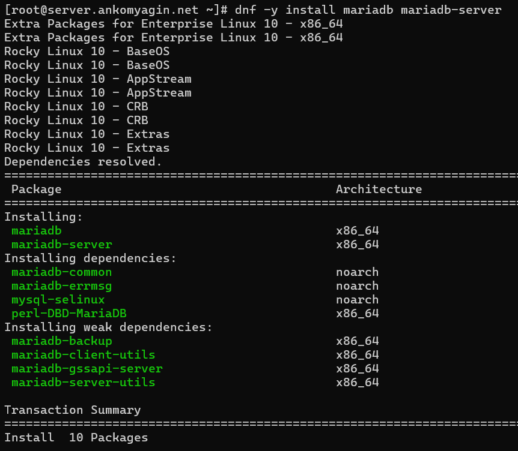
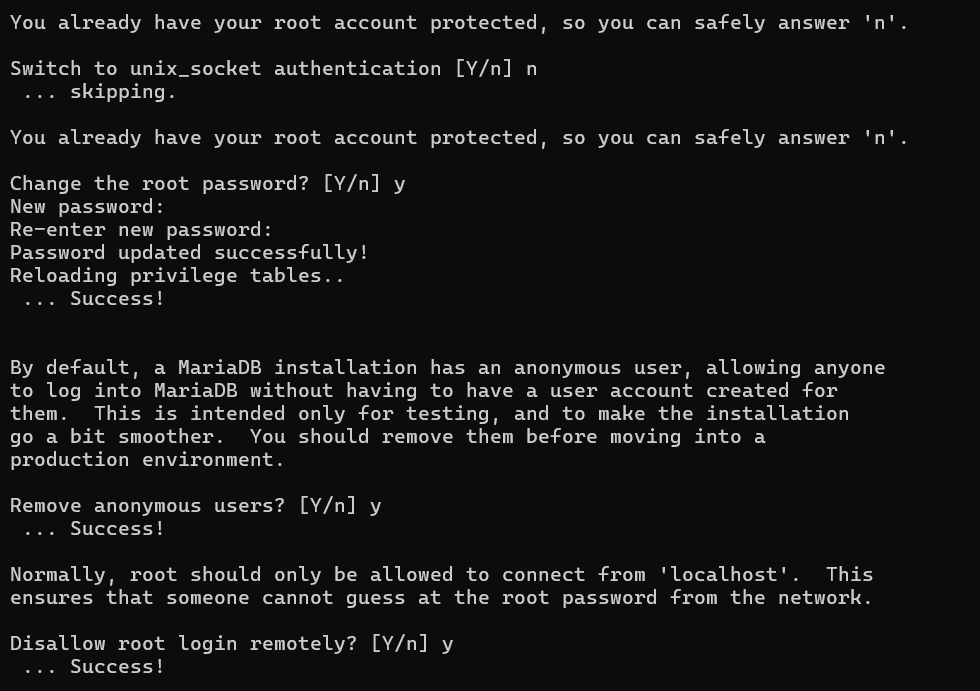
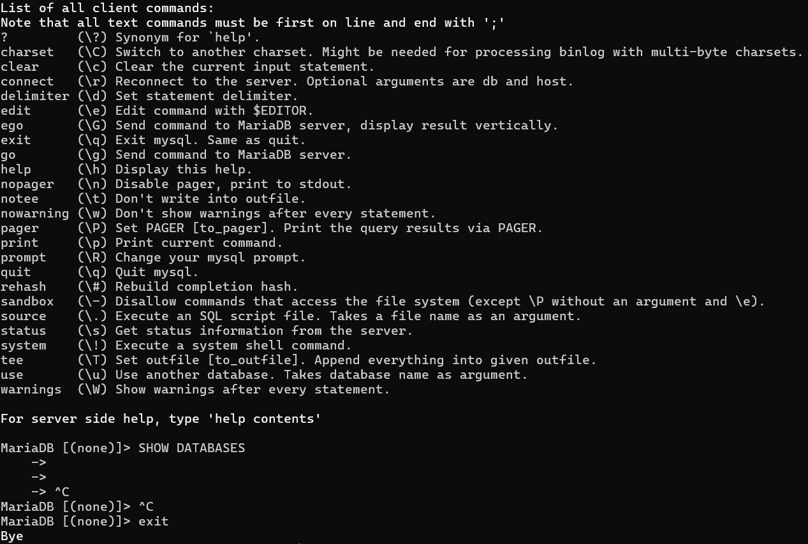
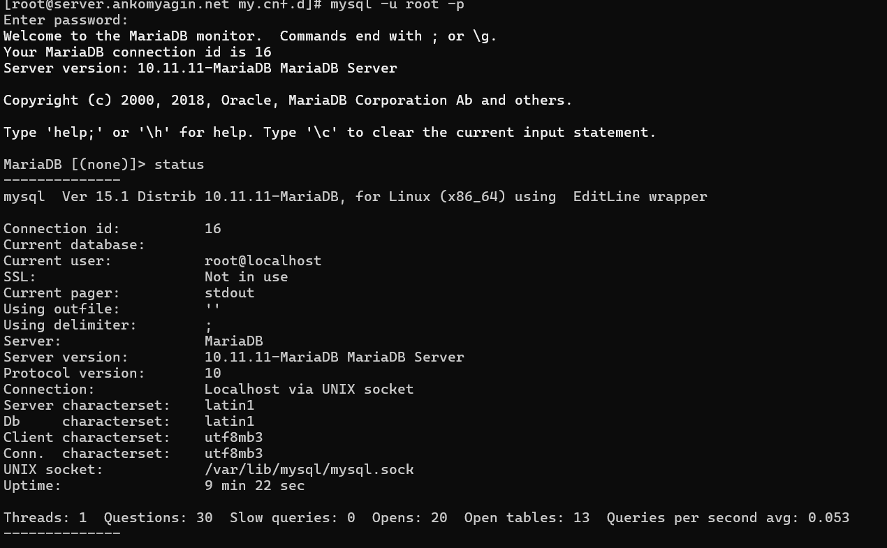
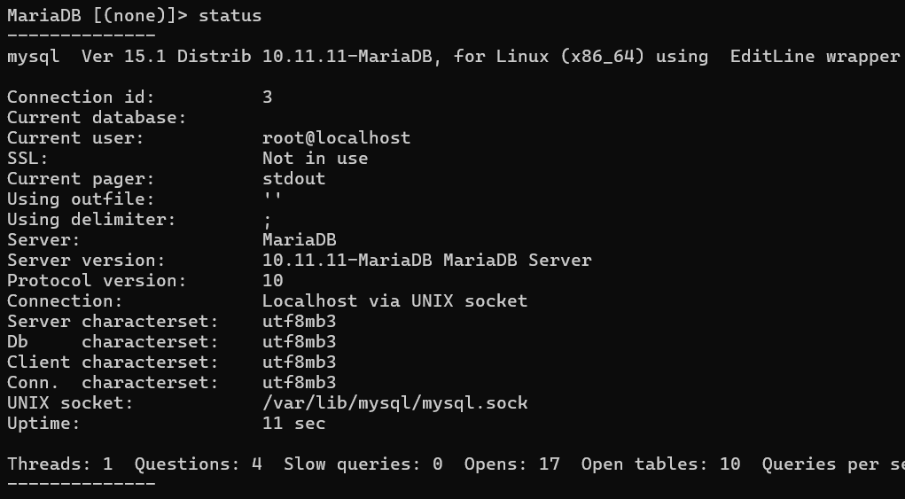
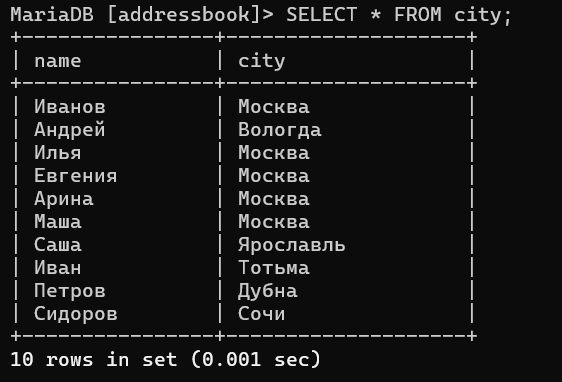

---
## Front matter
lang: ru-RU
title: Лабораторная №6
subtitle: Администрирование сетевых подсистем
  - Комягин А.Н.
institute:
  - Российский университет дружбы народов, Москва, Россия

## i18n babel
babel-lang: russian
babel-otherlangs: english

## Formatting pdf
toc: false
toc-title: Содержание
slide_level: 2
aspectratio: 169
section-titles: true
theme: metropolis
header-includes:
 - \metroset{progressbar=frametitle,sectionpage=progressbar,numbering=fraction}
 

## Fonts
mainfont: IBM Plex Serif
romanfont: IBM Plex Serif
sansfont: IBM Plex Sans
monofont: IBM Plex Mono
mathfont: STIX Two Math
mainfontoptions: Ligatures=Common,Ligatures=TeX,Scale=0.94
romanfontoptions: Ligatures=Common,Ligatures=TeX,Scale=0.94
sansfontoptions: Ligatures=Common,Ligatures=TeX,Scale=MatchLowercase,Scale=0.94
monofontoptions: Scale=MatchLowercase,Scale=0.94,FakeStretch=0.9
 
---

# Цель

## Цель работы

Приобретение практических навыков по установке и конфигурированию системы управления базами данных на примере программного обеспечения MariaDB.

# Ход работы 

# Установка MariaDB

## установка

## конфигурация

Посмотрим конфигурационные файлы mariadb:

Основной файл: **/etc/my.cnf**. Раньше он содержал все настройки, но сейчас обычно просто "включает" в себя файлы из специального каталога.

Каталог с файлами: **/etc/my.cnf.d/**. Это современный подход, позволяющий разделять конфигурацию на логические части. Сервер при запуске читает все файлы с расширением .cnf из этого каталога в алфавитном порядке.

## конфигурация

Комментарий к файлу **/etc/my.cnf**

**!includedir /etc/my.cnf.d/**: самая важная строка. Она говорит MariaDB загрузить и применить все .cnf файлы, которые находятся в каталоге /etc/my.cnf.d/. По сути, этот файл просто указывает, где лежат настоящие настройки.

## конфигурация

Комментарий к файлам в каталоге **/etc/my.cnf.d/**

1. Файл **client.cnf**
Этот файл отвечает за настройки клиентских приложений.

2. Файл **mysql-clients.cnf**
Содержит пустые секции для различных клиентских утилит. Нужен для того, чтобы пользователь мог легко добавить специфичные настройки для каждой из них.

## конфигурация

3. Файл **mariadb-server.cnf** (самый важный)
Этот файл содержит основные настройки самого сервера баз данных.

В этом файле:
**datadir=/var/lib/mysql** - Путь к каталогу, где хранятся файлы баз данных 
**socket=/var/lib/mysql/mysql.sock** - Путь к файлу сокета
**log-error=/var/log/mariadb/mariadb.log** - Путь к файлу журнала ошибок.
**pid-file=/run/mariadb/mariadb.pid** - Путь к файлу, в котором хранится идентификатор процесса (PID) запущенного сервера.
**bind-address=0.0.0.0** - Указывает серверу принимать подключения на всех сетевых интерфейсах

## прослушивание порта 3306

# Базовое конфигурирование HTTP-сервера

## Конфигурационный файл

## Конфигурационный файл

## проверка работы среды бд

# Конфигурация кодировки символов

## статус MariaDB

## статус MariaDB обновлённый

# Создание базы данных

## вывод из таблицы

## добавление пользователя

## список баз данных

# Резервные копии

## резервные копии

# Внесение изменений в настройки внутреннего окружения виртуальной машины

По аналогии с прошлыми лабораторными работами внесём изменения в настройки внутреннего окружения. 

Заменим различные конфигурационные файлы

Изменим скрипт mysql.sh, который повторит действия по установке и настройке HTTPS-сервера. И добавим его выполнение в Vagrantfile.

# Контрольные вопросы

## Какая команда отвечает за настройки безопасности в MariaDB?

За первоначальную базовую настройку безопасности отвечает интерактивный скрипт mysql_secure_installation.

Этот скрипт помогает выполнить несколько ключевых действий для защиты сервера:

Установить пароль для пользователя root.

Удалить анонимных пользователей.

Запретить удаленное подключение для пользователя root.

Удалить тестовую базу данных, доступную всем по умолчанию.

## Как настроить MariaDB для доступа через сеть?

Чтобы разрешить доступ к MariaDB по сети, необходимо в конфигурационном файле (обычно /etc/my.cnf.d/mariadb-server.cnf) в секции [mysqld] добавить или изменить параметр bind-address.

Чтобы разрешить подключения со всех IP-адресов, используется значение 0.0.0.0:
bind-address = 0.0.0.0

Если нужно разрешить подключения только с определенного IP-адреса, его нужно указать явно. После внесения изменений службу MariaDB необходимо перезапустить.

## Какая команда позволяет получить обзор доступных баз данных после входа в среду оболочки MariaDB?

Для просмотра списка всех баз данных на сервере используется команда SHOW DATABASES;.

## Какая команда позволяет узнать, какие таблицы доступны в базе данных?

После выбора конкретной базы данных (с помощью команды USE имя_базы;), для просмотра всех таблиц в ней используется команда SHOW TABLES;.

## Какая команда позволяет узнать, какие поля доступны в таблице?

Для просмотра структуры таблицы, включая названия полей (столбцов), их типы данных и другую информацию, используется команда DESCRIBE имя_таблицы;. Сокращенный вариант этой команды — DESC имя_таблицы;.

## Какая команда позволяет узнать, какие записи доступны в таблице?

Чтобы посмотреть все записи (строки) и все поля в таблице, используется команда SELECT. Классический запрос для этого выглядит так: SELECT * FROM имя_таблицы;.

## Как удалить запись из таблицы?
Для удаления записей используется команда DELETE FROM. Крайне важно использовать ее вместе с условием WHERE, чтобы указать, какую именно запись (или записи) нужно удалить.

Пример удаления одной записи:
DELETE FROM имя_таблицы WHERE id = 5;

Если выполнить команду DELETE FROM имя_таблицы; без условия WHERE, будут удалены все записи из таблицы.

## Где расположены файлы конфигурации MariaDB? Что можно настроить с их помощью?

Расположение: Основные конфигурационные файлы обычно находятся в каталоге /etc/. Современный подход предполагает использование главного файла /etc/my.cnf, который, в свою очередь, подключает все файлы с расширением .cnf из каталога /etc/my.cnf.d/. Ключевые настройки самого сервера находятся в файле /etc/my.cnf.d/mariadb-server.cnf.

Что можно настроить: С помощью этих файлов можно настроить практически все аспекты работы сервера, включая:

* Сетевые параметры (порт, адрес для подключений).

* Пути к файлам данных, логам и сокетам.

* Настройки производительности (размеры буферов и кэшей).

## Где располагаются файлы с базами данных MariaDB?

По умолчанию файлы баз данных (таблицы, индексы) располагаются в каталоге /var/lib/mysql/.

Этот путь определяется параметром datadir в конфигурационном файле сервера.

## Как сделать резервную копию базы данных и затем её восстановить?

Для создания и восстановления логических резервных копий используется утилита командной строки mysqldump.

Создание резервной копии (бэкапа):
Команда выгружает структуру и данные указанной базы в текстовый файл в виде SQL-команд.

**mysqldump -u [пользователь] -p [имя_базы] > backup.sql**

Восстановление из резервной копии:
Для восстановления нужно выполнить SQL-команды из файла бэкапа. Это делается путем перенаправления содержимого файла на вход клиента mysql.

**mysql -u [пользователь] -p [имя_базы] < backup.sql**

# Вывод

## Выводы

В ходе выполнения лабораторной работы я приобрёл практические навыки по установке и конфигурированию системы управления базами данных на примере программного обеспечения MariaDB.

