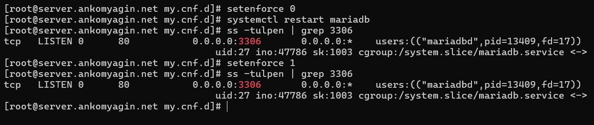
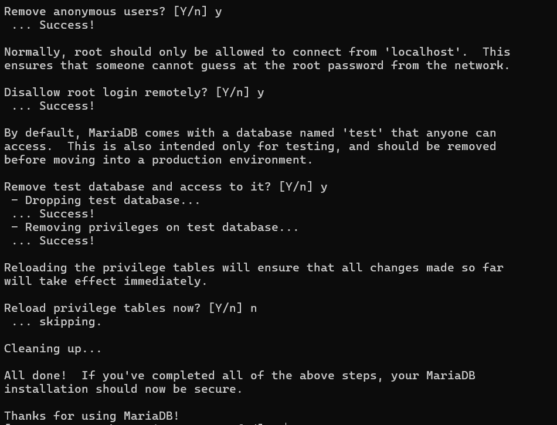
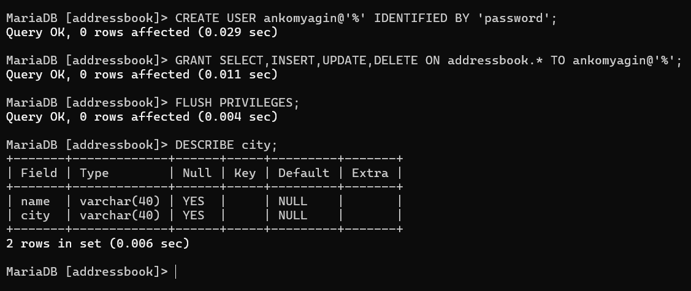
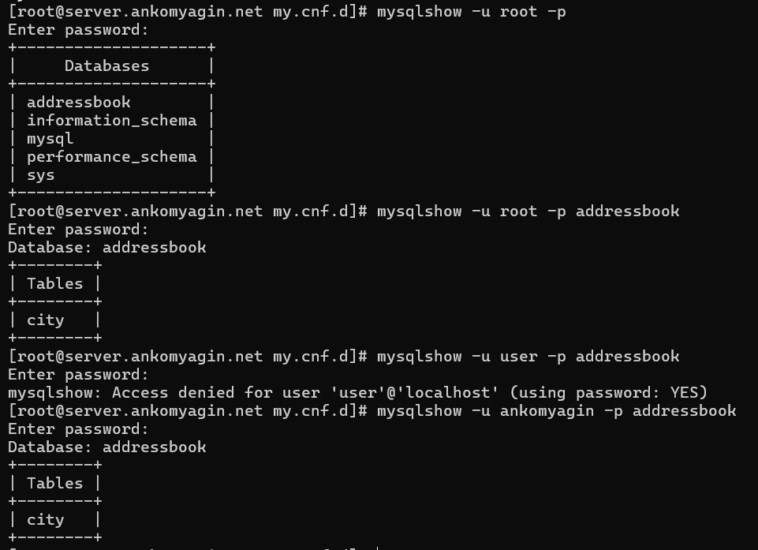
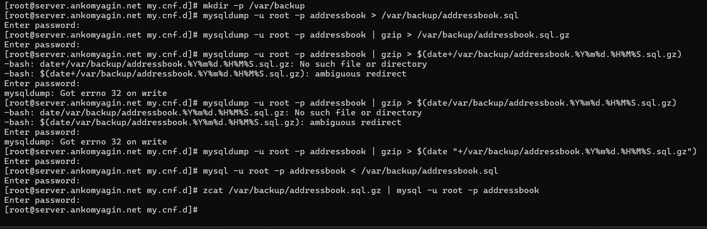

---
# Front matter
title: "Лабораторная работа №6"
subtitle: "Дисциплина: Администрирование сетевых подсистем"
author: "Комягин Андрей Николаевич"

# Generic options
lang: ru-RU
toc-title: "Содержание"

# Bibliography
bibliography: bib/cite.bib
csl: pandoc/csl/gost-r-7-0-5-2008-numeric.csl

# Pdf output format
toc: true                # Table of contents
toc-depth: 2
lof: true                # List of figures
lot: true                # List of tables
fontsize: 12pt
linestretch: 1.5
papersize: a4
documentclass: scrreprt

# I18n polyglossia
polyglossia-lang:
  name: russian
  options:
    - spelling=modern
    - babelshorthands=true
polyglossia-otherlangs:
  name: english

# I18n babel
babel-lang: russian
babel-otherlangs: english

# Fonts
mainfont: IBM Plex Serif
romanfont: IBM Plex Serif
sansfont: IBM Plex Sans
monofont: IBM Plex Mono
mathfont: STIX Two Math
mainfontoptions: Ligatures=Common,Ligatures=TeX,Scale=0.94
romanfontoptions: Ligatures=Common,Ligatures=TeX,Scale=0.94
sansfontoptions: Ligatures=Common,Ligatures=TeX,Scale=MatchLowercase,Scale=0.94
monofontoptions: Scale=MatchLowercase,Scale=0.94,FakeStretch=0.9
mathfontoptions: []

# Biblatex
biblatex: true
biblio-style: gost-numeric
biblatexoptions:
  - parentracker=true
  - backend=biber
  - hyperref=auto
  - language=auto
  - autolang=other*
  - citestyle=gost-numeric

# Pandoc-crossref LaTeX customization
figureTitle: "Рис."
tableTitle: "Таблица"
listingTitle: "Листинг"
lofTitle: "Список иллюстраций"
lotTitle: "Список таблиц"
lolTitle: "Листинги"

# Misc options
indent: true
header-includes:
  - \usepackage{indentfirst}
  - \usepackage{float}        # keep figures where they are in the text
  - \floatplacement{figure}{H}
---

# Цель работы

Приобретение практических навыков по установке и конфигурированию системы управления базами данных на примере программного обеспечения MariaDB.

# Выполнение лабораторной работы

## Установка MariaDB

Загружaем операционну систему с помощью Vagrant и входим в терминал под именем ankomyagin.

Установим необходимые пакеты для работы с бд(рис. [-@fig:001]).

{#fig:001 width=70%}

Посмотрим конфигурационные файлы mariadb:

Основной файл: **/etc/my.cnf**. Раньше он содержал все настройки, но сейчас обычно просто "включает" в себя файлы из специального каталога.

Каталог с файлами: **/etc/my.cnf.d/**. Это современный подход, позволяющий разделять конфигурацию на логические части. Сервер при запуске читает все файлы с расширением .cnf из этого каталога в алфавитном порядке.

Комментарий к файлу **/etc/my.cnf**

**!includedir /etc/my.cnf.d/**: самая важная строка. Она говорит MariaDB загрузить и применить все .cnf файлы, которые находятся в каталоге /etc/my.cnf.d/. По сути, этот файл просто указывает, где лежат настоящие настройки.

Комментарий к файлам в каталоге **/etc/my.cnf.d/**

1. Файл **client.cnf**
Этот файл отвечает за настройки клиентских приложений.

2. Файл **mysql-clients.cnf**
Содержит пустые секции для различных клиентских утилит. Нужен для того, чтобы пользователь мог легко добавить специфичные настройки для каждой из них.

3. Файл **mariadb-server.cnf** (самый важный)
Этот файл содержит основные настройки самого сервера баз данных.

В этом файле:
**datadir=/var/lib/mysql** - Путь к каталогу, где хранятся файлы баз данных 
**socket=/var/lib/mysql/mysql.sock** - Путь к файлу сокета
**log-error=/var/log/mariadb/mariadb.log** - Путь к файлу журнала ошибок.
**pid-file=/run/mariadb/mariadb.pid** - Путь к файлу, в котором хранится идентификатор процесса (PID) запущенного сервера.
**bind-address=0.0.0.0** - Указывает серверу принимать подключения на всех сетевых интерфейсах

Запустим и включим программное обеспечение mariadb. Затем убедимся, что дб прослушивает порт 3306(рис. [-@fig:002])

{#fig:002 width=70%}

Запустим скрипт конфигурации безопасности mysql_secure_installation и настроим конфигурацию(рис. [-@fig:003]), (рис. [-@fig:004]).

{#fig:003 width=70%}

{#fig:004 width=70%}

Войдём в бд с правами администратора. Посмотрим список возможных команд, выведем список баз данных. В списке баз данных есть: **information_schema, sql, sys, perfomance_schema**. На изображении их не видно из-за некорректного ввода команды (рис. [-@fig:005]).

{#fig:005 width=70%}

## Конфигурация кодировки символов

Посмотрим статус MariaDB(рис. [-@fig:006])

{#fig:006 width=70%}

В статусе мы видим:

Айди подключения - 16
Текущую базу данных - (не выбрана, поэтому нет)
Текущий пользователь - (в нашем случае рут)
SSL - не используется
Тип сервера - MariaDB
Версию сервера
Версию протокола
Тип соединения
Далее видим несколько строк, которые отвечают за кодировку
Тип сокета, который мы уже видели в конфигурационном файле
Время работы - (9 минут 22 секунды)

Поработаем с кодировкой. Создадим конфигурационный файл и добавим кодировку utf-8 для client и mysql. Перезапустим сервис.

В результате посмотрим обновлённый статус MariaDB (рис. [-@fig:007]).

{#fig:007 width=70%}

Заметим, что кодировка для server и db теперь та, которую мы задали в конфигурационном файле вместо latin1 utf-8mb3. Также отметим, что после перезапуска сервиса прошло 11 секунд.

## Создание базы данных

Создадим бд с именем addressbook. Перейдём к этой базе данных, отразим столбцы (их нет). Создадим столбес с названием город, который будет иметь 2 поля: имя и город. Заполним несколько строк тестовыми данными. Затем сделаем запрос в бд, в котором попросим вывести все (*) значения из таблицы сити (рис. [-@fig:008]).

В качестве вывода видим имена людей и города, которые к ним прикреплены. Выведены они в порядке добавления данных.

{#fig:008 width=70%}

Затем создадим пользователя для работы с бд и предоставим ему необходимые права доступа (рис. [-@fig:009])

{#fig:009 width=70%}

После этого посмотрим список баз данных и список таблиц (рис. [-@fig:010])

{#fig:010 width=70%}

## Резервные копии

Создадим каталог для резервных копий и сделаем копии базы addressbook. Также попробуем восстановить бд из копий (рис. [-@fig:011])

{#fig:011 width=70%}

## Внесение изменений в настройки внутреннего окружения виртуальной машины

По аналогии с прошлыми лабораторными работами внесём изменения в настройки внутреннего окружения. 

Заменим различные конфигурационные файлы

Изменим скрипт mysql.sh, который повторит действия по установке и настройке HTTPS-сервера. И добавим его выполнение в Vagrantfile.

# Контрольные вопросы

1. Какая команда отвечает за настройки безопасности в MariaDB?

За первоначальную базовую настройку безопасности отвечает интерактивный скрипт mysql_secure_installation.

Этот скрипт помогает выполнить несколько ключевых действий для защиты сервера:

Установить пароль для пользователя root.

Удалить анонимных пользователей.

Запретить удаленное подключение для пользователя root.

Удалить тестовую базу данных, доступную всем по умолчанию.

2. Как настроить MariaDB для доступа через сеть?

Чтобы разрешить доступ к MariaDB по сети, необходимо в конфигурационном файле (обычно /etc/my.cnf.d/mariadb-server.cnf) в секции [mysqld] добавить или изменить параметр bind-address.

Чтобы разрешить подключения со всех IP-адресов, используется значение 0.0.0.0:
bind-address = 0.0.0.0

Если нужно разрешить подключения только с определенного IP-адреса, его нужно указать явно. После внесения изменений службу MariaDB необходимо перезапустить.

3. Какая команда позволяет получить обзор доступных баз данных после входа в среду оболочки MariaDB?

Для просмотра списка всех баз данных на сервере используется команда SHOW DATABASES;.

4. Какая команда позволяет узнать, какие таблицы доступны в базе данных?

После выбора конкретной базы данных (с помощью команды USE имя_базы;), для просмотра всех таблиц в ней используется команда SHOW TABLES;.

5. Какая команда позволяет узнать, какие поля доступны в таблице?

Для просмотра структуры таблицы, включая названия полей (столбцов), их типы данных и другую информацию, используется команда DESCRIBE имя_таблицы;. Сокращенный вариант этой команды — DESC имя_таблицы;.

6. Какая команда позволяет узнать, какие записи доступны в таблице?

Чтобы посмотреть все записи (строки) и все поля в таблице, используется команда SELECT. Классический запрос для этого выглядит так: SELECT * FROM имя_таблицы;.

7. Как удалить запись из таблицы?
Для удаления записей используется команда DELETE FROM. Крайне важно использовать ее вместе с условием WHERE, чтобы указать, какую именно запись (или записи) нужно удалить.

Пример удаления одной записи:
DELETE FROM имя_таблицы WHERE id = 5;

Если выполнить команду DELETE FROM имя_таблицы; без условия WHERE, будут удалены все записи из таблицы.

8. Где расположены файлы конфигурации MariaDB? Что можно настроить с их помощью?

Расположение: Основные конфигурационные файлы обычно находятся в каталоге /etc/. Современный подход предполагает использование главного файла /etc/my.cnf, который, в свою очередь, подключает все файлы с расширением .cnf из каталога /etc/my.cnf.d/. Ключевые настройки самого сервера находятся в файле /etc/my.cnf.d/mariadb-server.cnf.

Что можно настроить: С помощью этих файлов можно настроить практически все аспекты работы сервера, включая:

* Сетевые параметры (порт, адрес для подключений).

* Пути к файлам данных, логам и сокетам.

* Настройки производительности (размеры буферов и кэшей).

* Параметры репликации и кластеризации.

* Настройки безопасности и кодировок по умолчанию.

9. Где располагаются файлы с базами данных MariaDB?

По умолчанию файлы баз данных (таблицы, индексы) располагаются в каталоге /var/lib/mysql/.

Этот путь определяется параметром datadir в конфигурационном файле сервера.

10. Как сделать резервную копию базы данных и затем её восстановить?

Для создания и восстановления логических резервных копий используется утилита командной строки mysqldump.

Создание резервной копии (бэкапа):
Команда выгружает структуру и данные указанной базы в текстовый файл в виде SQL-команд.

**mysqldump -u [пользователь] -p [имя_базы] > backup.sql**

Восстановление из резервной копии:
Для восстановления нужно выполнить SQL-команды из файла бэкапа. Это делается путем перенаправления содержимого файла на вход клиента mysql.

**mysql -u [пользователь] -p [имя_базы] < backup.sql**

# Выводы

В ходе выполнения лабораторной работы я приобрёл практические навыки по установке и конфигурированию системы управления базами данных на примере программного обеспечения MariaDB.

# Список литературы{.unnumbered}

[ТУИС] (https://esystem.rudn.ru/pluginfile.php/2854738/mod_resource/content/8/003-dhcp.pdf)

