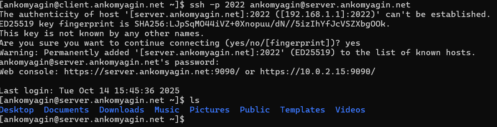

---
## Front matter
lang: ru-RU
title: Лабораторная работа №7
subtitle: Расширенные настройки межсетевого экрана
author:
  - Комягин А.Н.
institute:
  - Российский университет дружбы народов, Москва, Россия

## i18n babel
babel-lang: russian
babel-otherlangs: english

## Formatting pdf
toc: false
toc-title: Содержание
slide_level: 2
aspectratio: 169
section-titles: true
theme: metropolis
header-includes:
 - \metroset{progressbar=frametitle,sectionpage=progressbar,numbering=fraction}
 

## Fonts
mainfont: IBM Plex Serif
romanfont: IBM Plex Serif
sansfont: IBM Plex Sans
monofont: IBM Plex Mono
mathfont: STIX Two Math
mainfontoptions: Ligatures=Common,Ligatures=TeX,Scale=0.94
romanfontoptions: Ligatures=Common,Ligatures=TeX,Scale=0.94
sansfontoptions: Ligatures=Common,Ligatures=TeX,Scale=MatchLowercase,Scale=0.94
monofontoptions: Scale=MatchLowercase,Scale=0.94,FakeStretch=0.9
 
---

# Цель работы

## Цель работы

Получить навыки настройки межсетевого экрана в Linux в части **переадресации портов** и настройки **Masquerading**.

# Ход работы 

# 1. Создание пользовательской службы firewalld

## Изменение порта SSH

Создаём собственную службу `ssh-custom`, скопировав стандартную службу `ssh`.

В новом файле `/etc/firewalld/services/ssh-custom.xml` меняем порт с **22** на **2022**.

## Активация новой службы

Добавляем службу `ssh-custom` в постоянные правила `firewalld` и перезагружаем межсетевой экран.

# 2. Настройка перенаправления портов

## Переадресация и проверка

Настраиваем переадресацию трафика: всё, что приходит на порт **2022**, направляется на порт **22**.

Проверяем подключение с клиента: `ssh -p 2022 user@server...` — подключение успешно.

# 3. Настройка Masquerading

## Включение перенаправления и маскарадинга

Разрешаем перенаправление IPv4-пакетов в ядре системы.

Включаем маскарадинг для зоны `public`, чтобы разрешить клиентам выходить в интернет через наш сервер.

## Проверка доступа в Интернет

Проверяем с клиентской машины доступность внешних ресурсов командой `ping`. Доступ есть.

# 4. Автоматизация Vagrant

## Создание provisioning-скрипта

Для автоматизации всех настроек создаём структуру каталогов и копируем в неё наши конфигурационные файлы (`ssh-custom.xml` и `90-forward.conf`).

## Скрипт и Vagrantfile

Пишем shell-скрипт `firewall.sh`, который применяет все настройки.

Добавляем вызов этого скрипта в `Vagrantfile` для автоматического выполнения при запуске виртуальной машины.

# Контрольные вопросы

##  Где хранятся пользовательские файлы firewalld?
    Пользовательские файлы служб `firewalld` хранятся в каталоге `/etc/firewalld/services/`. Файлы в этом каталоге имеют приоритет над стандартными файлами служб из `/usr/lib/firewalld/services/`.

##  Какую строку надо включить в пользовательский файл службы, чтобы указать порт TCP 2022?
    Необходимо включить следующую строку в XML-файл службы:
    

    <port protocol="tcp" port="2022"/>

##  Какая команда позволяет вам перечислить все службы, доступные в настоящее время на вашем сервере?
    Для перечисления всех доступных (но не обязательно активных) служб используется команда:
    

    firewall-cmd --get-services

##  В чем разница между трансляцией сетевых адресов (NAT) и маскарадингом (masquerading)?
    NAT (Network Address Translation) — это общий механизм преобразования IP-адресов. Маскарадинг — это частный случай NAT (а именно, NAT Overload или PAT), который используется, когда внешний IP-адрес шлюза является динамическим. Маскарадинг автоматически определяет IP-адрес исходящего интерфейса и подставляет его в качестве адреса источника для пакетов из локальной сети, в то время как для статического NAT (SNAT) нужно явно указывать IP-адрес для подстановки.

##  Какая команда разрешает входящий трафик на порт 4404 и перенаправляет его в службу ssh по IP-адресу 10.0.0.10?
    Для этого используется команда перенаправления порта, где в качестве адресата (`toaddr`) указывается нужный IP, а в качестве порта назначения (`toport`) — порт службы SSH (22):
    

    firewall-cmd --add-forward-port=port=4404:proto=tcp:toport=22:toaddr=10.0.0.10

##  Какая команда используется для включения маскарадинга IP-пакетов для всех пакетов, выходящих в зону public?
    Для включения маскарадинга в зоне `public` используется следующая команда:
    

    firewall-cmd --zone=public --add-masquerade

    
    Для сохранения правила после перезагрузки необходимо добавить флаг `--permanent`.

# Выводы

## Выводы

В ходе лабораторной работы я получил практические навыки настройки межсетевого экрана `firewalld` в Rocky Linux.

Были успешно выполнены:
*   Создание кастомной службы для SSH на нестандартном порту.
*   Настройка переадресации портов (Port Forwarding).
*   Настройка маскарадинга (Masquerading/NAT) для предоставления доступа в интернет.
*   Автоматизация конфигурации с помощью Vagrant.
