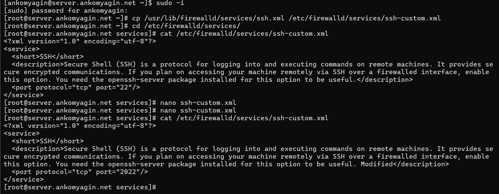
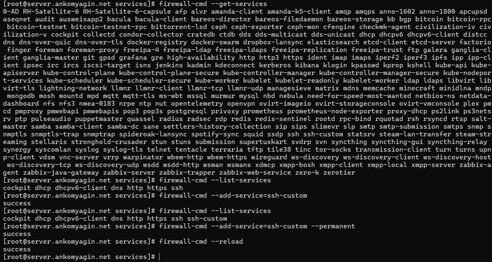
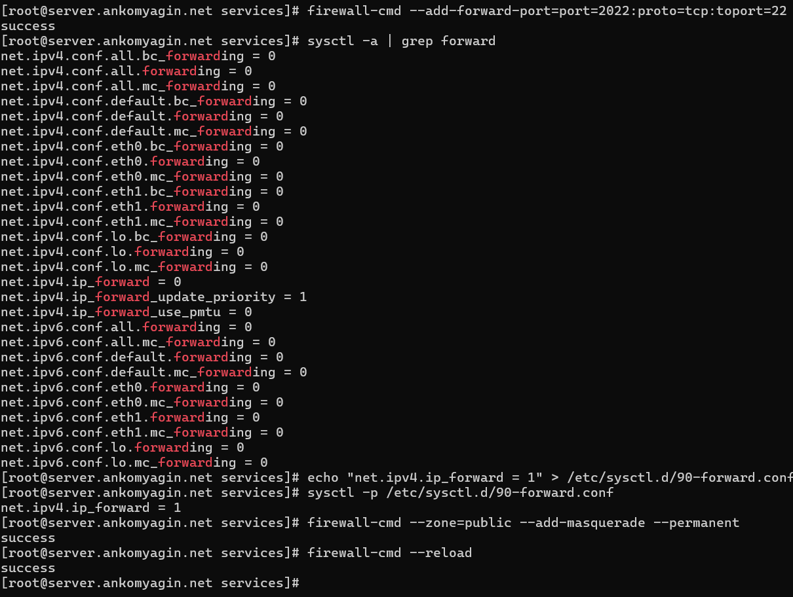
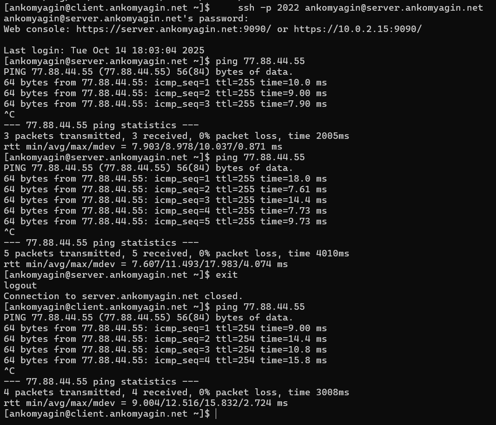
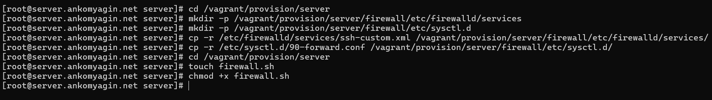

---
# Front matter
title: "Лабораторная работа №7"
subtitle: "Дисциплина: Администрирование сетевых подсистем"
author: "Комягин Андрей Николаевич"

# Generic options
lang: ru-RU
toc-title: "Содержание"

# Bibliography
bibliography: bib/cite.bib
csl: pandoc/csl/gost-r-7-0-5-2008-numeric.csl

# Pdf output format
toc: true                # Table of contents
toc-depth: 2
lof: true                # List of figures
lot: true                # List of tables
fontsize: 12pt
linestretch: 1.5
papersize: a4
documentclass: scrreprt

# I18n polyglossia
polyglossia-lang:
  name: russian
  options:
    - spelling=modern
    - babelshorthands=true
polyglossia-otherlangs:
  name: english

# I18n babel
babel-lang: russian
babel-otherlangs: english

# Fonts
mainfont: IBM Plex Serif
romanfont: IBM Plex Serif
sansfont: IBM Plex Sans
monofont: IBM Plex Mono
mathfont: STIX Two Math
mainfontoptions: Ligatures=Common,Ligatures=TeX,Scale=0.94
romanfontoptions: Ligatures=Common,Ligatures=TeX,Scale=0.94
sansfontoptions: Ligatures=Common,Ligatures=TeX,Scale=MatchLowercase,Scale=0.94
monofontoptions: Scale=MatchLowercase,Scale=0.94,FakeStretch=0.9
mathfontoptions: []

# Biblatex
biblatex: true
biblio-style: gost-numeric
biblatexoptions:
  - parentracker=true
  - backend=biber
  - hyperref=auto
  - language=auto
  - autolang=other*
  - citestyle=gost-numeric

# Pandoc-crossref LaTeX customization
figureTitle: "Рис."
tableTitle: "Таблица"
listingTitle: "Листинг"
lofTitle: "Список иллюстраций"
lotTitle: "Список таблиц"
lolTitle: "Листинги"

# Misc options
indent: true
header-includes:
  - \usepackage{indentfirst}
  - \usepackage{float}        # keep figures where they are in the text
  - \floatplacement{figure}{H}
---

# Цель работы

Получить навыки настройки межсетевого экрана в Linux в части переадресации портов и настройки Masquerading.

# Ход работы

## Создание пользовательской службы firewalld

1.  Первым шагом было создание пользовательской службы `firewalld`. Для этого мы скопировали существующий файл службы `ssh.xml` в новый файл `ssh-custom.xml` в каталоге `/etc/firewalld/services/`.

    


2.  Далее, мы открыли файл `ssh-custom.xml` и изменили стандартный порт SSH с 22 на 2022, а также добавили "Modified" в описание для наглядности.

    *   **Содержимое файла `/etc/firewalld/services/ssh-custom.xml` до изменения:**
    
        ```xml
        <?xml version="1.0" encoding="utf-8"?>
        <service>
          <short>SSH</short>
          <description>Secure Shell (SSH) is a protocol for logging into and 
          executing commands on remote machines. It provides secure encrypted 
          communications. If you plan on accessing your machine remotely via 
          SSH over a firewalled interface, enable this option. You need the 
          openssh-server package installed for this option to be useful.
          </description>
          <port protocol="tcp" port="22"/>
        </service>
        ```
        
    *   **Содержимое файла `/etc/firewalld/services/ssh-custom.xml` после изменения:**
    
        ```xml
        <?xml version="1.0" encoding="utf-8"?>
        <service>
          <short>SSH</short>
          <description>Secure Shell (SSH) is a protocol for logging into 
          and executing commands on remote machines. It provides secure 
          encrypted communications. If you plan on accessing your machine 
          remotely via SSH over a firewalled interface, enable this option. 
          You need the openssh-server package installed for this option to 
          be useful. Modified</description>
          <port protocol="tcp" port="2022"/>
        </service>
        ```
        

3.  **Построчный комментарий к синтаксису файла службы `ssh-custom.xml`:**

    *   `<?xml version="1.0" encoding="utf-8"?>` — это стандартный заголовок XML-документа, который определяет версию XML и кодировку символов (в данном случае UTF-8).
    *   `<service>` — это корневой тег, который обозначает начало описания службы для `firewalld`. Все остальные элементы, описывающие службу, должны находиться внутри этого тега.
    *   `<short>SSH</short>` — тег для краткого, удобочитаемого имени службы. Это имя будет отображаться, например, в графических утилитах управления `firewalld`.
    *   `<description>...</description>` — тег для полного, развернутого описания службы. Этот текст помогает понять назначение службы. Мы добавили в конец слово `Modified`, чтобы легко отличить нашу кастомную службу.
    *   `<port protocol="tcp" port="2022"/>` — это ключевой тег, определяющий сетевой порт. Атрибут `protocol="tcp"` указывает, что используется протокол TCP. Атрибут `port="2022"` задает номер порта, который будет открыт для данной службы. Именно это значение мы изменили с "22" на "2022".
    *   `</service>` — закрывающий тег, который завершает описание службы.
    
    
        
    

3.  После создания и изменения файла службы, мы перезагрузили правила `firewalld` с помощью команды `firewall-cmd --reload`. Затем мы добавили нашу новую службу `ssh-custom` в текущую сессию и в постоянные правила, чтобы изменения сохранились после перезагрузки.

    

## Перенаправление портов и проверка доступа

1.  Мы организовали перенаправление портов на сервере: весь трафик, приходящий на порт 2022, был перенаправлен на порт 22. Это позволяет подключаться к стандартной службе SSH через нестандартный порт.

2.  С клиентской машины мы успешно выполнили подключение по SSH к серверу, используя новый порт 2022.

    
    
## Настройка Masquerading и Port Forwarding

1.  Для предоставления доступа в Интернет клиентской машине через сервер, мы включили перенаправление IPv4-пакетов в ядре системы.

2.  Затем мы добавили правило маскарадинга для зоны `public`. Это позволило клиентской машине выходить в Интернет, используя IP-адрес сервера.

    

3.  Проверка с клиентской машины показала, что доступ в Интернет появился: команда `ping` до внешнего узла (`77.88.44.55`) успешно выполнялась.

    

## Автоматизация настройки с помощью Vagrant

1.  Для автоматизации всех выполненных настроек мы подготовили скрипт для `Vagrant`. Сначала была создана необходимая структура каталогов для хранения конфигурационных файлов.

2.  В созданные каталоги были скопированы наши файлы `ssh-custom.xml` и `90-forward.conf`.


3.  Был создан исполняемый скрипт `firewall.sh`, который копирует конфигурационные файлы в систему и применяет все необходимые правила `firewalld`.


4.  Наконец, был модифицирован `Vagrantfile`, чтобы этот скрипт выполнялся при запуске виртуальной машины `server`.


# Контрольные вопросы

1.  **Где хранятся пользовательские файлы firewalld?**
    Пользовательские файлы служб `firewalld` хранятся в каталоге `/etc/firewalld/services/`. Файлы в этом каталоге имеют приоритет над стандартными файлами служб из `/usr/lib/firewalld/services/`.

2.  **Какую строку надо включить в пользовательский файл службы, чтобы указать порт TCP 2022?**
    Необходимо включить следующую строку в XML-файл службы:
    ```xml
    <port protocol="tcp" port="2022"/>
    ```

3.  **Какая команда позволяет вам перечислить все службы, доступные в настоящее время на вашем сервере?**
    Для перечисления всех доступных (но не обязательно активных) служб используется команда:
    ```bash
    firewall-cmd --get-services
    ```

4.  **В чем разница между трансляцией сетевых адресов (NAT) и маскарадингом (masquerading)?**
    NAT (Network Address Translation) — это общий механизм преобразования IP-адресов. Маскарадинг — это частный случай NAT (а именно, NAT Overload или PAT), который используется, когда внешний IP-адрес шлюза является динамическим. Маскарадинг автоматически определяет IP-адрес исходящего интерфейса и подставляет его в качестве адреса источника для пакетов из локальной сети, в то время как для статического NAT (SNAT) нужно явно указывать IP-адрес для подстановки.

5.  **Какая команда разрешает входящий трафик на порт 4404 и перенаправляет его в службу ssh по IP-адресу 10.0.0.10?**
    Для этого используется команда перенаправления порта, где в качестве адресата (`toaddr`) указывается нужный IP, а в качестве порта назначения (`toport`) — порт службы SSH (22):
    ```bash
    firewall-cmd --add-forward-port=port=4404:proto=tcp:toport=22:toaddr=10.0.0.10
    ```

6.  **Какая команда используется для включения маскарадинга IP-пакетов для всех пакетов, выходящих в зону public?**
    Для включения маскарадинга в зоне `public` используется следующая команда:
    ```bash
    firewall-cmd --zone=public --add-masquerade
    ```
    Для сохранения правила после перезагрузки необходимо добавить флаг `--permanent`.

# Выводы

В ходе выполнения лабораторной работы я получил навыки настройки межсетевого экрана в Linux в части переадресации портов и настройки Masquerading.


# Список литературы{.unnumbered}

[ТУИС] (https://esystem.rudn.ru/pluginfile.php/2854738/mod_resource/content/8/003-dhcp.pdf)

