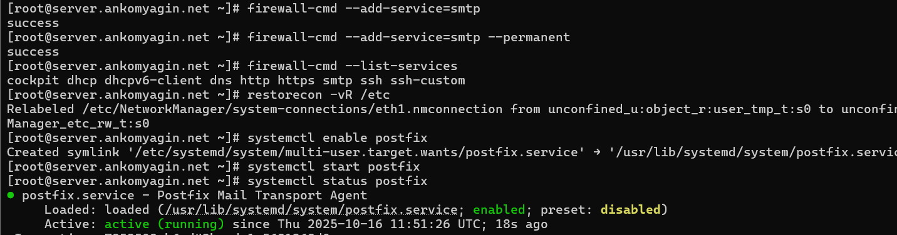
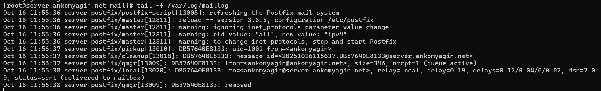
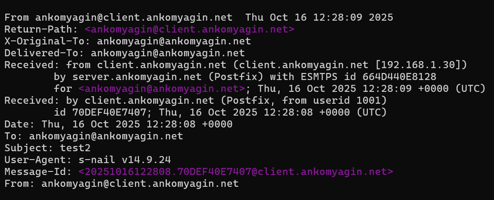

---
## Front matter
lang: ru-RU
title: Лабораторная работа №8
subtitle: Настройка SMTP-сервера
author:
  - Комягин А.Н.
institute:
  - Российский университет дружбы народов, Москва, Россия

## i18n babel
babel-lang: russian
babel-otherlangs: english

## Formatting pdf
toc: false
toc-title: Содержание
slide_level: 2
aspectratio: 169
section-titles: true
theme: metropolis
header-includes:
 - \metroset{progressbar=frametitle,sectionpage=progressbar,numbering=fraction}

## Fonts
mainfont: IBM Plex Serif
romanfont: IBM Plex Serif
sansfont: IBM Plex Sans
monofont: IBM Plex Mono
mathfont: STIX Two Math
mainfontoptions: Ligatures=Common,Ligatures=TeX,Scale=0.94
romanfontoptions: Ligatures=Common,Ligatures=TeX,Scale=0.94
sansfontoptions: Ligatures=Common,Ligatures=TeX,Scale=MatchLowercase,Scale=0.94
monofontoptions: Scale=MatchLowercase,Scale=0.94,FakeStretch=0.9
---

# Цель работы

## Цель работы

Приобретение практических навыков по установке и конфигурированию **SMTP-сервера**.

# Ход работы

# 1. Установка и запуск Postfix

## Установка пакетов и настройка firewall

Устанавливаем `postfix` и `s-nail`.

## Запуск службы

Открываем порт SMTP в `firewalld` и запускаем службу `postfix`.

# 2. Первоначальная настройка

## Настройка домена отправки

С помощью `postconf` изменяем параметр `myorigin` на `$mydomain`, чтобы письма отправлялись от имени нашего домена.

## Проверка и настройка протокола

Проверяем конфигурацию (`postfix check`), задаём домен и отключаем IPv6, оставляя только `ipv4`.

# 3. Проверка работы

## Локальная доставка почты

Отправляем тестовое письмо на локальный адрес и проверяем лог `/var/log/maillog`.

**Результат:** `status=sent (delivered to mailbox)` — письмо успешно доставлено.

## Проблема: доставка из сети

При отправке письма с клиента на сервер оно "застревает" в очереди.

**Причина:** Сервер не знает, как доставить ответное уведомление (`No route to host`).

# 4. Конфигурация для домена

## Настройка DNS

Для корректной маршрутизации почты добавляем **MX-запись** в прямую зону DNS.

## Настройка Postfix

*   Разрешаем Postfix принимать почту на всех интерфейсах (`inet_interfaces = all`).

*   Добавляем наш домен в `mydestination`, чтобы сервер считал себя конечным получателем.

*   Принудительно обрабатываем очередь (`postqueue -f`).

## Результат

Повторная отправка с клиента проходит успешно. Письмо доставлено на сервер.

# 5. Автоматизация Vagrant

## Скрипт для автоматизации

Для автоматической настройки сервера был написан bash-скрипт `mail.sh`, который выполняет установку пакетов и настройку `postfix` через `postconf`.

Этот скрипт был добавлен в `Vagrantfile` для автоматического выполнения при запуске виртуальной машины.

# Контрольные вопросы

## 1. Где находится конфигурация Postfix?

Основной каталог — `/etc/postfix/`.

Главный конфигурационный файл — `main.cf`.

## 2. Как проверить синтаксис конфигурации?

Для проверки корректности файлов конфигурации используется команда:

postfix check

## 3. Какие параметры нужны для работы с доменом?

mydomain — имя домена.

myorigin — домен для исходящей почты (обычно $mydomain).

inet_interfaces — для приема почты извне (значение all).

mydestination — домены, для которых сервер является конечной точкой.

## 4. Примеры работы с утилитой mail?

Отправить: echo "Тело" | mail -s "Тема" user@example.com

Просмотреть: mail (ввести номер письма для чтения).

Удалить: d <номер> в интерактивном режиме.

## 5. Примеры работы с postqueue?

Посмотреть очередь: postqueue -p

Отправить все: postqueue -f

Удалить письмо: postsuper -d <ID_сообщения>

# Выводы

## Выводы

В ходе лабораторной работы я получил практические навыки по:

Установке и базовой настройке SMTP-сервера Postfix.

Конфигурированию сервера для работы с локальными и доменными адресами.

Настройке DNS (MX-записи) для корректной маршрутизации почты.

Управлению почтовой очередью и анализу логов.
