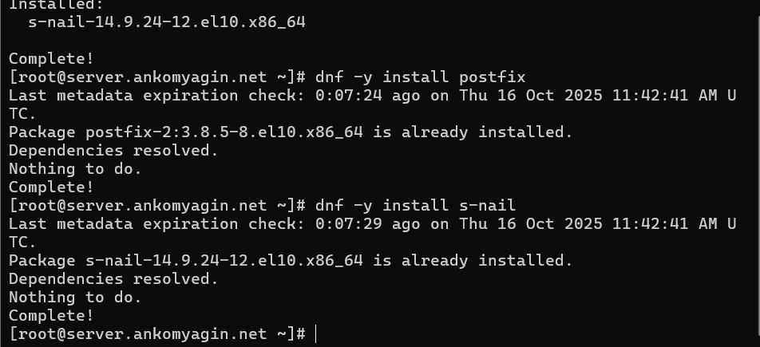
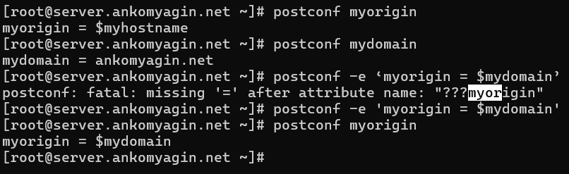
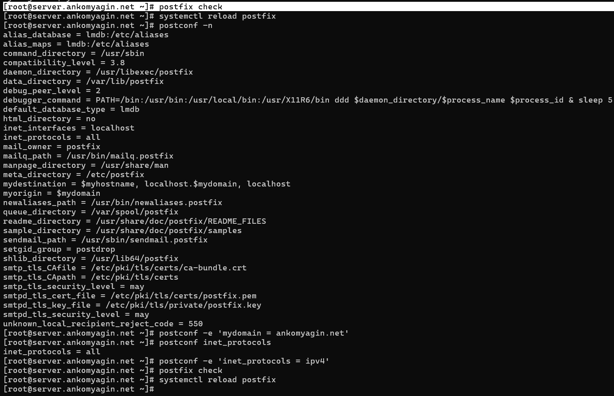
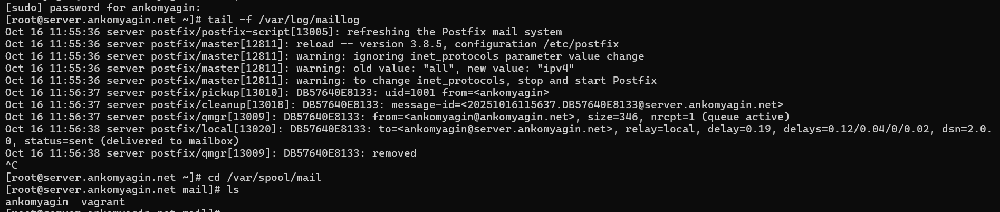
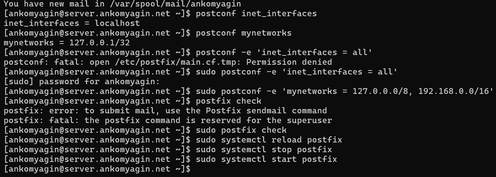
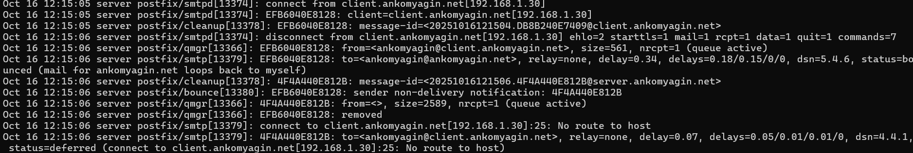
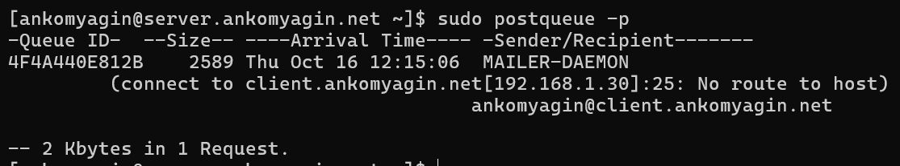
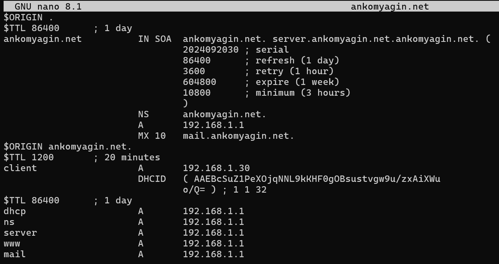
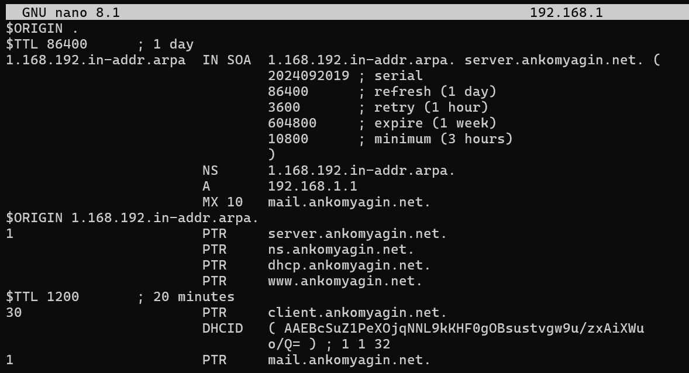
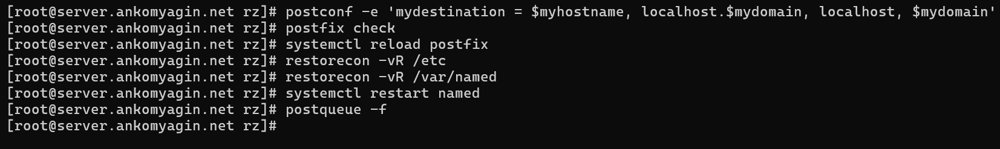

---
# Front matter
title: "Лабораторная работа №8"
subtitle: "Дисциплина: Администрирование сетевых подсистем"
author: "Комягин Андрей Николаевич"

# Generic options
lang: ru-RU
toc-title: "Содержание"

# Bibliography
bibliography: bib/cite.bib
csl: pandoc/csl/gost-r-7-0-5-2008-numeric.csl

# Pdf output format
toc: true                # Table of contents
toc-depth: 2
lof: true                # List of figures
lot: true                # List of tables
fontsize: 12pt
linestretch: 1.5
papersize: a4
documentclass: scrreprt

# I18n polyglossia
polyglossia-lang:
  name: russian
  options:
    - spelling=modern
    - babelshorthands=true
polyglossia-otherlangs:
  name: english

# I18n babel
babel-lang: russian
babel-otherlangs: english

# Fonts
mainfont: IBM Plex Serif
romanfont: IBM Plex Serif
sansfont: IBM Plex Sans
monofont: IBM Plex Mono
mathfont: STIX Two Math
mainfontoptions: Ligatures=Common,Ligatures=TeX,Scale=0.94
romanfontoptions: Ligatures=Common,Ligatures=TeX,Scale=0.94
sansfontoptions: Ligatures=Common,Ligatures=TeX,Scale=MatchLowercase,Scale=0.94
monofontoptions: Scale=MatchLowercase,Scale=0.94,FakeStretch=0.9
mathfontoptions: []

# Biblatex
biblatex: true
biblio-style: gost-numeric
biblatexoptions:
  - parentracker=true
  - backend=biber
  - hyperref=auto
  - language=auto
  - autolang=other*
  - citestyle=gost-numeric

# Pandoc-crossref LaTeX customization
figureTitle: "Рис."
tableTitle: "Таблица"
listingTitle: "Листинг"
lofTitle: "Список иллюстраций"
lotTitle: "Список таблиц"
lolTitle: "Листинги"

# Misc options
indent: true
header-includes:
  - \usepackage{indentfirst}
  - \usepackage{float}        # keep figures where they are in the text
  - \floatplacement{figure}{H}
---

# Цель работы

Приобретение практических навыков по установке и конфигурированию SMTP-сервера.

# Ход работы

## Установка Postfix

1.  Первым шагом была установка необходимых пакетов: `postfix` для SMTP-сервера и `s-nail` в качестве консольного почтового клиента.

    

2.  Далее была выполнена настройка межсетевого экрана `firewalld` для разрешения входящих соединений по протоколу SMTP. После этого служба `postfix` была добавлена в автозагрузку и запущена.

    

## Первоначальная настройка Postfix

1.  С помощью утилиты `postconf` были проверены текущие значения параметров `myorigin` (домен, от имени которого отправляется почта) и `mydomain` (домен, в котором расположен сервер).

2.  Параметр `myorigin` был изменён таким образом, чтобы он принимал значение из параметра `mydomain`. Это необходимо для корректной отправки почты от имени нашего домена.

    

3.  Была выполнена проверка синтаксиса конфигурационных файлов командой `postfix check`. Затем были заданы основной домен сервера и протокол работы (только IPv4), после чего конфигурация была перезагружена.

    

## Проверка локальной доставки почты

1.  Была выполнена отправка тестового письма с сервера на локальный адрес пользователя.

2.  С помощью мониторинга лог-файла `/var/log/maillog` мы убедились, что письмо было успешно доставлено в локальный почтовый ящик (`status=sent (delivered to mailbox)`). Также было проверено создание каталога для пользователя в `/var/spool/mail`.

    

## Настройка Postfix для работы в сети

1.  Для того чтобы сервер мог принимать почту из внешней сети (в нашем случае — от виртуальной машины `client`), были изменены два ключевых параметра:

    *   `inet_interfaces = all`: разрешает Postfix принимать соединения на всех сетевых интерфейсах, а не только на локальном.
    
    *   `mynetworks`: в этот параметр была добавлена внутренняя сеть, что позволило клиентам из этой сети отправлять почту через наш сервер.

    
    
    

2.  При попытке отправить письмо с клиента на сервер до завершения настройки DNS и Postfix, оно не доставлялось. В логах сервера была видна ошибка `No route to host`, так как сервер не знал, как доставить почту на машину `client`.

    

3.  Проверка очереди сообщений с помощью `postqueue -p` показала, что недоставленное письмо "застряло" в очереди.

    

## Конфигурация Postfix для домена

1.  Для корректной маршрутизации почты в домене в файлы прямой и обратной зон DNS были добавлены MX-записи, указывающие на наш почтовый сервер `mail.ankomyagin.net`.

    
    
    

2.  Далее был изменен параметр `mydestination` в конфигурации Postfix. В него был добавлен наш домен (`$mydomain`), что указало серверу на то, что он является конечной точкой доставки для писем, адресованных в этот домен.

3.  После изменения конфигурации службы `postfix` и `named` были перезапущены, а почтовая очередь была принудительно обработана командой `postqueue -f`.

    

4.  После всех настроек повторная отправка письма с машины `client` на доменный адрес `ankomyagin@ankomyagin.net` прошла успешно. Проверка почтового ящика на сервере подтвердила получение письма.

    
    
## Автоматизация настройки с помощью Vagrant

Для автоматизации развертывания почтового сервера был подготовлен скрипт `mail.sh` на языке bash, который выполняет все необходимые шаги: установку пакетов, настройку firewall и изменение конфигурационных файлов Postfix с помощью `postconf`. Далее в `Vagrantfile` была добавлена секция `provision`, которая автоматически запускает этот скрипт при создании или запуске виртуальной машины, что позволяет быстро развернуть полностью настроенный SMTP-сервер.

# Контрольные вопросы

1.  **В каком каталоге и в каком файле следует смотреть конфигурацию Postfix?**

    Основной каталог конфигурации Postfix — `/etc/postfix/`. Главный конфигурационный файл, содержащий большинство параметров, — `main.cf`.

2.  **Каким образом можно проверить корректность синтаксиса в конфигурационном файле Postfix?**

    Для проверки синтаксиса конфигурационных файлов Postfix используется команда `postfix check`. Она выведет ошибки, если они будут найдены.

3.  **В каких параметрах конфигурации Postfix требуется внести изменения в значениях для настройки возможности отправки писем не на локальный хост, а на доменные адреса?**

    *   `mydomain`: задаёт имя домена.
    
    *   `myorigin`: указывает, какой домен подставлять в адрес отправителя для локально отправляемой почты (обычно устанавливается в `$mydomain`).
    
    *   `inet_interfaces`: должен быть установлен в `all` для приема почты на всех сетевых интерфейсах.
    
    *   `mydestination`: определяет, для каких доменов данный сервер является конечной точкой доставки. Сюда необходимо добавить свой домен.
    
    *   `mynetworks`: определяет доверенные сети, которым разрешена пересылка почты (relay).

4.  **Приведите примеры работы с утилитой mail по отправке письма, просмотру имеющихся писем, удалению письма.**

    *   **Отправка письма:** `echo "Тело сообщения" | mail -s "Тема сообщения" user@example.com`
    
    *   **Просмотр писем:** Запустить утилиту командой `mail` без аргументов. На экране появится список писем. Для чтения письма нужно ввести его номер. Команда `h` показывает заголовки, `n` — переход к следующему письму.
    
    *   **Удаление письма:** В интерактивном режиме просмотра ввести команду `d <номер письма>`, например, `d 2`, чтобы пометить второе письмо к удалению. Команда `dq` удалит помеченные письма и выйдет из утилиты.
    
    
    

5.  **Приведите примеры работы с утилитой postqueue. Как посмотреть очередь сообщений? Как определить число сообщений в очереди? Как отправить все сообщения, находящиеся в очереди? Как удалить письмо из очереди?**

    *   **Посмотреть очередь:** `postqueue -p` или `mailq`.
    
    *   **Определить число сообщений:** Команда `postqueue -p` в последней строке выводит итог, например: `-- 2 Kbytes in 1 Request.`.
    
    *   **Отправить все сообщения:** `postqueue -f` или `postfix flush`.
    
    *   **Удалить письмо из очереди:** `postsuper -d <ID_сообщения>`. ID можно узнать из вывода `postqueue -p`. Для удаления всех сообщений используется `postsuper -d ALL`.

# Выводы

В ходе выполнения лабораторной работы я получил практические навыки установки, настройки и администрирования SMTP-сервера Postfix. Я научился конфигурировать сервер для локальной доставки и для работы в домене, а также освоил основные команды для управления почтовой очередью и проверки работы сервера.

# Список литературы{.unnumbered}

[ТУИС] (https://esystem.rudn.ru/pluginfile.php/2854738/mod_resource/content/8/003-dhcp.pdf)
