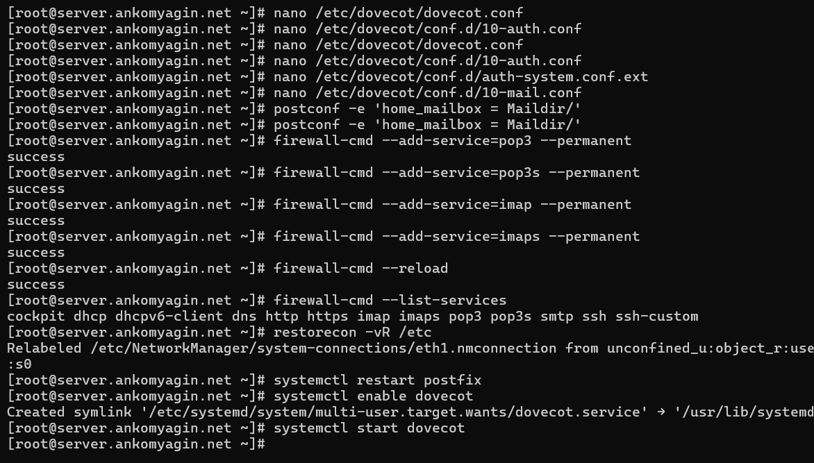
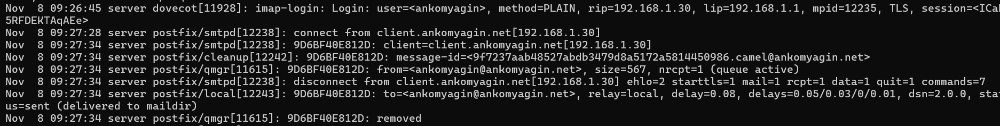

---
## Front matter
lang: ru-RU
title: Лабораторная работа №9
subtitle: Настройка POP3/IMAP сервера
author:
 - Комягин А.H.
institute:
 - Российский университет дружбы народов, Москва, Россия

## i18n babel
babel-lang: russian
babel-otherlangs: english

## Formatting pdf
toc: false
toc-title: Содержание
slide_level: 2
aspectratio: 169
section-titles: true
theme: metropolis
header-includes:
 - \metroset{progressbar=frametitle,sectionpage=progressbar,numbering=fraction}
---

# Цель работы

## Цель

Приобретение практических навыков по установке и конфигурированию POP3/IMAP-сервера Dovecot, а также интеграции его с MTA Postfix.

# Задачи работы

## Основные задачи

- Установка пакетов Dovecot

- Настройка конфигурационных файлов (протоколы, аутентификация, хранилище почты)

- Настройка почтового клиента Evolution

- Тестирование получения и отправки почты

- Автоматизация настройки через Vagrant

# Настройка сервера

## Установка и конфигурация

Установка `dovecot` и `telnet`. Настройка `/etc/dovecot/`:

- Включение протоколов `imap`, `pop3`.

- Настройка формата ящика: `mail_location = maildir:~/Maildir`.

- Разрешение аутентификации `plain`.

## Настройка Firewall

Открытие портов для почтовых служб и запуск сервисов.

# Настройка клиента

## Почтовый клиент Evolution

Установка и настройка учетной записи пользователя `ankomyagin`.

- Входящая почта: IMAP (порт 143).

- Исходящая почта: SMTP (порт 25).

# Тестирование

## Отправка и получение

Проверка работы почты через графический интерфейс. Письма успешно отправляются и доставляются в папку `Inbox`.

## Анализ логов

В логах `/var/log/maillog` фиксируются подключения IMAP, аутентификация и действия агента доставки.

## Проверка через Telnet

Диагностика работы протокола POP3 (порт 110) через консоль:

# Автоматизация

## Скрипты Provisioning

Сохранение конфигурационных файлов и создание скрипта `mail.sh` для автоматического развертывания почтового сервера.

# Контрольные вопросы

## Вопрос 1, 2, 3

**Протоколы:**

- **SMTP** — отправка и передача почты между серверами.

- **IMAP** — управление почтой на сервере (синхронизация папок).

- **POP3** — получение почты с сервера на клиент (обычно с удалением с сервера).

## Вопрос 4 и 6

**Роли сервисов:**

- **Postfix (MTA)** — маршрутизация и передача почты.

- **Dovecot (MDA/POP3/IMAP)** — хранение писем, аутентификация и выдача писем клиентам.

## Вопрос 5

**Конфигурация Dovecot:**

Основные файлы находятся в `/etc/dovecot/` и `/etc/dovecot/conf.d/` (настройки аутентификации, SSL, почтовых ящиков).

# Выводы

## Итоги

- Установлен сервер Dovecot.

- Настроено хранение почты в формате Maildir.

- Выполнена настройка клиента Evolution.

- Проведено успешное тестирование протоколов IMAP и POP3.

- Настроена автоматизация развертывания.
