---
# Front matter
title: "Лабораторная работа №9"
subtitle: "Дисциплина: Администрирование сетевых подсистем"
author: "Комягин Андрей Андреевич"

# Generic options
lang: ru-RU
toc-title: "Содержание"

# Bibliography
bibliography: bib/cite.bib
csl: pandoc/csl/gost-r-7-0-5-2008-numeric.csl

# Pdf output format
toc: true # Table of contents
toc-depth: 2
lof: true # List of figures
lot: true # List of tables
fontsize: 12pt
linestretch: 1.5
papersize: a4
documentclass: scrreprt

# I18n polyglossia
polyglossia-lang:
  name: russian
  options:
  - spelling=modern
  - babelshorthands=true
polyglossia-otherlangs:
  name: english

# I18n babel
babel-lang: russian
babel-otherlangs: english

# Fonts
mainfont: IBM Plex Serif
romanfont: IBM Plex Serif
sansfont: IBM Plex Sans
monofont: IBM Plex Mono
mathfont: STIX Two Math
mainfontoptions: Ligatures=Common,Ligatures=TeX,Scale=0.94
romanfontoptions: Ligatures=Common,Ligatures=TeX,Scale=0.94
sansfontoptions: Ligatures=Common,Ligatures=TeX,Scale=MatchLowercase,Scale=0.94
monofontoptions: Scale=MatchLowercase,Scale=0.94,FakeStretch=0.9
mathfontoptions: []

# Biblatex
biblatex: true
biblio-style: gost-numeric
biblatexoptions:
  - parentracker=true
  - backend=biber
  - hyperref=auto
  - language=auto
  - autolang=other*
  - citestyle=gost-numeric

# Pandoc-crossref LaTeX customization
figureTitle: "Рис."
tableTitle: "Таблица"
listingTitle: "Листинг"
lofTitle: "Список иллюстраций"
lotTitle: "Список таблиц"
lolTitle: "Листинги"

# Misc options
indent: true
header-includes:
  - \usepackage{indentfirst}
  - \usepackage{float} # keep figures where they are in the text
  - \floatplacement{figure}{H}
---

# Цель работы

Приобретение практических навыков по установке и простейшему конфигурированию POP3/IMAP-сервера Dovecot.

# Выполнение лабораторной работы

## Установка и настройка Dovecot на сервере

На виртуальной машине `server` были установлены пакеты `dovecot` (сервер POP3/IMAP) и `telnet` (для проверки соединений).

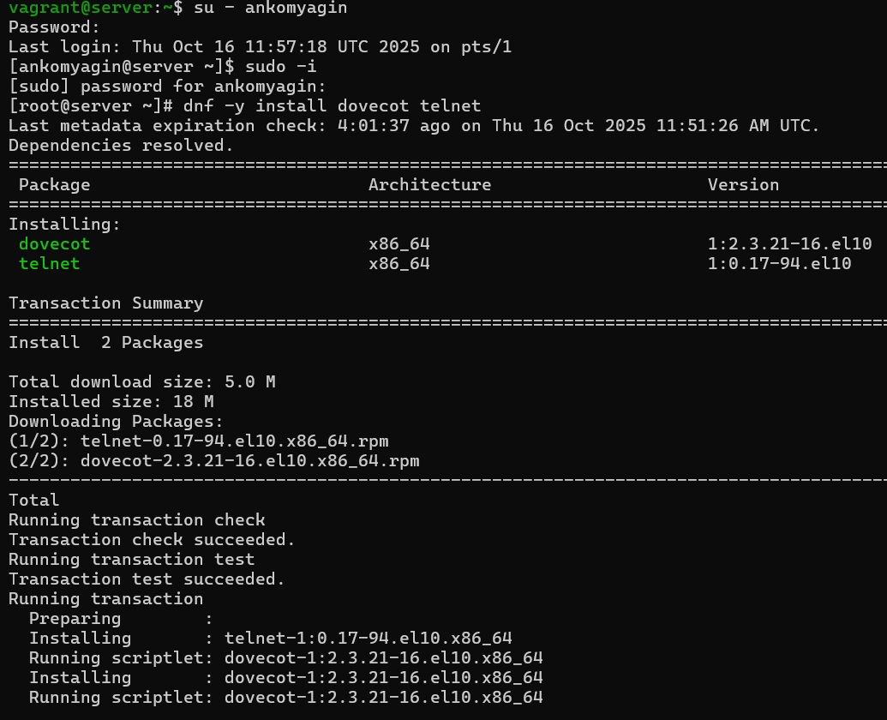{#fig:001 width=70%}

Далее была произведена настройка конфигурационных файлов Dovecot:

1.  В `/etc/dovecot/dovecot.conf` включены протоколы `imap` и `pop3`.

2.  В `/etc/dovecot/conf.d/10-auth.conf` разрешена аутентификация открытым текстом (`auth_mechanisms = plain`).

3.  В `/etc/dovecot/conf.d/10-mail.conf` задано местоположение почтовых ящиков в формате Maildir: `mail_location = maildir:~/Maildir`.

4.  В Postfix также настроено использование Maildir: `postconf -e 'home_mailbox = Maildir/'`.

Настроены правила межсетевого экрана (firewalld) для разрешения сервисов `pop3`, `pop3s`, `imap`, `imaps`. Обновлен контекст безопасности SELinux. Службы Postfix и Dovecot запущены.

{#fig:002 width=70%}

Для проверки создания структуры Maildir было отправлено тестовое письмо локальному пользователю. Проверка с помощью утилиты `doveadm` подтвердила наличие почтового ящика.

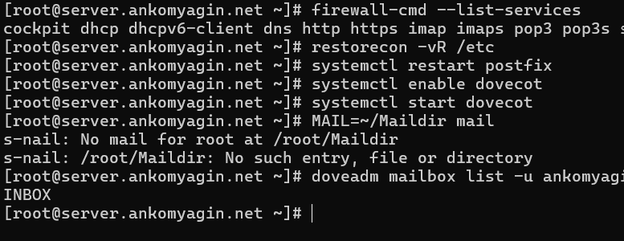{#fig:003 width=70%}

## Настройка почтового клиента Evolution

На виртуальной машине `client` был установлен почтовый клиент Evolution.

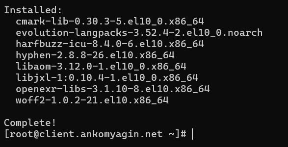{#fig:004 width=70%}

Произведена первоначальная настройка учетной записи пользователя `ankomyagin`.
Указано полное имя и адрес электронной почты.

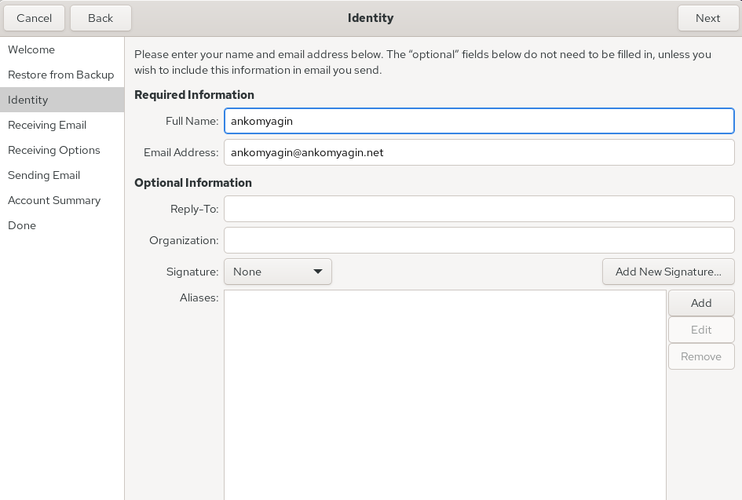{#fig:005 width=70%}

Настроен сервер входящей почты (Receiving Email):

*   Тип сервера: IMAP.

*   Сервер: `mail.ankomyagin.net`.

*   Порт: 143.

*   Шифрование: TLS on a dedicated port (или STARTTLS в зависимости от версии).

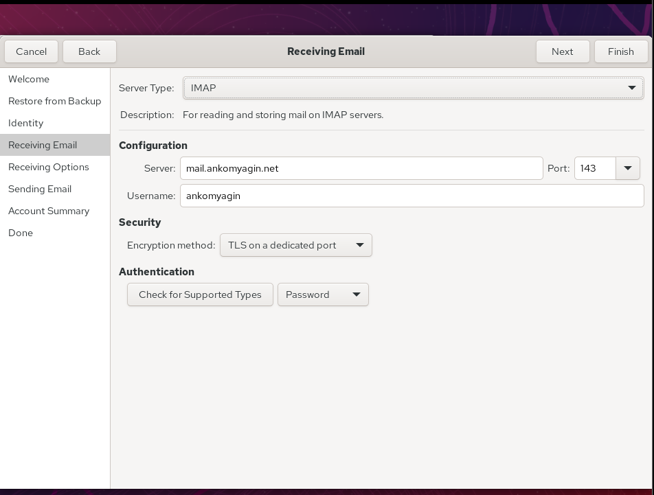{#fig:006 width=70%}

Настроен сервер исходящей почты (Sending Email):

*   Тип сервера: SMTP.

*   Сервер: `mail.ankomyagin.net`.

*   Порт: 25.

*   Аутентификация: PLAIN.

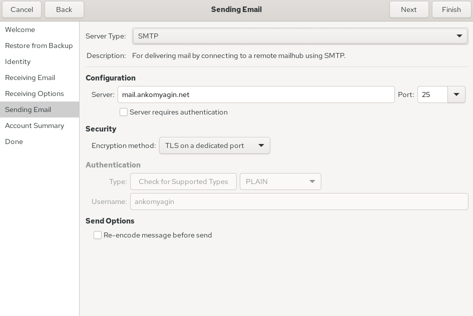{#fig:007 width=70%}

Итоговая сводка настроек учетной записи представлена ниже.

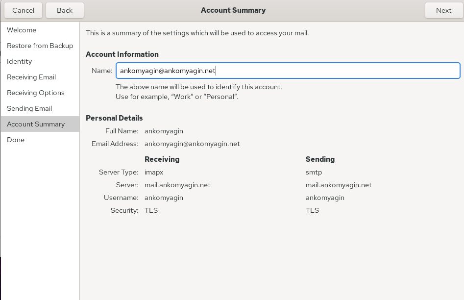{#fig:008 width=70%}

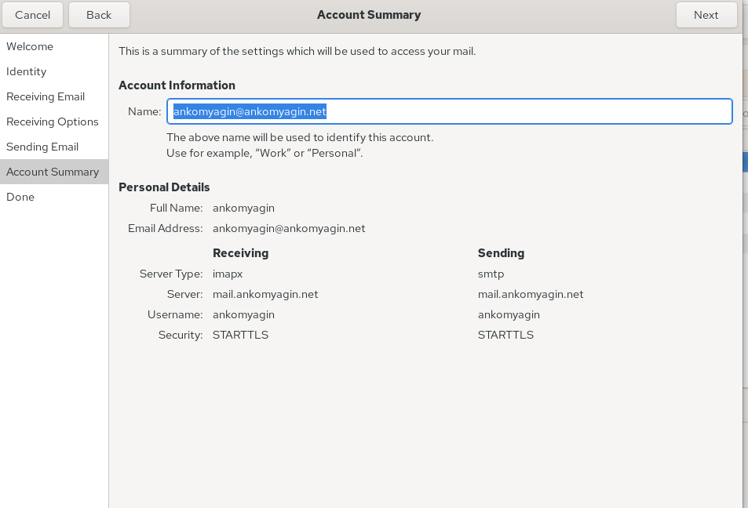{#fig:009 width=70%}

## Тестирование работы почтовой системы

С клиента было отправлено письмо ("from client"). В интерфейсе Evolution видно, что письмо успешно отправлено и принято сервером, а также видны письма, отправленные ранее локально на сервере.

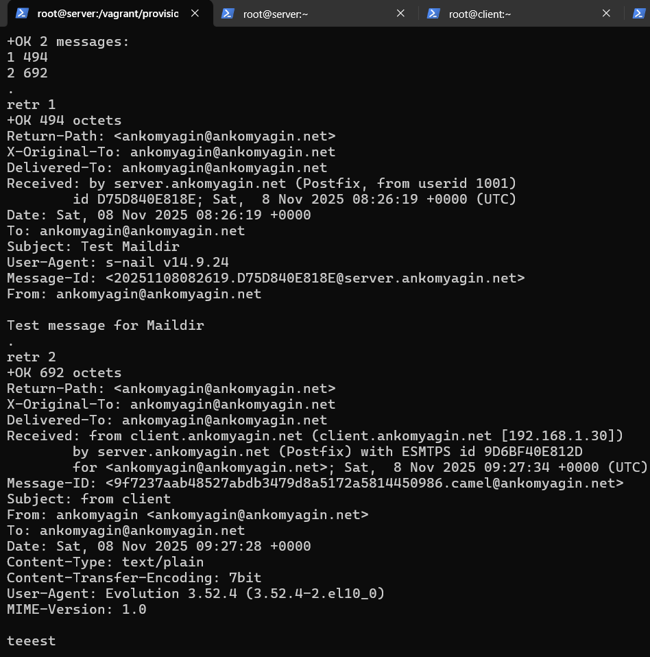{#fig:010 width=70%}

На сервере проверено содержимое почтового ящика через терминал. Видно наличие писем, включая отправленное с клиента.

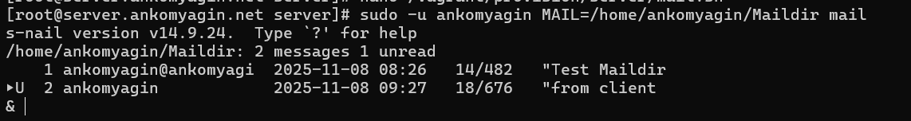{#fig:011 width=70%}

В логах сервера `/var/log/maillog` зафиксировано успешное подключение клиента по протоколу IMAP, аутентификация и действия Postfix по доставке письма.

{#fig:012 width=70%}

## Проверка через Telnet (POP3)

На сервере была выполнена проверка работы протокола POP3 с помощью утилиты `telnet` (порт 110).
Выполнены команды:

*   `user ankomyagin`

*   `pass <пароль>`

*   `list` (просмотр списка писем)

*   `retr 1` (чтение первого письма)

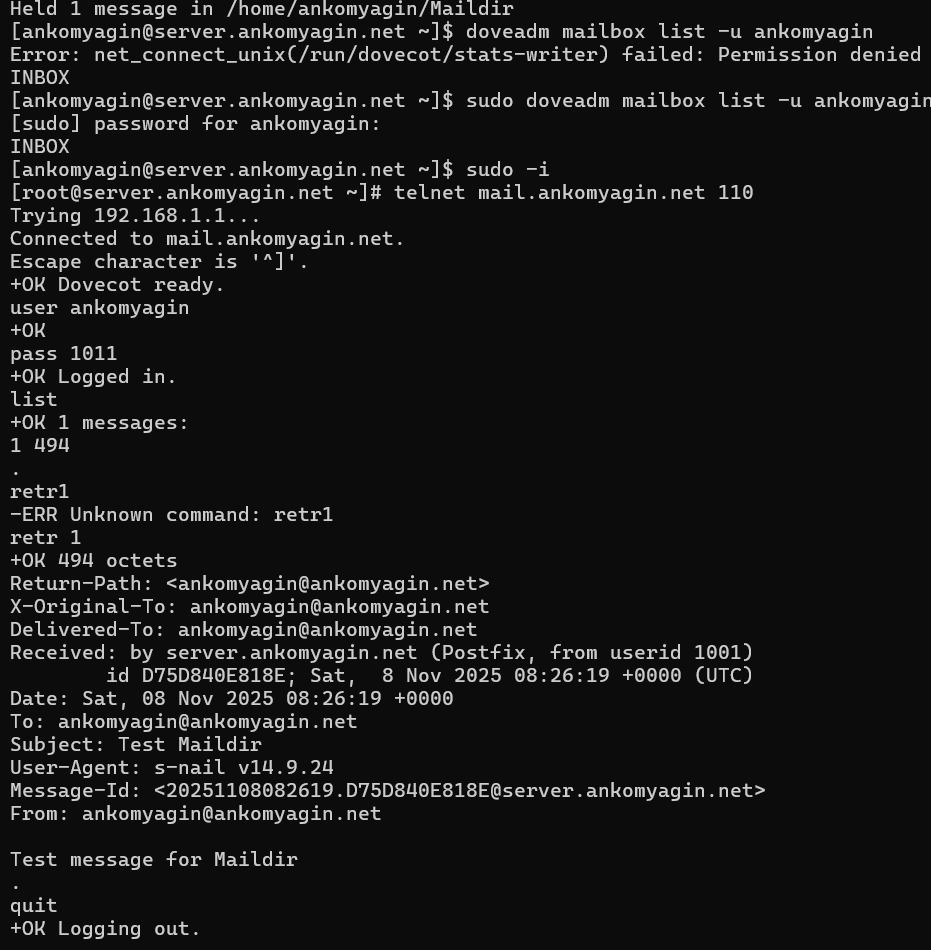{#fig:013 width=70%}

## Автоматизация (Provisioning)

Для сохранения настроек были скопированы конфигурационные файлы Dovecot в каталог `/vagrant/provision/server`. Обновлен скрипт `mail.sh` для автоматической установки и настройки Dovecot при развертывании виртуальной машины.

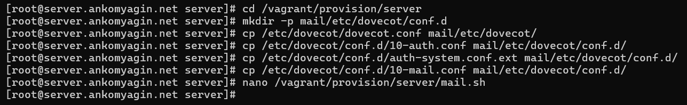{#fig:014 width=70%}

# Контрольные вопросы

1.  **За что отвечает протокол SMTP?**

    SMTP (Simple Mail Transfer Protocol) отвечает за отправку и передачу электронной почты между почтовыми серверами (MTA) и от клиента к серверу.

2.  **За что отвечает протокол IMAP?**

    IMAP (Internet Message Access Protocol) используется для доступа к электронной почте на сервере. Он позволяет управлять письмами непосредственно на сервере (создавать папки, перемещать письма), поддерживая синхронизацию между несколькими клиентами.

3.  **За что отвечает протокол POP3?**

    POP3 (Post Office Protocol version 3) используется для получения почты с сервера на клиент. Обычно письма скачиваются на устройство клиента и удаляются с сервера (хотя настройки позволяют оставлять копии).

4.  **В чём назначение Dovecot?**

    Dovecot — это сервер MDA (Mail Delivery Agent) и сервер доступа к почте по протоколам POP3 и IMAP. Он обеспечивает хранение писем, аутентификацию пользователей и доступ клиентов к ящикам.

5.  **В каких файлах обычно находятся настройки работы Dovecot?**

    Основной файл: `/etc/dovecot/dovecot.conf`. Детальные настройки разнесены по файлам в директории `/etc/dovecot/conf.d/` (например, `10-auth.conf`, `10-mail.conf`, `10-master.conf`).

6.  **В чём назначение Postfix?**

    Postfix — это агент передачи почты (MTA). Он занимается маршрутизацией и доставкой почты по протоколу SMTP.

7.  **Какие методы аутентификации пользователей можно использовать в Dovecot и в чём их отличие?**

    Основные методы: `PLAIN` (пароль передается в открытом виде, требуется TLS для безопасности), `LOGIN` (аналогично PLAIN, но в два этапа), `CRAM-MD5` (передача хеша, пароль не передается в открытом виде). Также возможна интеграция с системными пользователями (`passwd`, `pam`) или базами данных (SQL, LDAP).

8.  **Приведите пример заголовка письма с пояснениями его полей.**

    *   `From:` От кого (имя и адрес).

    *   `To:` Кому.

    *   `Subject:` Тема письма.

    *   `Date:` Дата и время отправки.

    *   `Message-ID:` Уникальный идентификатор сообщения.

    *   `Received:` Служебная информация о пути прохождения письма через серверы.

9.  **Приведите примеры использования команд для работы с почтовыми протоколами через терминал (например через telnet).**

    Для POP3 (порт 110):

    *   `user <name>` — ввод логина.

    *   `pass <password>` — ввод пароля.

    *   `list` — список сообщений.

    *   `retr <id>` — получить сообщение.

    *   `quit` — выход.

10. **Приведите примеры с пояснениями по работе с doveadm.**

    *   `doveadm mailbox list -u user` — показать список папок в ящике пользователя.

    *   `doveadm reload` — перезагрузить конфигурацию Dovecot.

    *   `doveadm user user` — проверить доступность и настройки пользователя.

# Выводы

В ходе выполнения лабораторной работы был установлен и настроен сервер Dovecot для работы по протоколам POP3 и IMAP. Настроена интеграция с MTA Postfix, организовано хранение почты в формате Maildir. Выполнена настройка почтового клиента Evolution, проведено успешное тестирование отправки и получения почты, а также диагностика работы сервера с помощью утилит Telnet и анализа логов.
