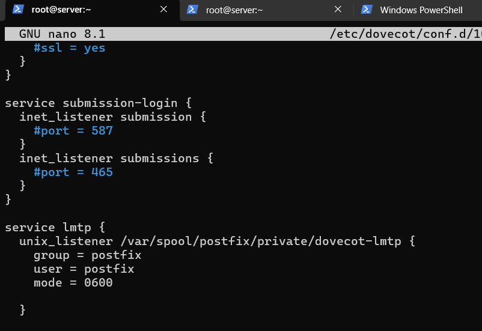
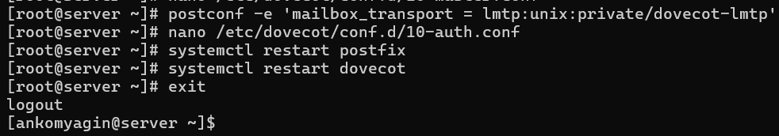
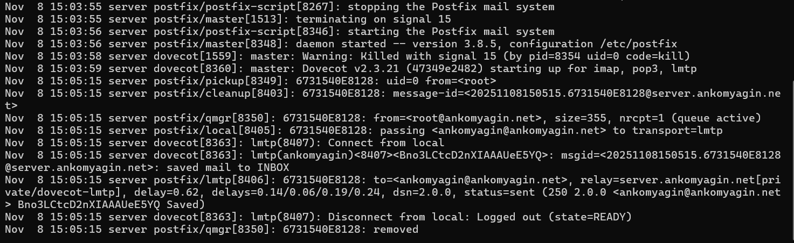
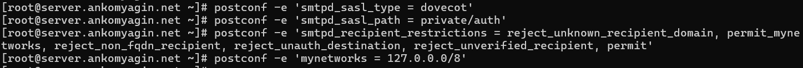
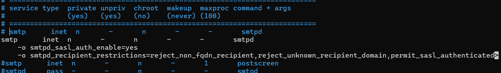
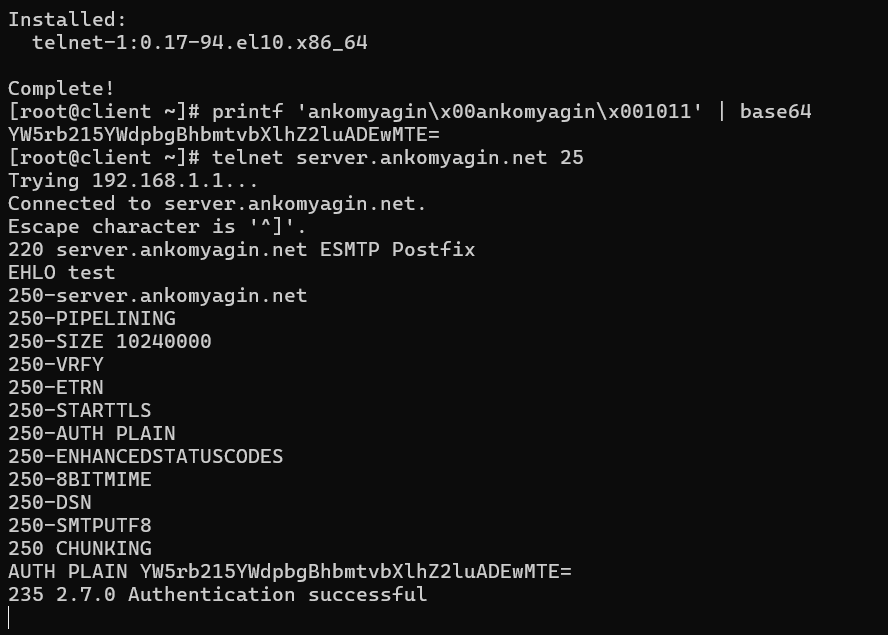
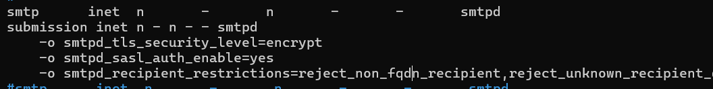
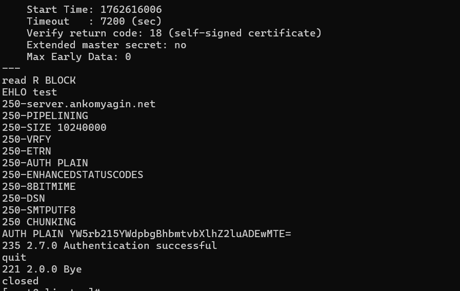

---
## Front matter
lang: ru-RU
title: Лабораторная №10
subtitle: Расширенные настройки SMTP-сервера
author: 
  - Комягин А.А.
institute:
  - Российский университет дружбы народов, Москва, Россия

## i18n babel
babel-lang: russian
babel-otherlangs: english

## Formatting pdf
toc: false
toc-title: Содержание
slide_level: 2
aspectratio: 169
section-titles: true
theme: metropolis
header-includes:
 - \metroset{progressbar=frametitle,sectionpage=progressbar,numbering=fraction}
---

# Цель работы

## Цель

Приобретение практических навыков по конфигурированию SMTP-сервера в части настройки аутентификации.


# Задачи работы

## Основные задачи

- Настройка Dovecot для работы с LMTP
- Настройка аутентификации через SASL  
- Настройка SMTP поверх TLS
- Обновление скриптов автоматизации


# Настройка LMTP в Dovecot

## Добавление протокола LMTP


## Конфигурация сервиса LMTP




# Тестирование LMTP

## Отправка тестового письма



## Логи доставки через LMTP




# Проверка работы LMTP

## Письмо доставлено успешно


# Настройка SMTP-аутентификации

## Конфигурация службы auth


## Настройка SASL в Postfix




# Включение аутентификации

## Изменения в master.cf



## Тестирование аутентификации




# Настройка SMTP over TLS

## Конфигурация порта 587



## Тестирование TLS соединения




# Автоматизация развертывания

## Копирование конфигураций


## Обновление скриптов

- Скрипт mail.sh дополнен настройками
- Добавлены все конфигурации LMTP, SASL, TLS
- Обновлены правила firewall


# Контрольные вопросы

## Вопрос 1

**Формат аутентификации с доменом**

```bash
auth_username_format = %u
```

## Вопрос 2

**Функции Relay-сервера**

- Прием и пересылка почты

- Фильтрация спама

- Аутентификация отправителей

- Кэширование сообщений

## Вопрос 3

**Угрозы безопасности**

- Открытый релей для спама

- Попадание в черные списки

- Перегрузка ресурсов сервера

- Юридические риски

# Выводы

## Итоги работы

* Успешно настроен LMTP для локальной доставки

* Реализована SASL аутентификация

* Настроено защищенное соединение TLS

* Все компоненты работают корректно

* Обеспечена защита от несанкционированного использования
