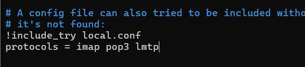
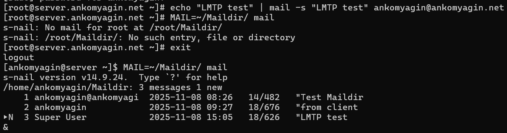
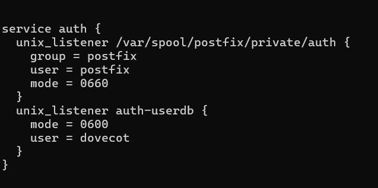
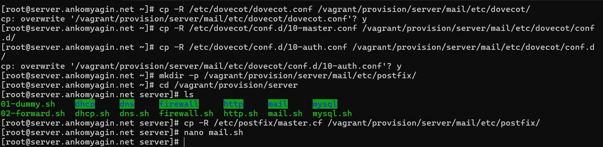

---
# Front matter
title: "Лабораторная работа №10"
subtitle: "Дисциплина: Администрирование сетевых подсистем"
author: "Комягин Андрей Андреевич"

# Generic options
lang: ru-RU
toc-title: "Содержание"

# Bibliography
bibliography: bib/cite.bib
csl: pandoc/csl/gost-r-7-0-5-2008-numeric.csl

# Pdf output format
toc: true                # Table of contents
toc-depth: 2
lof: true                # List of figures
lot: true                # List of tables
fontsize: 12pt
linestretch: 1.5
papersize: a4
documentclass: scrreprt

# I18n polyglossia
polyglossia-lang:
  name: russian
  options:
    - spelling=modern
    - babelshorthands=true
polyglossia-otherlangs:
  name: english

# I18n babel
babel-lang: russian
babel-otherlangs: english

# Fonts
mainfont: IBM Plex Serif
romanfont: IBM Plex Serif
sansfont: IBM Plex Sans
monofont: IBM Plex Mono
mathfont: STIX Two Math
mainfontoptions: Ligatures=Common,Ligatures=TeX,Scale=0.94
romanfontoptions: Ligatures=Common,Ligatures=TeX,Scale=0.94
sansfontoptions: Ligatures=Common,Ligatures=TeX,Scale=MatchLowercase,Scale=0.94
monofontoptions: Scale=MatchLowercase,Scale=0.94,FakeStretch=0.9
mathfontoptions: []

# Biblatex
biblatex: true
biblio-style: gost-numeric
biblatexoptions:
  - parentracker=true
  - backend=biber
  - hyperref=auto
  - language=auto
  - autolang=other*
  - citestyle=gost-numeric

# Pandoc-crossref LaTeX customization
figureTitle: "Рис."
tableTitle: "Таблица"
listingTitle: "Листинг"
lofTitle: "Список иллюстраций"
lotTitle: "Список таблиц"
lolTitle: "Листинги"

# Misc options
indent: true
header-includes:
  - \usepackage{indentfirst}
  - \usepackage{float}        # keep figures where they are in the text
  - \floatplacement{figure}{H}
---

# Цель работы

Приобретение практических навыков по конфигурированию SMTP-сервера в части настройки аутентификации.

# Выполнение лабораторной работы

## Настройка LMTP в Dovecot

### Добавление протокола LMTP

В файл `/etc/dovecot/dovecot.conf` добавлен протокол LMTP в список поддерживаемых протоколов (рис. [-@fig:001]):

```bash
protocols = imap pop3 lmtp
```

{#fig:001 width=70%}

### Настройка сервиса LMTP

В файле `/etc/dovecot/conf.d/10-master.conf` настроен сервис LMTP для связи с Postfix (рис. [-@fig:002]):

```bash
service lmtp {
    unix_listener /var/spool/postfix/private/dovecot-lmtp {
        group = postfix
        user = postfix
        mode = 0600
    }
}
```

{#fig:002 width=70%}

### Настройка Postfix для использования LMTP

Выполнена команда для настройки передачи сообщений через LMTP:

```bash
postconf -e 'mailbox_transport = lmtp:unix:private/dovecot-lmtp'
```

Также в файле `/etc/dovecot/conf.d/10-auth.conf` задан формат имени пользователя:

```bash
auth_username_format = %Ln
```

После перезапуска служб Postfix и Dovecot отправлено тестовое письмо (рис. [-@fig:003]):

```bash
systemctl restart postfix
systemctl restart dovecot
echo "LMTP test" | mail -s "LMTP test" ankomyagin@ankomyagin.net
```

{#fig:003 width=70%}

### Проверка работы LMTP

В логах почтовой службы видно успешную доставку письма через LMTP (рис. [-@fig:004]):

- Сообщение передано от Postfix к Dovecot через LMTP
- Письмо успешно сохранено в почтовом ящике пользователя
- Статус доставки: "250 2.0.0 Saved"

{#fig:004 width=70%}

Проверка почтового ящика подтвердила доставку тестового письма (рис. [-@fig:005]):

```bash
MAIL=~/Maildir/ mail
```

{#fig:005 width=70%}

## Настройка SMTP-аутентификации

### Настройка службы аутентификации

В файле `/etc/dovecot/conf.d/10-master.conf` определена служба аутентификации (рис. [-@fig:006]):

```bash
service auth {
    unix_listener /var/spool/postfix/private/auth {
        group = postfix
        user = postfix
        mode = 0660
    }
    unix_listener auth-userdb {
        mode = 0600
        user = dovecot
    }
}
```

**Пояснение к записи:**
- `unix_listener /var/spool/postfix/private/auth` - создает Unix-сокет для связи с Postfix
- `group = postfix` и `user = postfix` - обеспечивают права доступа для Postfix
- `mode = 0660` - разрешает чтение и запись для владельца и группы
- Второй `unix_listener` используется для внутренней аутентификации Dovecot

{#fig:006 width=70%}

### Настройка Postfix для SASL

Выполнены команды для настройки SASL аутентификации (рис. [-@fig:007]):

```bash
postconf -e 'smtpd_sasl_type = dovecot'
postconf -e 'smtpd_sasl_path = private/auth'
postconf -e 'smtpd_recipient_restrictions = reject_unknown_recipient_domain, permit_mynetworks, reject_non_fqdn_recipient, reject_unauth_destination, reject_unverified_recipient, permit'
postconf -e 'mynetworks = 127.0.0.0/8'
```

**Пояснение опций ограничений получателей:**
- `reject_unknown_recipient_domain` - отклоняет письма для неизвестных доменов
- `permit_mynetworks` - разрешает отправку из доверенных сетей
- `reject_non_fqdn_recipient` - отклоняет адреса без полного доменного имени
- `reject_unauth_destination` - запрещает релей для ненадлежащих получателей
- `reject_unverified_recipient` - отклоняет несуществующих получателей
- `permit` - разрешает все остальные случаи

{#fig:007 width=70%}

### Включение аутентификации в Postfix

В файле `/etc/postfix/master.cf` изменена конфигурация для включения SASL аутентификации (рис. [-@fig:008]):

```bash
smtp      inet n       -       n       -       -       smtpd
    -o smtpd_sasl_auth_enable=yes
    -o smtpd_recipient_restrictions=reject_non_fqdn_recipient,reject_unknown_recipient_domain,permit_sasl_authenticated,reject
```

{#fig:008 width=70%}

### Тестирование аутентификации

На клиенте сгенерирована строка для аутентификации и выполнено тестирование через Telnet (рис. [-@fig:009]):

```bash
printf 'ankomyagin\x00ankomyagin\x001011' | base64
telnet server.ankomyagin.net 25
EHLO test
AUTH PLAIN YW5rb215YWdpbgBhbmtvbXlhZ2luADEWMTE=
```

Результат: "235 2.7.0 Authentication successful" - аутентификация прошла успешно.

{#fig:009 width=70%}

## Настройка SMTP over TLS

### Копирование сертификатов

Скопированы сертификаты Dovecot для использования в Postfix:

```bash
cp /etc/pki/dovecot/certs/dovecot.pem /etc/pki/tls/certs/
cp /etc/pki/dovecot/private/dovecot.pem /etc/pki/tls/private/
```

### Настройка TLS в Postfix

Выполнены команды для настройки TLS:

```bash
postconf -e 'smtpd_tls_cert_file=/etc/pki/tls/certs/dovecot.pem'
postconf -e 'smtpd_tls_key_file=/etc/pki/tls/private/dovecot.pem'
postconf -e 'smtpd_tls_session_cache_database = btree:/var/lib/postfix/smtpd_scache'
postconf -e 'smtpd_tls_security_level = may'
postconf -e 'smtp_tls_security_level = may'
```

### Настройка порта 587

В файле `/etc/postfix/master.cf` настроен порт 587 для защищенного SMTP (рис. [-@fig:010]):

```bash
submission inet n - n - - smtpd
    -o smtpd_tls_security_level=encrypt
    -o smtpd_sasl_auth_enable=yes
    -o smtpd_recipient_restrictions=reject_non_fqdn_recipient,reject_unknown_recipient_domain,permit_sasl_authenticated,reject
```

{#fig:010 width=70%}

### Тестирование SMTP over TLS

Выполнено тестирование подключения через порт 587 с использованием TLS (рис. [-@fig:011]):

```bash
openssl s_client -starttls smtp -crlf -connect server.ankomyagin.net:587
EHLO test
AUTH PLAIN YW5rb215YWdpbgBhbmtvbXlhZ2luADEWMTE=
```

Результат: успешная аутентификация через защищенное соединение.

{#fig:011 width=70%}

## Внесение изменений в настройки внутреннего окружения

Скопированы конфигурационные файлы в каталог provision (рис. [-@fig:012]):

```bash
cp -R /etc/dovecot/dovecot.conf /vagrant/provision/server/mail/etc/dovecot/
cp -R /etc/dovecot/conf.d/10-master.conf /vagrant/provision/server/mail/etc/dovecot/conf.d/
cp -R /etc/dovecot/conf.d/10-auth.conf /vagrant/provision/server/mail/etc/dovecot/conf.d/
mkdir -p /vagrant/provision/server/mail/etc/postfix/
cp -R /etc/postfix/master.cf /vagrant/provision/server/mail/etc/postfix/
```

{#fig:012 width=70%}

Обновлен скрипт `mail.sh` с добавлением всех настроек из лабораторной работы №10.

# Контрольные вопросы

1. **Приведите пример задания формата аутентификации пользователя в Dovecot в форме логина с указанием домена.**

   Для задания формата аутентификации с указанием домена используется параметр `auth_username_format`:
   
   ```bash
   auth_username_format = %Lu
   ```
   
   Или для полного формата с доменом:
   
   ```bash
   auth_username_format = %u
   ```
   
   Где `%u` - полное имя пользователя с доменом, `%Lu` - имя пользователя в нижнем регистре с доменом.

2. **Какие функции выполняет почтовый Relay-сервер?**

   Почтовый Relay-сервер выполняет следующие функции:

   - Прием почтовых сообщений от авторизованных пользователей

   - Пересылка (ретрансляция) сообщений к конечным почтовым серверам получателей

   - Фильтрация спама и вирусов

   - Аутентификация отправителей для предотвращения несанкционированного использования

   - Кэширование сообщений при временной недоступности серверов получателей

3. **Какие угрозы безопасности могут возникнуть в случае настройки почтового сервера как Relay-сервера?**

   Основные угрозы безопасности:

   - **Открытый релей** - возможность отправки почты любыми пользователями, что приводит к спам-рассылкам

   - **Черные списки** - попадание IP-адреса сервера в DNSBL (DNS-based Blackhole Lists)

   - **Расход ресурсов** - повышенная нагрузка на сервер из-за спам-рассылок

   - **Компрометация репутации** - ухудшение репутации домена и IP-адреса

   - **Юридические риски** - возможные правовые последствия за распространение спама

   Для предотвращения этих угроз необходимо:

   - Настраивать аутентификацию пользователей

   - Ограничивать сети, которым разрешен релей

   - Использовать механизмы проверки отправителей (SPF, DKIM, DMARC)

   - Настраивать фильтрацию спама

# Выводы

В ходе выполнения лабораторной работы №10 были приобретены практические навыки по расширенной настройке SMTP-сервера. Были успешно выполнены следующие задачи:

1. Настроен протокол LMTP в Dovecot для локальной доставки почты

2. Реализована аутентификация SMTP через механизм SASL

3. Настроена работа SMTP поверх TLS для защищенной передачи почты

4. Проведено тестирование всех настроенных механизмов

5. Обновлены скрипты для автоматизации развертывания конфигурации

Все компоненты работают корректно: аутентификация пользователей проходит успешно, почта доставляется через LMTP, защищенное соединение через TLS функционирует должным образом. Настройки безопасности предотвращают использование сервера в качестве открытого релея для спам-рассылок.

# Список литературы{.unnumbered}

