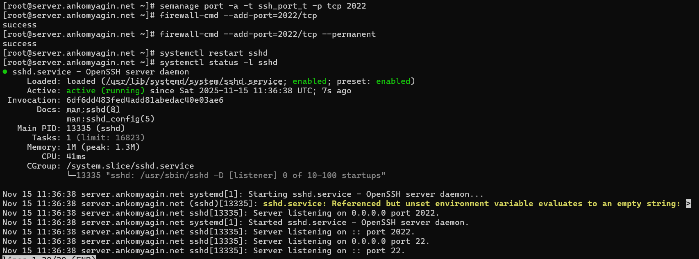
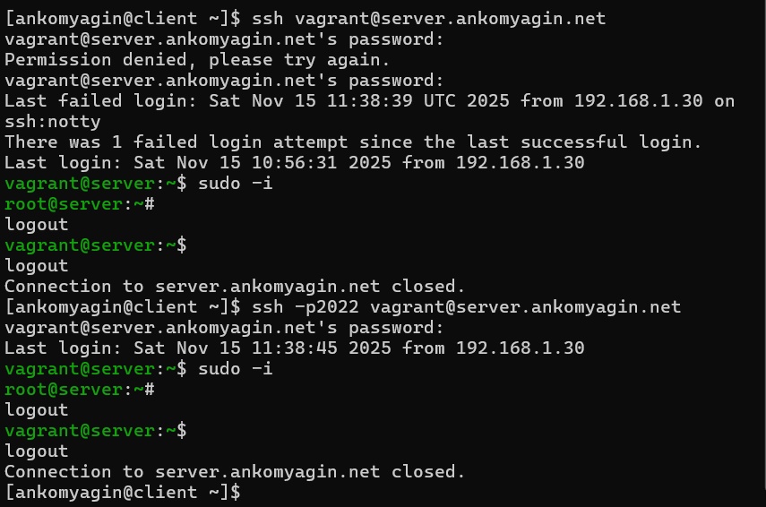
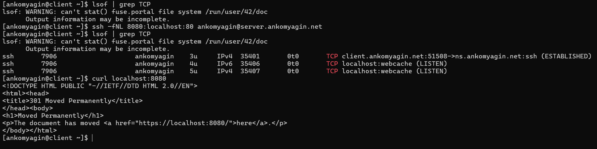
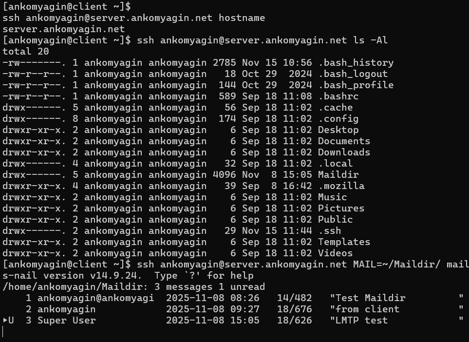
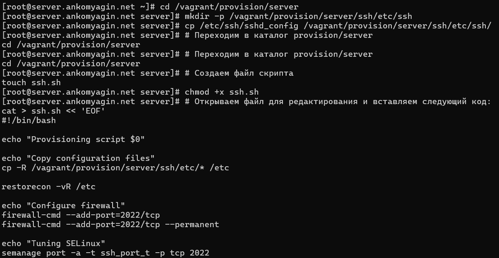
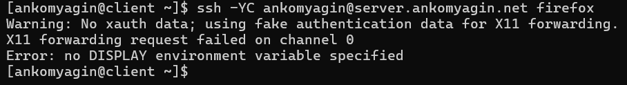
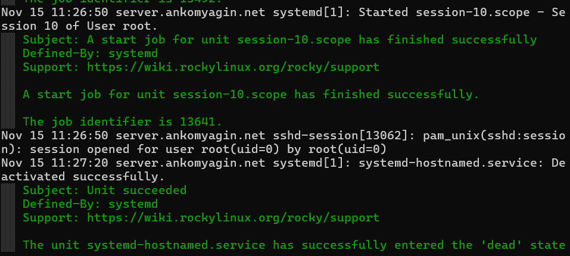
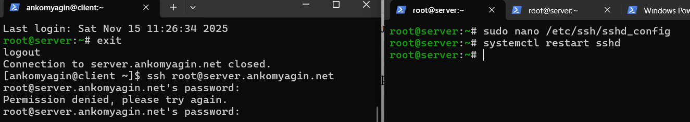
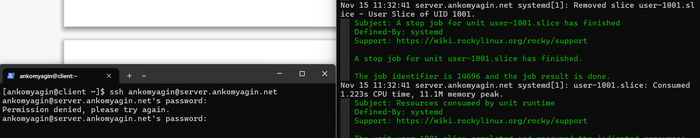

---
## Front matter
lang: ru-RU
title: Лабораторная №11
subtitle: Настройка безопасного удалённого доступа по SSH
author: 
  - Комягин А.А.
institute:
  - Российский университет дружбы народов, Москва, Россия

## i18n babel
babel-lang: russian
babel-otherlangs: english

## Formatting pdf
toc: false
toc-title: Содержание
slide_level: 2
aspectratio: 169
section-titles: true
theme: metropolis
header-includes:
 - \metroset{progressbar=frametitle,sectionpage=progressbar,numbering=fraction}
---

# Цель работы

## Цель

Приобретение практических навыков по настройке удалённого доступа к серверу с помощью SSH.

# Задачи работы

## Основные задачи

- Запрет доступа для пользователя root

- Ограничение списка пользователей

- Настройка дополнительных портов

- Аутентификация по ключам

- Организация SSH-туннелей

# Безопасность доступа

## Запрет доступа root


## Успешное ограничение



# Ограничение пользователей

## Доступ для ankomyagin


## Запрет после настройки



# Настройка портов

## Ошибка привязки порта



## Успешная работа двух портов



# Аутентификация по ключам

## Копирование SSH-ключа



## Подключение через порт 2022



# SSH-туннелирование

## TCP-соединения после туннеля



## Выполнение удалённых команд



# Графические приложения

## Ошибка X11 forwarding


# Автоматизация развертывания

## Копирование конфигураций



## Скрипт настройки SSH

```bash
#!/bin/bash
echo "Provisioning script $0"
cp -R /vagrant/provision/server/ssh/etc/* /etc
firewall-cmd --add-port=2022/tcp --permanent
semanage port -a -t ssh_port_t -p tcp 2022
systemctl restart sshd
```

# Контрольные вопросы

## Вопрос 1

**Запрет root и разрешение alice**

```bash
PermitRootLogin no
AllowUsers alice
```

## Вопрос 2

**Настройка нескольких портов**

```bash
Port 22
Port 2022
Port 2222
```

## Вопрос 3

**Параметры SSH-туннеля**

- -f — фоновый режим

- -N — не выполнять команду

- -L — локальная переадресация

## Вопрос 4

**Локальная переадресация порта**

```bash
ssh -L 5555:server2.example.com:80 user@gateway
```

## Вопрос 5

**Настройка SELinux для порта 2022**

```bash
semanage port -a -t ssh_port_t -p tcp 2022
```

## Вопрос 6

**Разрешение порта в firewall**

```bash
firewall-cmd --add-port=2022/tcp --permanent
```

# Выводы

## Итоги работы

* Настроен безопасный доступ по SSH

* Запрещён вход для root

* Реализована аутентификация по ключам

* Настроен дополнительный порт

* Созданы скрипты автоматизации

* Повышена безопасность сервера
