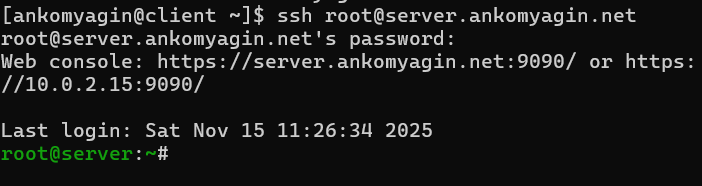
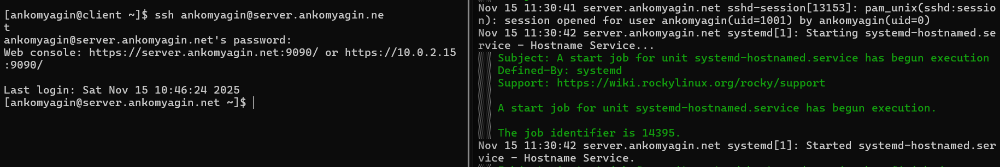

---
# Front matter
title: "Лабораторная работа №11"
subtitle: "Дисциплина: Администрирование сетевых подсистем"
author: "Комягин Андрей Андреевич"

# Generic options
lang: ru-RU
toc-title: "Содержание"

# Bibliography
bibliography: bib/cite.bib
csl: pandoc/csl/gost-r-7-0-5-2008-numeric.csl

# Pdf output format
toc: true                # Table of contents
toc-depth: 2
lof: true                # List of figures
lot: true                # List of tables
fontsize: 12pt
linestretch: 1.5
papersize: a4
documentclass: scrreprt

# I18n polyglossia
polyglossia-lang:
  name: russian
  options:
    - spelling=modern
    - babelshorthands=true
polyglossia-otherlangs:
  name: english

# I18n babel
babel-lang: russian
babel-otherlangs: english

# Fonts
mainfont: IBM Plex Serif
romanfont: IBM Plex Serif
sansfont: IBM Plex Sans
monofont: IBM Plex Mono
mathfont: STIX Two Math
mainfontoptions: Ligatures=Common,Ligatures=TeX,Scale=0.94
romanfontoptions: Ligatures=Common,Ligatures=TeX,Scale=0.94
sansfontoptions: Ligatures=Common,Ligatures=TeX,Scale=MatchLowercase,Scale=0.94
monofontoptions: Scale=MatchLowercase,Scale=0.94,FakeStretch=0.9
mathfontoptions: []

# Biblatex
biblatex: true
biblio-style: gost-numeric
biblatexoptions:
  - parentracker=true
  - backend=biber
  - hyperref=auto
  - language=auto
  - autolang=other*
  - citestyle=gost-numeric

# Pandoc-crossref LaTeX customization
figureTitle: "Рис."
tableTitle: "Таблица"
listingTitle: "Листинг"
lofTitle: "Список иллюстраций"
lotTitle: "Список таблиц"
lolTitle: "Листинги"

# Misc options
indent: true
header-includes:
  - \usepackage{indentfirst}
  - \usepackage{float}        # keep figures where they are in the text
  - \floatplacement{figure}{H}
---

# Цель работы

Приобретение практических навыков по настройке удалённого доступа к серверу с помощью SSH.

# Выполнение лабораторной работы

## Запрет удалённого доступа по SSH для пользователя root

### Начальная проверка доступа root

Сначала был выполнен тестовый вход на сервер под пользователем root (рис. [-@fig:001]):

```bash
ssh root@server.ankomyagin.net
```

Результат: успешное подключение с запросом пароля и последующим входом в систему.

{#fig:001 width=70%}

### Настройка запрета доступа root

В файле `/etc/ssh/sshd_config` установлен параметр:

```bash
PermitRootLogin no
```

После перезапуска службы sshd повторная попытка подключения под root завершилась ошибкой "Permission denied" (рис. [-@fig:002]):

```bash
systemctl restart sshd
ssh root@server.ankomyagin.net
```

{#fig:002 width=70%}

## Ограничение списка пользователей для удалённого доступа по SSH

### Начальная проверка доступа пользователя

Проверен доступ под обычным пользователем (рис. [-@fig:003]):

```bash
ssh ankomyagin@server.ankomyagin.net
```

Результат: успешное подключение.

{#fig:003 width=70%}

### Ограничение доступа только для пользователя vagrant

В файл `/etc/ssh/sshd_config` добавлена строка:

```bash
AllowUsers vagrant
```

После перезапуска sshd попытка подключения под пользователем ankomyagin завершилась ошибкой "Permission denied" (рис. [-@fig:004]).

{#fig:004 width=70%}

### Разрешение доступа для нескольких пользователей

В файл конфигурации добавлены оба пользователя:

```bash
AllowUsers vagrant ankomyagin
```

После перезапуска службы доступ для пользователя ankomyagin был восстановлен.

## Настройка дополнительных портов для удалённого доступа по SSH

### Добавление порта 2022

В файл `/etc/ssh/sshd_config` добавлены порты:

```bash
Port 22
Port 2022
```

После перезапуска службы возникла ошибка привязки к порту 2022 (рис. [-@fig:005]):

```bash
systemctl status -l sshd
```

В логах: "error: Bind to port 2022 on 0.0.0.0 failed: Permission denied"

{#fig:005 width=70%}

### Настройка SELinux и firewall

Выполнены команды для разрешения доступа к порту 2022:


```bash
semanage port -a -t ssh_port_t -p tcp 2022
firewall-cmd --add-port=2022/tcp
firewall-cmd --add-port=2022/tcp --permanent
```

После перезапуска sshd служба успешно прослушивает оба порта (рис. [-@fig:006]):

```bash
systemctl restart sshd
systemctl status -l sshd
```

{#fig:006 width=70%}

### Тестирование подключения через порт 2022

Проверено подключение через нестандартный порт (рис. [-@fig:007]):

```bash
ssh -p2022 vagrant@server.ankomyagin.net
```

Результат: успешное подключение с возможностью получения прав root через sudo.

{#fig:007 width=70%}

## Настройка удалённого доступа по SSH по ключу

### Настройка сервера для аутентификации по ключу

В файле `/etc/ssh/sshd_config` установлен параметр:

```bash
PubkeyAuthentication yes
```

### Генерация ключей на клиенте

На клиентской машине сгенерирована пара ключей:

```bash
ssh-keygen
```

Приняты настройки по умолчанию: ключи сохранены в ~/.ssh/id_rsa (закрытый) и ~/.ssh/id_rsa.pub (открытый).

### Копирование открытого ключа на сервер

Выполнена команда для копирования ключа:

```bash
ssh-copy-id ankomyagin@server.ankomyagin.net
```

Результат: ключ успешно добавлен (рис. [-@fig:008]).

{#fig:008 width=70%}

### Тестирование аутентификации по ключу

Проверено подключение без ввода пароля:

```bash
ssh ankomyagin@server.ankomyagin.net
```

Результат: успешный вход без запроса пароля.

## Организация туннелей SSH, перенаправление TCP-портов

### Проверка текущих TCP-соединений

Перед созданием туннеля проверены активные TCP-соединения:

```bash
lsof | grep TCP
```

### Создание SSH-туннеля

Выполнена команда для создания туннеля:

```bash
ssh -fNL 8080:localhost:80 ankomyagin@server.ankomyagin.net
```

### Проверка созданного туннеля

После создания туннеля повторно проверены TCP-соединения (рис. [-@fig:009]):

```bash
lsof | grep TCP
```

Результат: появилось новое соединение SSH и прослушивающий сокет на localhost:webcache (порт 8080).

{#fig:009 width=70%}

### Тестирование туннеля

Проверена работа туннеля через браузер и curl:

```bash
curl localhost:8080
```

В браузере по адресу localhost:8080 отобразилась приветственная страница сервера.

## Запуск консольных приложений через SSH

### Выполнение удалённых команд

Проверены различные команды, выполняемые напрямую через SSH (рис. [-@fig:010]):

```bash
ssh ankomyagin@server.ankomyagin.net hostname
ssh ankomyagin@server.ankomyagin.net ls -Al
ssh ankomyagin@server.ankomyagin.net MAIL=~/Maildir/ mail
```

Все команды выполнены успешно, получен ожидаемый вывод.

{#fig:010 width=70%}

## Запуск графических приложений через SSH (X11Forwarding)

### Настройка сервера для X11 forwarding

В файле `/etc/ssh/sshd_config` установлен параметр:

```bash
X11Forwarding yes
```

После перезапуска sshd выполнена попытка запуска графического приложения:

```bash
ssh -YC ankomyagin@server.ankomyagin.net firefox
```

Результат: возникла ошибка "X11 forwarding request failed on channel 0" и "no DISPLAY environment variable specified" 
Возникла она из-за отсутствия необходимого ПО на клиенте (рис. [-@fig:011]).

{#fig:011 width=70%}

## Внесение изменений в настройки внутреннего окружения виртуальной машины

### Копирование конфигурационных файлов

Создана структура каталогов и скопированы конфигурационные файлы (рис. [-@fig:012]):

```bash
cd /vagrant/provision/server
mkdir -p /vagrant/provision/server/ssh/etc/ssh
cp /etc/ssh/sshd_config /vagrant/provision/server/ssh/etc/ssh/
```

{#fig:012 width=70%}

### Создание скрипта настройки

Создан исполняемый файл `ssh.sh` со следующим содержимым:

```bash
#!/bin/bash

echo "Provisioning script $0"

echo "Copy configuration files"
cp -R /vagrant/provision/server/ssh/etc/* /etc

restorecon -vR /etc

echo "Configure firewall"
firewall-cmd --add-port=2022/tcp
firewall-cmd --add-port=2022/tcp --permanent


echo "Tuning SELinux"
semanage port -a -t ssh_port_t -p tcp 2022

echo "Restart sshd service"
systemctl restart sshd
```

### Настройка Vagrantfile

В конфигурационный файл Vagrantfile добавлен вызов скрипта:

```bash
server.vm.provision "server ssh",
  type: "shell",
  preserve_order: true,
  path: "provision/server/ssh.sh"
```

# Контрольные вопросы

1. **Вы хотите запретить удалённый доступ по SSH на сервер пользователю root и разрешить доступ пользователю alice. Как это сделать?**

   В файле `/etc/ssh/sshd_config` необходимо установить:
   
   ```bash
   PermitRootLogin no
   AllowUsers alice
   ```
   
   После чего перезапустить службу: `systemctl restart sshd`

2. **Как настроить удалённый доступ по SSH через несколько портов? Для чего это может потребоваться?**

   В файле конфигурации указать несколько портов:
   
   ```bash
   Port 22
   Port 2022
   Port 2222
   ```
   Это может потребоваться для:
   
   - Резервирования на случай ошибок в конфигурации
   
   - Обхода блокировок провайдеров
   
   - Сокрытия SSH-сервиса
   
   - Тестирования различных конфигураций

3. **Какие параметры используются для создания туннеля SSH, когда команда ssh устанавливает фоновое соединение и не ожидает какой-либо конкретной команды?**

   Основные параметры:
   
   - `-f` - переход в фоновый режим
   
   - `-N` - не выполнять удалённую команду
   
   - `-L` - локальная переадресация портов
   
   - `-R` - удалённая переадресация портов

   Пример: `ssh -fNL 8080:localhost:80 user@host`

4. **Как настроить локальную переадресацию с локального порта 5555 на порт 80 сервера server2.example.com?**

   Выполнить команду:
   
   ```bash
   ssh -L 5555:server2.example.com:80 user@gateway-server
   ```
   Или для фонового режима:
   
   ```bash
   ssh -fNL 5555:server2.example.com:80 user@gateway-server
   ```

5. **Как настроить SELinux, чтобы позволить SSH связываться с портом 2022?**

   Выполнить команду:
   
   ```bash
   semanage port -a -t ssh_port_t -p tcp 2022
   ```
   Проверить текущие разрешённые порты:
   
   ```bash
   semanage port -l | grep ssh
   ```

6. **Как настроить межсетевой экран на сервере, чтобы разрешить входящие подключения по SSH через порт 2022?**

   Для firewalld выполнить команды:
   
   ```bash
   firewall-cmd --add-port=2022/tcp
   firewall-cmd --add-port=2022/tcp --permanent
   ```
   
   Для iptables:
   
   ```bash
   iptables -A INPUT -p tcp --dport 2022 -j ACCEPT
   ```

# Выводы

В ходе выполнения лабораторной работы №11 были успешно приобретены практические навыки по настройке безопасного удалённого доступа по протоколу SSH. Были выполнены следующие задачи:

1. Настроен запрет удалённого доступа для пользователя root, что повысило безопасность сервера

2. Реализовано ограничение доступа по SSH только для определённой группы пользователей

3. Настроен дополнительный порт 2022 для SSH-подключений с корректной конфигурацией SELinux и firewall

4. Реализована аутентификация по SSH-ключам, что исключило необходимость ввода паролей

5. Организован SSH-туннель для перенаправления TCP-портов

6. Освоено выполнение удалённых команд через SSH без интерактивного входа

7. Созданы скрипты для автоматизации развёртывания конфигурации SSH

Все настройки были проверены и работают корректно. Применённые меры безопасности (запрет root-доступа, нестандартный порт, аутентификация по ключам) значительно повысили защищённость SSH-сервера от потенциальных атак.

# Список литературы{.unnumbered}
