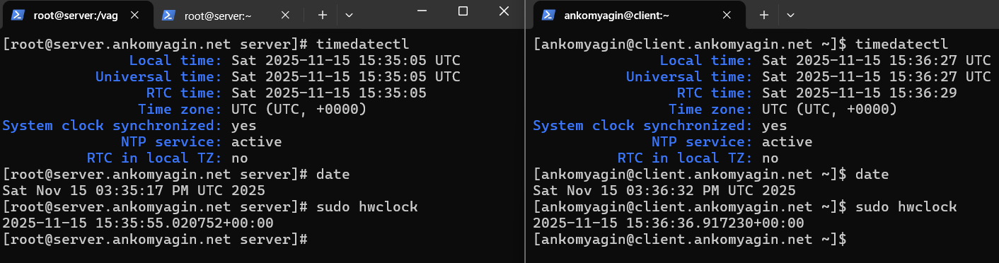
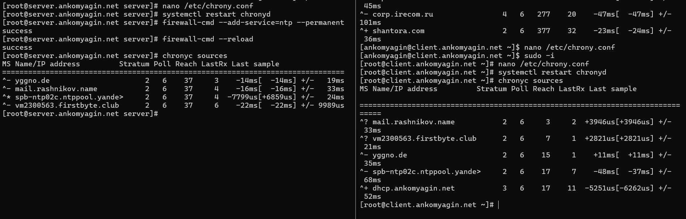

---
## Front matter
lang: ru-RU
title: Лабораторная работа №12
subtitle: Синхронизация времени
author:
 - Комягин А.А.
institute:
 - Российский университет дружбы народов, Москва, Россия

## i18n babel
babel-lang: russian
babel-otherlangs: english

## Formatting pdf
toc: false
toc-title: Содержание
slide_level: 2
aspectratio: 169
section-titles: true
theme: metropolis
header-includes:
 - \metroset{progressbar=frametitle,sectionpage=progressbar,numbering=fraction}
---

# Цель работы

## Цель

Приобретение практических навыков по управлению системным временем и настройке синхронизации времени в ОС Linux.

# Задачи работы

## Основные задачи

- Изучение команд настройки времени

- Настройка сервера синхронизации (NTP)

- Настройка клиента для работы с локальным сервером

- Написание скриптов автоматизации (provisioning)

# Проверка текущих настроек

## Параметры времени

Проверка текущего времени и часового пояса на сервере и клиенте.



# Анализ источников времени

## Исходное состояние

Изначально используются общедоступные пулы NTP-серверов.


# Настройка конфигурации

## Настройка Chrony и Firewall

- На сервере: разрешение доступа (`allow`) и открытие порта firewall.

- На клиенте: указание локального сервера (`server`).



# Проверка синхронизации

## Результат настройки

Клиент успешно синхронизируется с локальным сервером (отображается как локальный источник).


# Автоматизация

## Создание скриптов Provisioning

Подготовка структуры каталогов и скриптов для автоматического развертывания.


# Контрольные вопросы

## Вопрос 1

**Почему важна точная синхронизация времени для служб баз данных?**

Для обеспечения целостности транзакций, корректной репликации данных и ведения логов.

## Вопрос 2

**Зависимость Kerberos от времени**

Kerberos использует метки времени для защиты от атак повторного воспроизведения (replay attacks). Рассинхронизация приводит к сбою аутентификации.

## Вопрос 3 и 4

**Служба по умолчанию в RHEL 7**

- Chronyd

**Страта локальных часов**

- Stratum 10 (при настройке `local`) или Stratum 0 (для аппаратных эталонов).

## Вопрос 5 и 6

**Порт для NTP**

- UDP 123

**Директива для изолированного сервера**

```bash
local stratum 10
```

## Вопрос 7, 8, 9

**Страта без синхронизации**

- 16

**Команда проверки источников**

```bash
chronyc sources
```

**Команда статистики**

```bash
chronyc tracking
```

# Выводы

## Итоги

- Изучены утилиты управления временем (`timedatectl`, `hwclock`).

- Настроен NTP-сервер для локальной сети.

- Настроена синхронизация клиента с локальным сервером.

- Созданы скрипты автоматизации для Vagrant.

