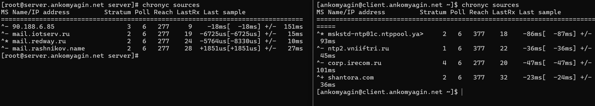
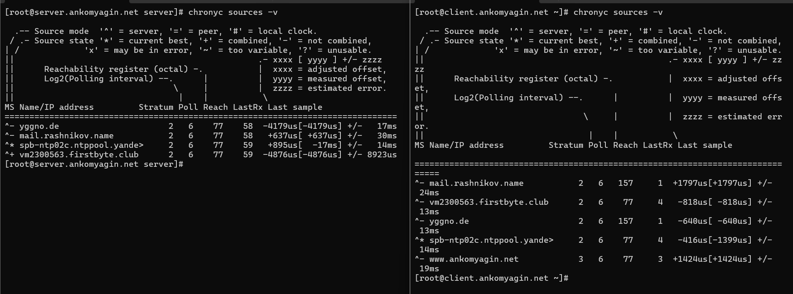
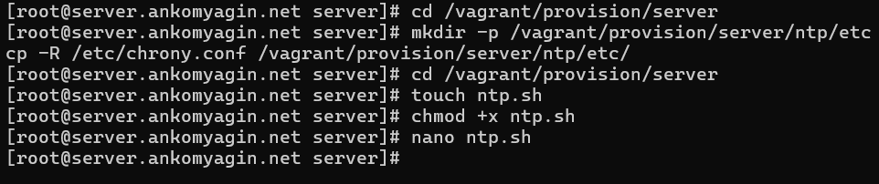

---
# Front matter
title: "Лабораторная работа №12"
subtitle: "Дисциплина: Администрирование сетевых подсистем"
author: "Комягин Андрей Андреевич"

# Generic options
lang: ru-RU
toc-title: "Содержание"

# Bibliography
bibliography: bib/cite.bib
csl: pandoc/csl/gost-r-7-0-5-2008-numeric.csl

# Pdf output format
toc: true # Table of contents
toc-depth: 2
lof: true # List of figures
lot: true # List of tables
fontsize: 12pt
linestretch: 1.5
papersize: a4
documentclass: scrreprt

# I18n polyglossia
polyglossia-lang:
  name: russian
  options:
  - spelling=modern
  - babelshorthands=true
polyglossia-otherlangs:
  name: english

# I18n babel
babel-lang: russian
babel-otherlangs: english

# Fonts
mainfont: IBM Plex Serif
romanfont: IBM Plex Serif
sansfont: IBM Plex Sans
monofont: IBM Plex Mono
mathfont: STIX Two Math
mainfontoptions: Ligatures=Common,Ligatures=TeX,Scale=0.94
romanfontoptions: Ligatures=Common,Ligatures=TeX,Scale=0.94
sansfontoptions: Ligatures=Common,Ligatures=TeX,Scale=MatchLowercase,Scale=0.94
monofontoptions: Scale=MatchLowercase,Scale=0.94,FakeStretch=0.9
mathfontoptions: []

# Biblatex
biblatex: true
biblio-style: gost-numeric
biblatexoptions:
  - parentracker=true
  - backend=biber
  - hyperref=auto
  - language=auto
  - autolang=other*
  - citestyle=gost-numeric

# Pandoc-crossref LaTeX customization
figureTitle: "Рис."
tableTitle: "Таблица"
listingTitle: "Листинг"
lofTitle: "Список иллюстраций"
lotTitle: "Список таблиц"
lolTitle: "Листинги"

# Misc options
indent: true
header-includes:
  - \usepackage{indentfirst}
  - \usepackage{float} # keep figures where they are in the text
  - \floatplacement{figure}{H}
---

# Цель работы

Получение навыков по управлению системным временем и настройке синхронизации времени.

# Выполнение лабораторной работы

## Настройка параметров времени

На виртуальных машинах `server` и `client` были просмотрены параметры настройки даты и времени, а также текущее системное и аппаратное время (рис. [-@fig:001]).

Использованные команды:

```bash
timedatectl
date
sudo hwclock
```

В результате выполнения команд определено, что обе машины находятся в часовом поясе UTC, служба NTP активна, а системные часы синхронизированы.

{#fig:001 width=70%}

## Управление синхронизацией времени

Проверены текущие источники времени на клиенте и сервере с помощью команды `chronyc sources` (рис. [-@fig:002]). Изначально устройства используют общедоступные пулы NTP-серверов.

{#fig:002 width=70%}

### Настройка сервера

На машине `server` отредактирован конфигурационный файл `/etc/chrony.conf`. Добавлена строка разрешения доступа для локальной сети:

```bash
allow 192.168.0.0/16
```

Перезапущена служба `chronyd` и настроен межсетевой экран (FirewallD) для разрешения трафика NTP (рис. [-@fig:003], слева):

```bash
systemctl restart chronyd
firewall-cmd --add-service=ntp --permanent
firewall-cmd --reload
```

### Настройка клиента

На машине `client` отредактирован файл `/etc/chrony.conf`. Удалены внешние пулы и добавлен сервер локальной сети (рис. [-@fig:003], справа):

```bash
server server.ankomyagin.net iburst
```

После перезапуска службы выполнена проверка источников.

{#fig:003 width=70%}

### Проверка синхронизации

Выполнен подробный просмотр информации об источниках синхронизации с помощью команды `chronyc sources -v`.
На клиенте видно, что синхронизация происходит с настроенным локальным сервером (в данном случае отображается как `www.ankomyagin.net` или IP-адрес сервера из локальной сети), статус источника отмечен как `^*` (текущий лучший источник) или `^+` (кандидат).

{#fig:004 width=70%}

## Автоматизация настройки (Provisioning)

Для автоматизации процесса настройки созданы скрипты provisioning для Vagrant. На сервере создана структура каталогов и скопированы конфигурационные файлы (рис. [-@fig:005]).

Команды создания структуры:

```bash
mkdir -p /vagrant/provision/server/ntp/etc
cp -R /etc/chrony.conf /vagrant/provision/server/ntp/etc/
```

Создан исполняемый файл `ntp.sh`:
```bash
touch ntp.sh
chmod +x ntp.sh
```

{#fig:005 width=70%}

Содержимое скрипта `ntp.sh` для сервера:

```bash
#!/bin/bash
echo "Provisioning script $0"
echo "Install needed packages"
dnf -y install chrony
echo "Copy configuration files"
cp -R /vagrant/provision/server/ntp/etc/* /etc
restorecon -vR /etc
echo "Configure firewall"
firewall-cmd --add-service=ntp
firewall-cmd --add-service=ntp --permanent
echo "Restart chronyd service"
systemctl restart chronyd
```

Аналогичные действия (с соответствующим конфигурационным файлом для клиента) предполагаются для машины `client` согласно заданию.

# Контрольные вопросы

1.  **Почему важна точная синхронизация времени для служб баз данных?**
    Точная синхронизация времени необходима для корректного обеспечения целостности транзакций, работы механизмов репликации (определение того, какая запись новее), ведения логов и возможности восстановления данных на определенный момент времени (Point-in-Time Recovery). Рассинхронизация может привести к потере данных или конфликтам записей.

2.  **Почему служба проверки подлинности Kerberos сильно зависит от правильной синхронизации времени?**
    Протокол Kerberos использует метки времени (timestamps) в своих билетах (tickets) для предотвращения атак повторного воспроизведения (replay attacks). Если время на клиенте и сервере различается больше чем на допустимое значение (обычно 5 минут), аутентификация не пройдет.

3.  **Какая служба используется по умолчанию для синхронизации времени на RHEL 7?**
    По умолчанию используется служба `chronyd` (пакет `chrony`).

4.  **Какова страта по умолчанию для локальных часов?**
    Аппаратные часы (атомарные, GPS) считаются Stratum 0. Компьютер, подключенный к ним напрямую, имеет Stratum 1. Если речь идет о директиве `local` в конфигурации `chrony`, которая позволяет серверу отдавать свое время даже без внешней синхронизации, то по умолчанию (или согласно рекомендациям для изолированных сетей) обычно устанавливается высокая страта, например, 10 (`local stratum 10`), чтобы клиенты не предпочитали этот сервер реальным источникам точного времени, если они доступны.

5.  **Какой порт брандмауэра должен быть открыт, если вы настраиваете свой сервер как одноранговый узел NTP?**
    Необходимо открыть порт UDP 123.

6.  **Какую строку вам нужно включить в конфигурационный файл chrony, если вы хотите быть сервером времени, даже если внешние серверы NTP недоступны?**
    Необходимо добавить директиву `local`, указав страту. Например:
    
    ```bash
    local stratum 10
    ```

7.  **Какую страту имеет хост, если нет текущей синхронизации времени NTP?**
    Если хост не синхронизирован и не настроен как локальный источник, он имеет страту 16 (что означает "не синхронизирован" или "время недостоверно").

8.  **Какую команду вы бы использовали на сервере с chrony, чтобы узнать, с какими серверами он синхронизируется?**
    Используется команда:
    
    ```bash
    chronyc sources
    ```
    Для более подробной информации: `chronyc sources -v`.

9.  **Как вы можете получить подробную статистику текущих настроек времени для процесса chrony вашего сервера?**
    Для получения подробной информации о состоянии синхронизации используется команда:
    
    ```bash
    chronyc tracking
    ```
    
    Для статистики по каждому источнику: `chronyc sourcestats`.

# Выводы

В ходе выполнения лабораторной работы были приобретены практические навыки по управлению системным временем в ОС Linux. Изучены утилиты `date`, `hwclock`, `timedatectl`. Выполнена настройка службы синхронизации времени `chrony` в конфигурации клиент-сервер для локальной сети. Настроены правила межсетевого экрана для корректной работы NTP. Созданы скрипты для автоматического развертывания конфигурации в среде Vagrant.

# Список литературы{.unnumbered}

1.  Официальная документация Red Hat Enterprise Linux 7. System Administrator's Guide. Chapter 15. Configuring NTP Using the chrony Suite.
2.  Руководство `man chrony.conf`.
3.  Королькова А. В., Кулябов Д. С. Администрирование сетевых подсистем. Учебно-методическое пособие.
