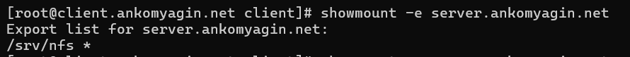
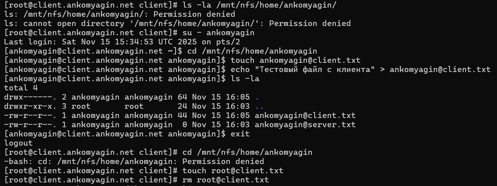

---
## Front matter
lang: ru-RU
title: Лабораторная работа №13
subtitle: Настройка NFS
author:
 - Комягин А.А.
institute:
 - Российский университет дружбы народов, Москва, Россия

## i18n babel
babel-lang: russian
babel-otherlangs: english

## Formatting pdf
toc: false
toc-title: Содержание
slide_level: 2
aspectratio: 169
section-titles: true
theme: metropolis
header-includes:
 - \metroset{progressbar=frametitle,sectionpage=progressbar,numbering=fraction}
---

# Цель работы

## Цель
Приобретение навыков настройки сервера NFS (Network File System) для организации удалённого доступа к файловым ресурсам.

# Задачи работы

## Основные задачи

- Установка и настройка NFS-сервера

- Экспорт каталогов (общих и веб-контента)

- Настройка клиента и монтирование ресурсов

- Проверка прав доступа и безопасности

- Автоматизация настройки

# Настройка сервера

## Базовая конфигурация

Создание каталога `/srv/nfs`, настройка SELinux и запуск служб.

## Настройка Firewall

Открытие необходимых портов и служб (`nfs`, `mountd`, `rpc-bind`).

# Настройка клиента

## Проверка доступных ресурсов

Использование команды `showmount` для просмотра экспортируемых каталогов сервера.

## Монтирование

Создание точки монтирования и подключение удаленного ресурса.

# Расширенная настройка

## Экспорт веб-контента

Использование bind-монтирования для экспорта `/var/www` через NFS.

## Экспорт пользовательских каталогов

Настройка доступа к домашним директориям пользователей с правами на запись.

# Проверка безопасности

## Тестирование прав доступа

Демонстрация работы опции `root_squash`: пользователь может писать файлы, а `root` клиента получает отказ в доступе.

# Автоматизация

## Скрипты Provisioning

Создание bash-скриптов для автоматического развертывания конфигурации через Vagrant.

# Контрольные вопросы

## Вопрос 1

**Как называется файл конфигурации, содержащий общие ресурсы NFS?**

Файл `/etc/exports`.

## Вопрос 2

**Какие порты должны быть открыты в брандмауэре?**

- 2049 (nfs)

- 111 (rpcbind)

- 20048 (mountd)

## Вопрос 3

**Какую опцию следует использовать в `/etc/fstab`?**

Опция `_netdev`. Она гарантирует, что система попытается смонтировать ресурс только после поднятия сети.

# Выводы

## Итоги

- Настроен сервер NFSv4.

- Реализован экспорт различных типов ресурсов.

- Настроено автоматическое монтирование на клиенте.

- Проверены механизмы разграничения доступа.
