---
# Front matter
title: "Лабораторная работа №13"
subtitle: "Дисциплина: Администрирование сетевых подсистем"
author: "Комягин Андрей Андреевич"

# Generic options
lang: ru-RU
toc-title: "Содержание"

# Bibliography
bibliography: bib/cite.bib
csl: pandoc/csl/gost-r-7-0-5-2008-numeric.csl

# Pdf output format
toc: true # Table of contents
toc-depth: 2
lof: true # List of figures
lot: true # List of tables
fontsize: 12pt
linestretch: 1.5
papersize: a4
documentclass: scrreprt

# I18n polyglossia
polyglossia-lang:
  name: russian
  options:
  - spelling=modern
  - babelshorthands=true
polyglossia-otherlangs:
  name: english

# I18n babel
babel-lang: russian
babel-otherlangs: english

# Fonts
mainfont: IBM Plex Serif
romanfont: IBM Plex Serif
sansfont: IBM Plex Sans
monofont: IBM Plex Mono
mathfont: STIX Two Math
mainfontoptions: Ligatures=Common,Ligatures=TeX,Scale=0.94
romanfontoptions: Ligatures=Common,Ligatures=TeX,Scale=0.94
sansfontoptions: Ligatures=Common,Ligatures=TeX,Scale=MatchLowercase,Scale=0.94
monofontoptions: Scale=MatchLowercase,Scale=0.94,FakeStretch=0.9
mathfontoptions: []

# Biblatex
biblatex: true
biblio-style: gost-numeric
biblatexoptions:
  - parentracker=true
  - backend=biber
  - hyperref=auto
  - language=auto
  - autolang=other*
  - citestyle=gost-numeric

# Pandoc-crossref LaTeX customization
figureTitle: "Рис."
tableTitle: "Таблица"
listingTitle: "Листинг"
lofTitle: "Список иллюстраций"
lotTitle: "Список таблиц"
lolTitle: "Листинги"

# Misc options
indent: true
header-includes:
  - \usepackage{indentfirst}
  - \usepackage{float} # keep figures where they are in the text
  - \floatplacement{figure}{H}
---

# Цель работы

Приобретение навыков настройки сервера NFS для удалённого доступа к ресурсам.

# Выполнение лабораторной работы

## Настройка сервера NFSv4

На сервере было установлено необходимое программное обеспечение `nfs-utils`. Создан основной каталог для экспорта `/srv/nfs`.
В файле `/etc/exports` прописан общий доступ только на чтение для всех (`*(ro)`).
Настроен контекст безопасности SELinux и применены изменения.
Запущена служба `nfs-server` и настроен межсетевой экран (добавлены службы `nfs`, `mountd`, `rpc-bind`).

Использованные команды на сервере (рис. [-@fig:001], [-@fig:002]):

```bash
mkdir -p /srv/nfs
semanage fcontext -a -t nfs_t "/srv/nfs(/.*)?"
restorecon -vR /srv/nfs
systemctl enable --now nfs-server
firewall-cmd --add-service=nfs --add-service=mountd --add-service=rpc-bind --permanent
firewall-cmd --reload
```

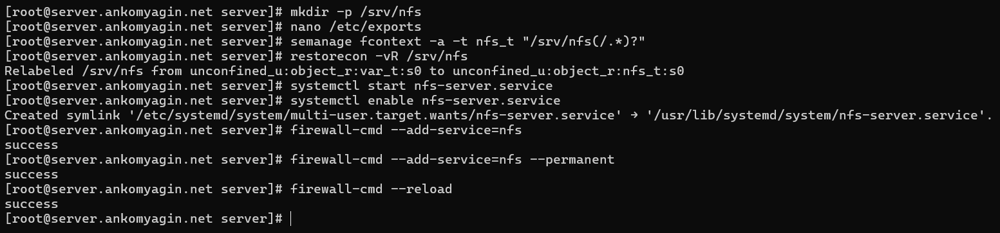{#fig:001 width=70%}

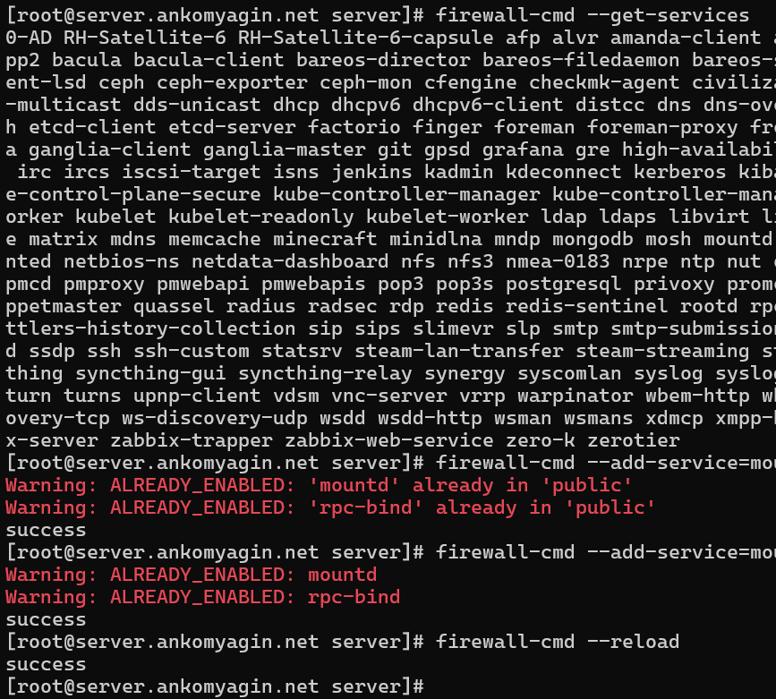{#fig:002 width=70%}

## Настройка клиента и монтирование ресурсов

На клиенте установлен пакет `nfs-utils` (рис. [-@fig:003]).

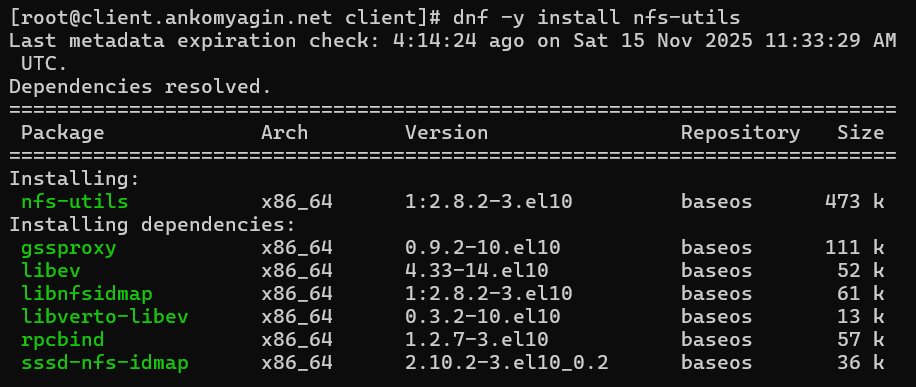{#fig:003 width=70%}

Выполнена проверка доступных экспортируемых ресурсов на сервере с помощью команды `showmount` (рис. [-@fig:004]).

{#fig:004 width=70%}

Создана точка монтирования `/mnt/nfs` и выполнено монтирование удаленного ресурса. Проверена корректность подключения (рис. [-@fig:005]).

```bash
mkdir -p /mnt/nfs
mount server.ankomyagin.net:/srv/nfs /mnt/nfs
```

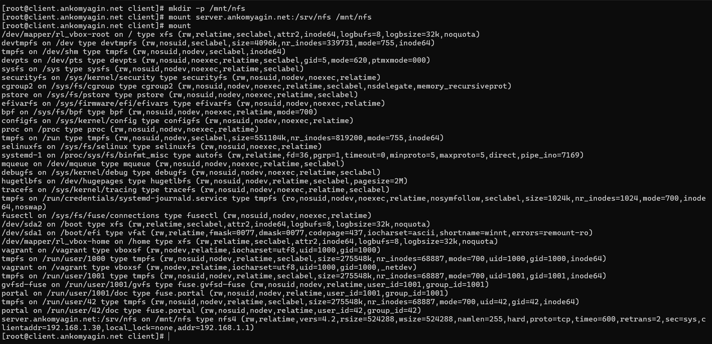{#fig:005 width=70%}

Для автоматического монтирования при загрузке добавлена запись в `/etc/fstab`. Проверена работоспособность `remote-fs.target` (рис. [-@fig:006]).

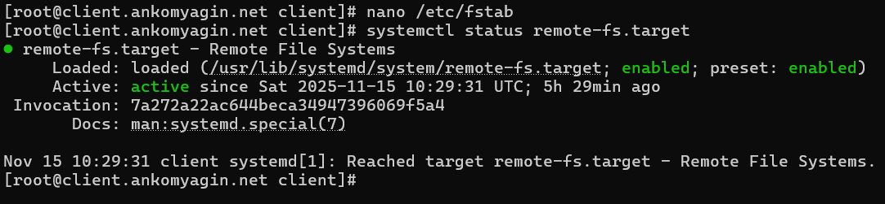{#fig:006 width=70%}

## Подключение каталога с контентом веб-сервера

На сервере создан каталог `/srv/nfs/www`, выполнено bind-монтирование каталога `/var/www` в структуру NFS. Обновлен файл `/etc/exports` для экспорта новой директории в подсеть `192.168.0.0/16` (рис. [-@fig:007]).

```bash
mkdir -p /srv/nfs/www
mount --bind /var/www/ /srv/nfs/www
exportfs -r
```

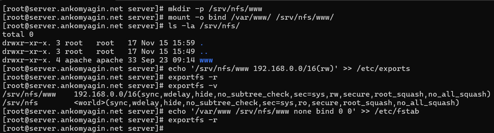{#fig:007 width=70%}

На клиенте проверено появление нового ресурса (рис. [-@fig:008]).

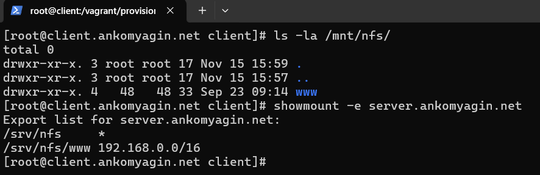{#fig:008 width=70%}

## Подключение каталогов пользователей

На сервере в домашнем каталоге пользователя `ankomyagin` создана папка `common` и тестовый файл. Права доступа ограничены (рис. [-@fig:009]).

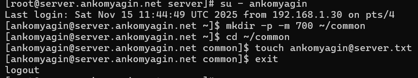{#fig:009 width=70%}

Создана точка монтирования в дереве NFS `/srv/nfs/home/ankomyagin`, выполнено bind-монтирование и обновление `/etc/exports` с правами на чтение и запись (`rw`) для локальной сети (рис. [-@fig:010]).

```bash
mkdir -p /srv/nfs/home/ankomyagin
mount --bind /home/ankomyagin/common /srv/nfs/home/ankomyagin
echo '/srv/nfs/home/ankomyagin 192.168.0.0/16(rw)' >> /etc/exports
exportfs -r
```

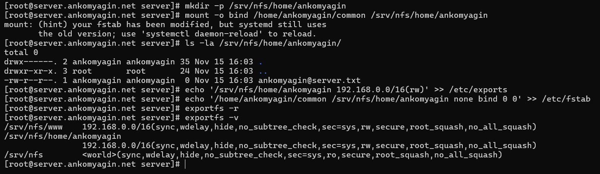{#fig:010 width=70%}

### Проверка доступа

На клиенте выполнен вход под пользователем `ankomyagin`. Пользователь успешно создал файл в смонтированном каталоге.
Также проведена попытка записи от имени `root` клиента. Получен отказ в доступе (`Permission denied`), что подтверждает работу механизма `root_squash` (безопасность NFS по умолчанию) (рис. [-@fig:011]).

{#fig:011 width=70%}

На сервере проверено, что файл, созданный клиентом, действительно появился в каталоге (рис. [-@fig:012]).

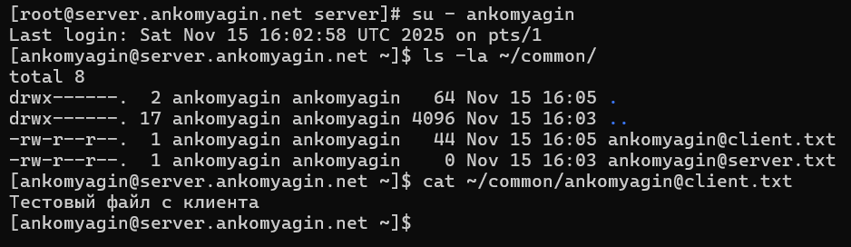{#fig:012 width=70%}

## Автоматизация

Созданы скрипты `nfs.sh` для автоматической настройки сервера и клиента в среде Vagrant (provisioning). Скрипт включает в себя установку пакетов, настройку firewall, создание каталогов, правку fstab и экспортов (рис. [-@fig:013]).

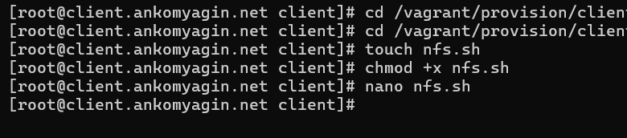{#fig:013 width=70%}

# Контрольные вопросы

1.  **Как называется файл конфигурации, содержащий общие ресурсы NFS?**
   
    Файл конфигурации называется `/etc/exports`. В нем перечисляются экспортируемые каталоги, разрешенные клиенты и параметры доступа.

2.  **Какие порты должны быть открыты в брандмауэре, чтобы обеспечить полный доступ к серверу NFS?**
   
    Для работы NFSv3/NFSv4 требуются порты:
   
    *   TCP/UDP 2049 (nfs)
   
    *   TCP/UDP 111 (rpcbind)
   
    *   TCP/UDP 20048 (mountd)
   
    В `firewalld` достаточно разрешить службы `nfs`, `rpc-bind` и `mountd`.

3.  **Какую опцию следует использовать в `/etc/fstab`, чтобы убедиться, что общие ресурсы NFS могут быть установлены автоматически при перезагрузке?**
   
    Следует использовать опцию `_netdev`. Она указывает системе, что устройство требует сети, и предотвращает попытки монтирования до того, как сеть будет поднята.

# Выводы

В ходе выполнения лабораторной работы был настроен сервер NFS для предоставления доступа к файлам по сети. Изучены механизмы экспортирования каталогов (`/etc/exports`, `exportfs`), настройки firewall и SELinux для NFS. Отработано монтирование удаленных ресурсов на клиенте, в том числе автоматическое через `/etc/fstab`. Проверено разграничение прав доступа и работа опции `root_squash`. Написаны скрипты для автоматизации настройки.

# Список литературы{.unnumbered}

1.  Официальная документация Red Hat Enterprise Linux 7. Storage Administration Guide. Chapter 8. Network File System (NFS).
2.  Руководство `man exports`, `man nfs`.
3.  Королькова А. В., Кулябов Д. С. Администрирование сетевых подсистем. Учебно-методическое пособие.
