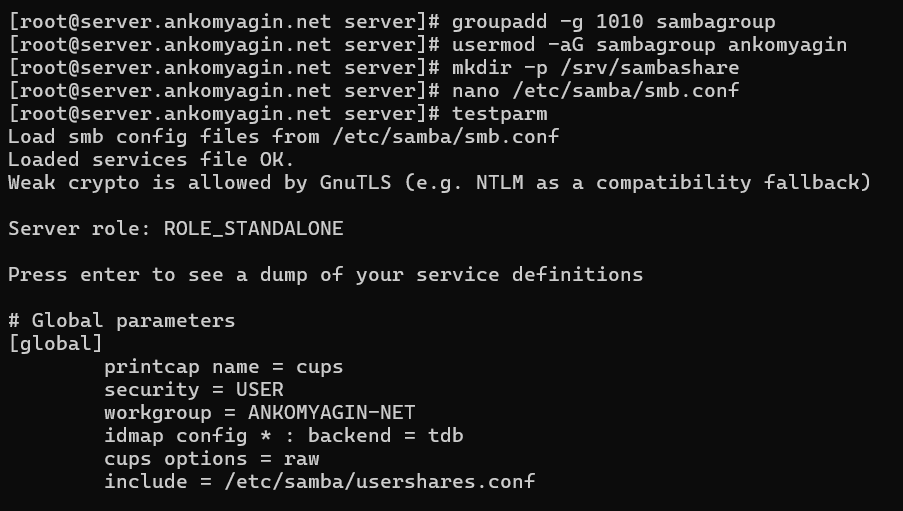
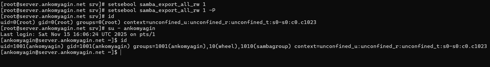
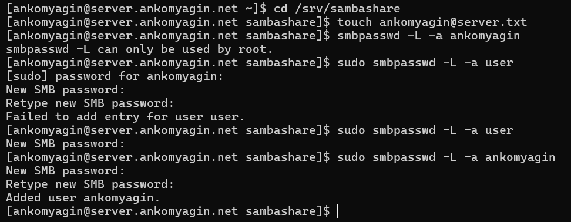
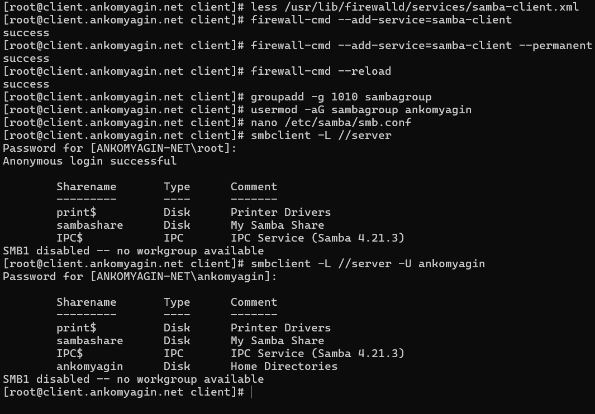
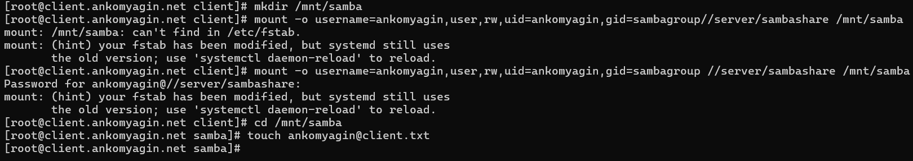
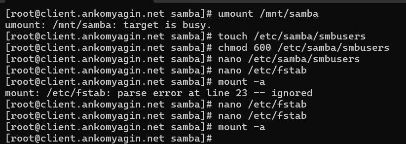
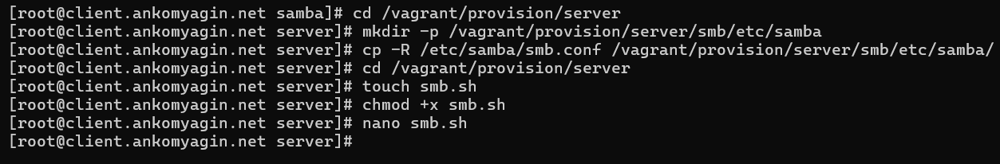

---
## Front matter
lang: ru-RU
title: Лабораторная работа №14
subtitle: Настройка файловых служб Samba
author:
 - Комягин А.А.
institute:
 - Российский университет дружбы народов, Москва, Россия

## i18n babel
babel-lang: russian
babel-otherlangs: english

## Formatting pdf
toc: false
toc-title: Содержание
slide_level: 2
aspectratio: 169
section-titles: true
theme: metropolis
header-includes:
 - \metroset{progressbar=frametitle,sectionpage=progressbar,numbering=fraction}
---

# Цель работы

## Цель

Приобретение навыков настройки доступа групп пользователей к общим ресурсам по протоколу SMB (Server Message Block) для взаимодействия между Unix/Linux и Windows системами.

# Задачи работы

## Основные задачи

- Установка и настройка сервера Samba

- Управление пользователями и правами доступа

- Настройка безопасности (SELinux, Firewall)

- Настройка клиента и монтирование ресурсов

- Автоматизация настройки

# Настройка сервера

## Конфигурация

Настройка файла `/etc/samba/smb.conf`: определение рабочей группы и параметров общего ресурса `[sambashare]`.



## Настройка Firewall и прав доступа

- Открытие портов для службы Samba.

- Настройка прав доступа к файловой системе для группы пользователей.


# Настройка безопасности SELinux

## Контекст и политики

- Установка контекста `samba_share_t` на каталог.

- Включение необходимых переключателей (booleans) для доступа.



# Управление пользователями

## База пользователей Samba

Добавление системного пользователя в базу данных Samba с помощью утилиты `smbpasswd`.



# Настройка клиента

## Проверка доступности

Использование утилиты `smbclient` для просмотра списка экспортируемых ресурсов на сервере.



## Монтирование ресурсов

Ручное монтирование общего каталога и проверка прав на запись (создание файла).



## Автоматическое монтирование

Настройка `/etc/fstab` с использованием файла учетных данных для автоматического подключения при загрузке.



# Автоматизация

## Скрипты Provisioning

Создание скриптов для автоматического развертывания конфигурации сервера через Vagrant.



# Контрольные вопросы

## Вопрос 1

**Минимальная конфигурация ресурса**

```ini
[share]
path = /data
read only = no
```

## Вопрос 5

**Ограничение доступа по IP**

Для ограничения доступа только для определенной сети используется параметр:

```ini
hosts allow = 192.168.10.
```

## Вопрос 6

**Просмотр пользователей Samba**

Команда для вывода списка пользователей:

```bash
pdbedit -L
```

## Вопрос 9

**Защита учетных данных в fstab**

Использование опции `credentials=/path/to/file`, где файл содержит логин и пароль, а права доступа к нему установлены в `600` (только root).

# Выводы

## Итоги

- Развернут сервер Samba для обмена файлами.

- Настроена интеграция с SELinux и Firewall.

- Отработано управление доступом на уровне пользователей и групп.

- Реализовано безопасное автоматическое монтирование ресурсов на клиенте.

