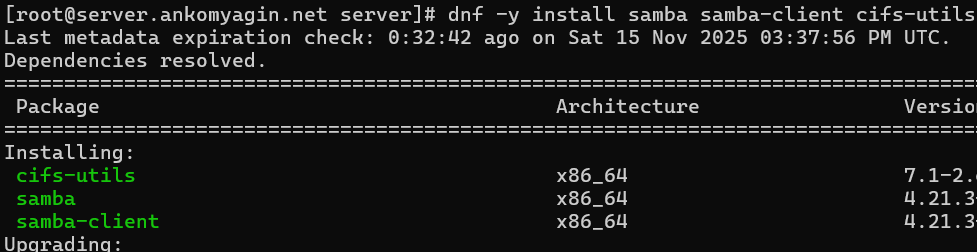
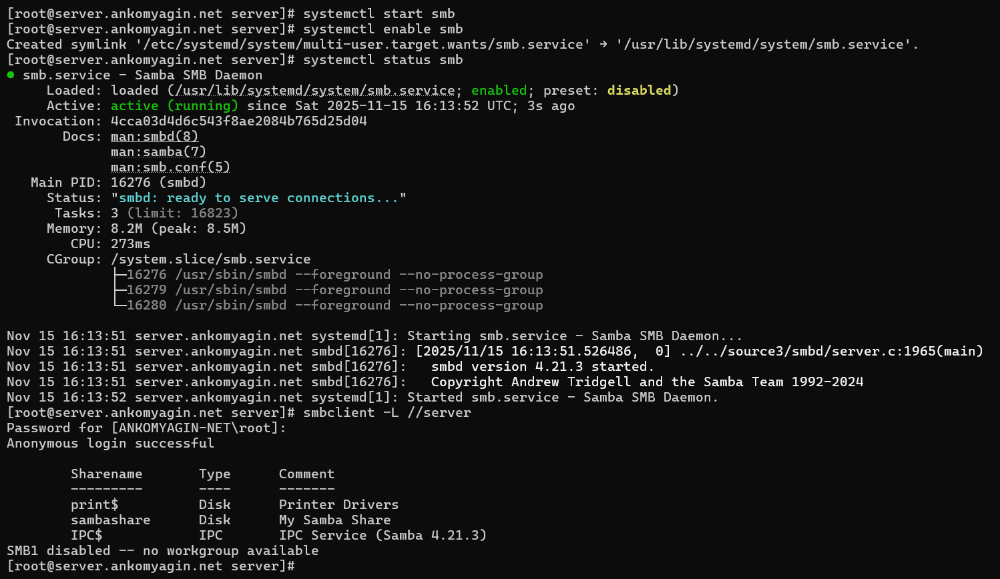
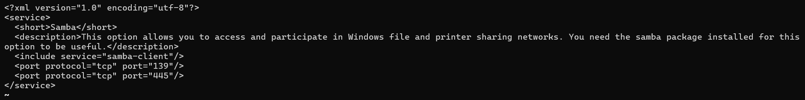
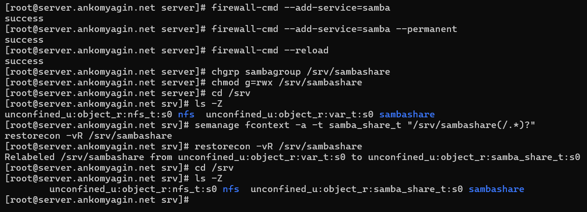
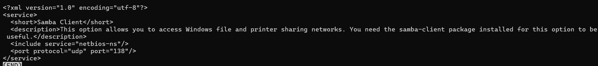

---
# Front matter
title: "Лабораторная работа №14"
subtitle: "Дисциплина: Администрирование сетевых подсистем"
author: "Комягин Андрей Андреевич"

# Generic options
lang: ru-RU
toc-title: "Содержание"

# Bibliography
bibliography: bib/cite.bib
csl: pandoc/csl/gost-r-7-0-5-2008-numeric.csl

# Pdf output format
toc: true # Table of contents
toc-depth: 2
lof: true # List of figures
lot: true # List of tables
fontsize: 12pt
linestretch: 1.5
papersize: a4
documentclass: scrreprt

# I18n polyglossia
polyglossia-lang:
  name: russian
  options:
  - spelling=modern
  - babelshorthands=true
polyglossia-otherlangs:
  name: english

# I18n babel
babel-lang: russian
babel-otherlangs: english

# Fonts
mainfont: IBM Plex Serif
romanfont: IBM Plex Serif
sansfont: IBM Plex Sans
monofont: IBM Plex Mono
mathfont: STIX Two Math
mainfontoptions: Ligatures=Common,Ligatures=TeX,Scale=0.94
romanfontoptions: Ligatures=Common,Ligatures=TeX,Scale=0.94
sansfontoptions: Ligatures=Common,Ligatures=TeX,Scale=MatchLowercase,Scale=0.94
monofontoptions: Scale=MatchLowercase,Scale=0.94,FakeStretch=0.9
mathfontoptions: []

# Biblatex
biblatex: true
biblio-style: gost-numeric
biblatexoptions:
  - parentracker=true
  - backend=biber
  - hyperref=auto
  - language=auto
  - autolang=other*
  - citestyle=gost-numeric

# Pandoc-crossref LaTeX customization
figureTitle: "Рис."
tableTitle: "Таблица"
listingTitle: "Листинг"
lofTitle: "Список иллюстраций"
lotTitle: "Список таблиц"
lolTitle: "Листинги"

# Misc options
indent: true
header-includes:
  - \usepackage{indentfirst}
  - \usepackage{float} # keep figures where they are in the text
  - \floatplacement{figure}{H}
---

# Цель работы

Приобретение навыков настройки доступа групп пользователей к общим ресурсам по протоколу SMB.

# Выполнение лабораторной работы

## Настройка сервера Samba

На сервере установлены необходимые пакеты для работы с Samba: `samba`, `samba-client`, `cifs-utils`.

{#fig:001 width=70%}

Создана группа `sambagroup` с GID 1010, и пользователь `ankomyagin` добавлен в эту группу.

Создан каталог `/srv/sambashare` для общих ресурсов.

Внесены изменения в конфигурационный файл `/etc/samba/smb.conf`: задана рабочая группа и описан раздел `[sambashare]`.

Выполнена проверка конфигурации командой `testparm`.

{#fig:002 width=70%}

Запущена и добавлена в автозагрузку служба `smb`. Проверен статус службы.
Выполнена проверка доступных ресурсов локально с помощью `smbclient -L //server`.

{#fig:003 width=70%}

Просмотрен файл конфигурации firewall для сервиса samba.

{#fig:004 width=70%}

Настроен межсетевой экран: разрешен сервис `samba`.

Настроены права доступа к каталогу: группа `sambagroup` назначена владельцем, права установлены в `rwx` для группы.

Настроен контекст безопасности SELinux: установлен тип `samba_share_t` для каталога.

{#fig:005 width=70%}

Установлены необходимые переключатели (booleans) SELinux для разрешения экспорта файлов (`samba_export_all_rw`). Проверены идентификаторы пользователя.

{#fig:006 width=70%}

Создан тестовый файл в общем каталоге.
Пользователь `ankomyagin` добавлен в базу пользователей Samba с помощью команды `smbpasswd -a`.

{#fig:007 width=70%}

## Настройка клиента Samba

На клиенте установлены пакеты `samba-client` и `cifs-utils`.
Просмотрен файл сервиса firewall для клиента samba.

{#fig:008 width=70%}

Настроен межсетевой экран на клиенте.
Создана аналогичная группа и пользователь на клиенте для совместимости ID.
Выполнена проверка доступности ресурсов сервера с клиента командой `smbclient -L //server`.

{#fig:009 width=70%}

## Монтирование ресурсов

Создана точка монтирования `/mnt/samba`.
Выполнено ручное монтирование ресурса с указанием учетных данных.
В смонтированном каталоге создан тестовый файл `ankomyagin@client.txt` для проверки прав на запись.

{#fig:010 width=70%}

Ресурс размонтирован.
Для автоматического монтирования создан файл с учетными данными `/etc/samba/smbusers` (права доступа 600).
В файл `/etc/fstab` добавлена строка для автоматического монтирования при загрузке.
Выполнена проверка монтирования командой `mount -a`.

{#fig:011 width=70%}

## Автоматизация (Provisioning)

Создан скрипт `smb.sh` в каталоге `/vagrant/provision/server` для автоматической установки и настройки сервера Samba (копирование конфигурации, настройка прав, SELinux, Firewall).

{#fig:012 width=70%}

# Контрольные вопросы

1.  **Какова минимальная конфигурация для smb.conf для создания общего ресурса, который предоставляет доступ к каталогу /data?**

    Минимальная конфигурация должна содержать имя секции и путь:

    ```ini
    [data]
    path = /data
    read only = no
    ```

2.  **Как настроить общий ресурс, который даёт доступ на запись всем пользователям, имеющим права на запись в файловой системе Linux?**

    Необходимо установить параметр `read only = no` (или `writable = yes`) и `create mask`, соответствующий правам Linux.

3.  **Как ограничить доступ на запись к ресурсу только членам определённой группы?**

    Использовать параметры:

    ```ini
    valid users = @groupname
    write list = @groupname
    ```

4.  **Какой переключатель SELinux нужно использовать, чтобы позволить пользователям получать доступ к домашним каталогам на сервере через SMB?**
    `setsebool -P samba_enable_home_dirs 1`

5.  **Как ограничить доступ к определённому ресурсу только узлам из сети 192.168.10.0/24?**
    Добавить в секцию ресурса или global параметр:

    ```ini
    hosts allow = 192.168.10.
    ```

6.  **Какую команду можно использовать, чтобы отобразить список всех пользователей Samba на сервере?**
    `pdbedit -L`

7.  **Что нужно сделать пользователю для доступа к ресурсу, который настроен как многопользовательский ресурс?**
    При монтировании использовать опцию `multiuser`. Это позволяет клиенту использоxвать credentials текущего пользователя Linux для доступа к SMB шаре, если у него есть билет Kerberos или сохраненные учетные данные в keyring.

8.  **Как установить общий ресурс Samba в качестве многопользовательской учётной записи, где пользователь alice используется как минимальная учётная запись пользователя?**
    В опциях монтирования указать: `multiuser,sec=ntlmssp,username=alice`.

9.  **Как можно запретить пользователям просматривать учётные данные монтирования Samba в файле /etc/fstab?**
    Использовать файл с учетными данными. В `fstab` указать опцию `credentials=/path/to/file`, а на сам файл установить права доступа 600 (чтение только root).

10. **Какая команда позволяет перечислить все экспортируемые ресурсы Samba, доступные на определённом сервере?**
    `smbclient -L //hostname`

# Выводы

В ходе лабораторной работы были приобретены навыки настройки файлового сервера Samba. Выполнена установка пакетов, настройка конфигурационного файла `smb.conf`, управление пользователями Samba и правами доступа. Также настроены политики SELinux и Firewalld для корректной работы сервиса. На стороне клиента отработано монтирование общих ресурсов как в ручном режиме, так и автоматически через `/etc/fstab` с использованием файла учетных данных.

# Список литературы{.unnumbered}

1.  Официальная документация Samba.
2.  Руководство `man smb.conf`, `man smbclient`, `man mount.cifs`.
3.  Королькова А. В., Кулябов Д. С. Администрирование сетевых подсистем. Учебно-методическое пособие.
