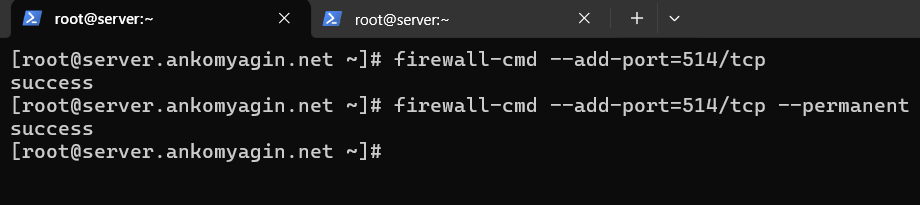
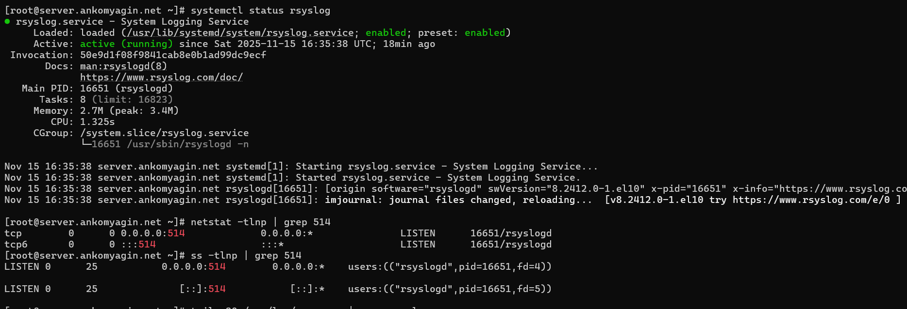
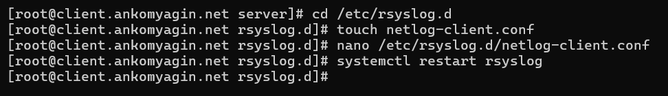
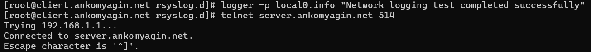
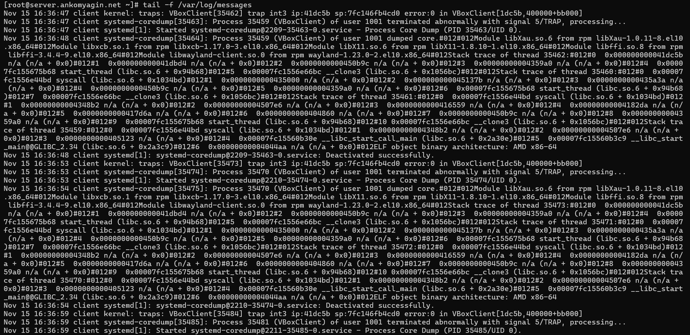
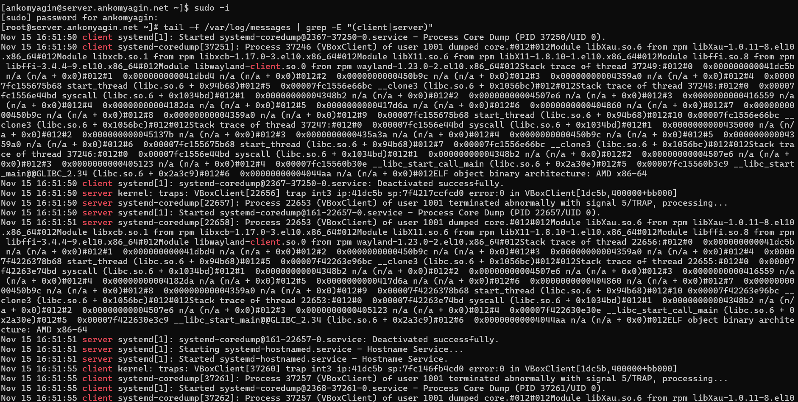
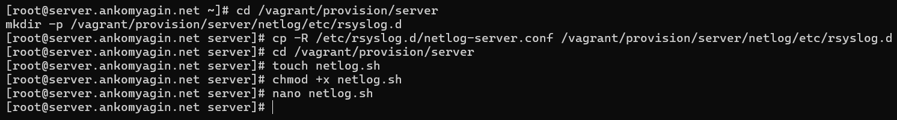

---
## Front matter
lang: ru-RU
title: Лабораторная работа №15
subtitle: Настройка сетевого журналирования
author:
 - Комягин А.А.
institute:
 - Российский университет дружбы народов, Москва, Россия

## i18n babel
babel-lang: russian
babel-otherlangs: english

## Formatting pdf
toc: false
toc-title: Содержание
slide_level: 2
aspectratio: 169
section-titles: true
theme: metropolis
header-includes:
 - \metroset{progressbar=frametitle,sectionpage=progressbar,numbering=fraction}
---

# Цель работы

## Цель

Получение навыков по работе с журналами системных событий и настройка централизованного сбора логов на базе службы `rsyslog`.

# Задачи работы

## Основные задачи

- Настройка сервера для приема логов по TCP

- Настройка клиента для отправки логов на сервер

- Анализ журналов событий

- Автоматизация настройки (Provisioning)

# Настройка сервера

## Конфигурация rsyslog

Создание файла конфигурации для загрузки модуля TCP и прослушивания порта 514.


## Настройка Firewall

Открытие порта 514/tcp для входящих соединений.



## Проверка статуса

Проверка того, что служба запущена и порт прослушивается.



# Настройка клиента

## Перенаправление логов

Настройка отправки всех системных событий (`*.*`) на удаленный сервер.



## Тестирование соединения

Проверка доступности порта и отправка тестового сообщения через утилиту `logger`.



# Анализ журналов

## Просмотр логов на сервере

Мониторинг файла `/var/log/messages` в реальном времени. Видны сообщения от клиента.



## Фильтрация событий

Разделение потоков сообщений от сервера и клиента с помощью `grep`.



# Автоматизация

## Скрипты Provisioning

Подготовка конфигурационных файлов и создание скриптов для автоматического развертывания через Vagrant.



# Контрольные вопросы

## Вопрос 1 и 2

**Модуль для journald**

- `imjournal`

**Устаревший модуль для локального сокета**

- `imuxsock`

## Вопрос 3 и 4

**Отключение устаревшего метода**

- Параметр `$OmitLocalLogging on`

**Основной файл конфигурации**

- `/etc/rsyslog.conf`

## Вопрос 8

**Включение приема по TCP**
Необходимо добавить директивы:

```bash
$ModLoad imtcp
$InputTCPServerRun 514
```

## Вопрос 9

**Настройка Firewall**
Команда для разрешения приема логов:

```bash
firewall-cmd --add-port=514/tcp --permanent
```

# Выводы

## Итоги

- Настроен сервер централизованного сбора логов.

- Организована передача событий с клиента по протоколу TCP.

- Отработаны навыки фильтрации и анализа системных журналов.

- Созданы скрипты для автоматизации процесса.
