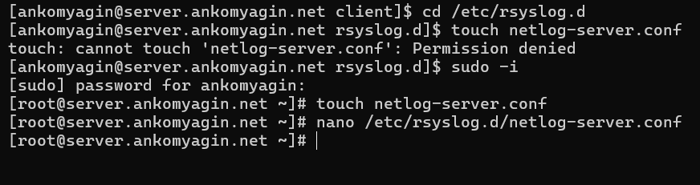
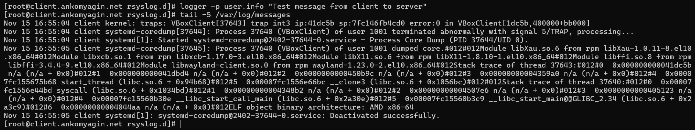
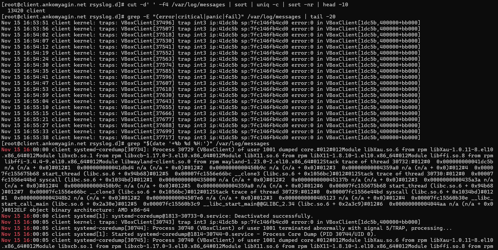
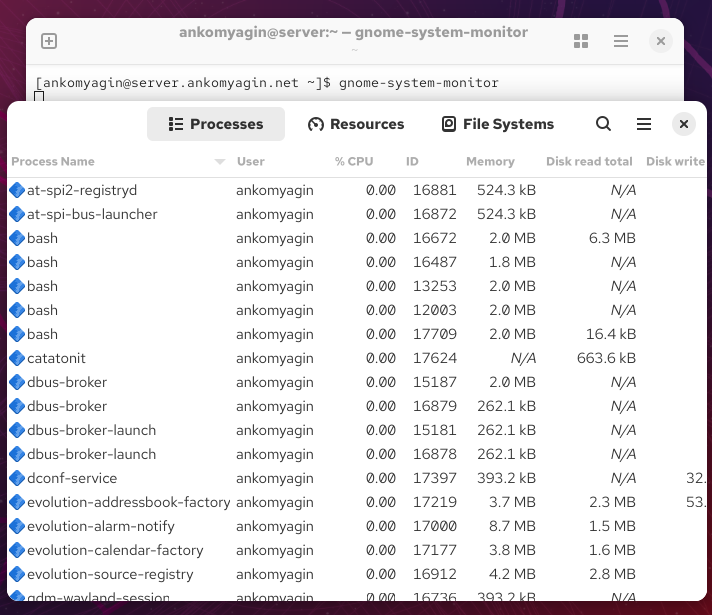

---
# Front matter
title: "Лабораторная работа №15"
subtitle: "Дисциплина: Администрирование сетевых подсистем"
author: "Комягин Андрей Николаевич"

# Generic options
lang: ru-RU
toc-title: "Содержание"

# Bibliography
bibliography: bib/cite.bib
csl: pandoc/csl/gost-r-7-0-5-2008-numeric.csl

# Pdf output format
toc: true # Table of contents
toc-depth: 2
lof: true # List of figures
lot: true # List of tables
fontsize: 12pt
linestretch: 1.5
papersize: a4
documentclass: scrreprt

# I18n polyglossia
polyglossia-lang:
  name: russian
  options:
  - spelling=modern
  - babelshorthands=true
polyglossia-otherlangs:
  name: english

# I18n babel
babel-lang: russian
babel-otherlangs: english

# Fonts
mainfont: IBM Plex Serif
romanfont: IBM Plex Serif
sansfont: IBM Plex Sans
monofont: IBM Plex Mono
mathfont: STIX Two Math
mainfontoptions: Ligatures=Common,Ligatures=TeX,Scale=0.94
romanfontoptions: Ligatures=Common,Ligatures=TeX,Scale=0.94
sansfontoptions: Ligatures=Common,Ligatures=TeX,Scale=MatchLowercase,Scale=0.94
monofontoptions: Scale=MatchLowercase,Scale=0.94,FakeStretch=0.9
mathfontoptions: []

# Biblatex
biblatex: true
biblio-style: gost-numeric
biblatexoptions:
  - parentracker=true
  - backend=biber
  - hyperref=auto
  - language=auto
  - autolang=other*
  - citestyle=gost-numeric

# Pandoc-crossref LaTeX customization
figureTitle: "Рис."
tableTitle: "Таблица"
listingTitle: "Листинг"
lofTitle: "Список иллюстраций"
lotTitle: "Список таблиц"
lolTitle: "Листинги"

# Misc options
indent: true
header-includes:
  - \usepackage{indentfirst}
  - \usepackage{float} # keep figures where they are in the text
  - \floatplacement{figure}{H}
---

# Цель работы

Получение навыков по работе с журналами системных событий, настройка централизованного сбора логов.

# Выполнение лабораторной работы

## Настройка сервера сетевого журнала

На сервере создан конфигурационный файл `/etc/rsyslog.d/netlog-server.conf` для настройки приема логов.
В файл добавлены директивы для загрузки модуля TCP и прослушивания порта 514 (рис. [-@fig:001]):


```bash
$ModLoad imtcp
$InputTCPServerRun 514
```

{#fig:001 width=70%}

Служба `rsyslog` была перезапущена. Выполнена проверка того, что порт 514 прослушивается (рис. [-@fig:002]):


```bash
systemctl restart rsyslog
netstat -tlnp | grep 514
```

{#fig:002 width=70%}

В межсетевом экране открыт порт 514/tcp для приема входящих соединений (рис. [-@fig:003]):


```bash
firewall-cmd --add-port=514/tcp
firewall-cmd --add-port=514/tcp --permanent
```

{#fig:003 width=70%}

## Настройка клиента сетевого журнала

На клиенте создан файл `/etc/rsyslog.d/netlog-client.conf`. В него добавлена строка перенаправления всех логов (`*.*`) на сервер по протоколу TCP (рис. [-@fig:004]):


```bash
*.* @@server.ankomyagin.net:514
```

Служба `rsyslog` на клиенте перезапущена.

{#fig:004 width=70%}

Выполнена проверка связности с сервером по порту 514 с помощью `telnet` и отправка тестового сообщения через `logger` (рис. [-@fig:005]).

{#fig:005 width=70%}

## Просмотр и анализ журналов

На сервере запущен мониторинг файла `/var/log/messages` в реальном времени. В логах отображаются события как от локальной системы, так и от клиента (рис. [-@fig:006], [-@fig:007]).

{#fig:006 width=70%}

{#fig:007 width=70%}

На клиенте также проверена отправка сообщений и их локальная регистрация (рис. [-@fig:008]).

{#fig:008 width=70%}

Для анализа логов использованы команды фильтрации (`grep`, `cut`, `sort`) для выборки интересующих событий (рис. [-@fig:009]).

{#fig:009 width=70%}

Также рассмотрен графический инструмент просмотра процессов и ресурсов `gnome-system-monitor` (рис. [-@fig:010]).

{#fig:010 width=70%}

## Автоматизация настройки

Для автоматизации процесса настройки созданы скрипты provisioning. На сервере подготовлена структура каталогов и скопированы конфигурационные файлы (рис. [-@fig:011]).


```bash
mkdir -p /vagrant/provision/server/netlog/etc/rsyslog.d
cp -R /etc/rsyslog.d/netlog-server.conf /vagrant/provision/server/netlog/etc/rsyslog.d
```

{#fig:011 width=70%}

Создан скрипт `netlog.sh` для автоматической настройки при развертывании Vagrant.

**Содержимое скрипта для сервера:**

```bash
#!/bin/bash
echo "Provisioning script $0"
echo "Copy configuration files"
cp -R /vagrant/provision/server/netlog/etc/* /etc
restorecon -vR /etc
echo "Configure firewall"
firewall-cmd --add-port=514/tcp
firewall-cmd --add-port=514/tcp --permanent
echo "Start rsyslog service"
systemctl restart rsyslog
```

Для клиента также создан соответствующий скрипт, копирующий `netlog-client.conf` и перезапускающий службу.

# Контрольные вопросы

1.  **Какой модуль rsyslog вы должны использовать для приёма сообщений от journald?**
    Для приема сообщений от системного журнала journald используется модуль `imjournal`.

2.  **Как называется устаревший модуль, который можно использовать для включения приёма сообщений журнала в rsyslog?**
    Устаревший модуль, который читал сообщения из локального сокета системы (обычно `/dev/log`), называется `imuxsock`.

3.  **Чтобы убедиться, что устаревший метод приёма сообщений из journald в rsyslog не используется, какой дополнительный параметр следует использовать?**
    В конфигурационном файле следует установить параметр `$OmitLocalLogging on`. Это отключает прием логов через `imuxsock`, полагаясь на `imjournal`.

4.  **В каком конфигурационном файле содержатся настройки, которые позволяют вам настраивать работу журнала?**
    Основной файл конфигурации — `/etc/rsyslog.conf`. Дополнительные настройки часто размещаются в каталоге `/etc/rsyslog.d/`.

5.  **Каким параметром управляется пересылка сообщений из journald в rsyslog?**
    В конфигурации journald (`/etc/systemd/journald.conf`) параметр `ForwardToSyslog=yes` управляет пересылкой. Однако, `rsyslog` с модулем `imjournal` может самостоятельно забирать данные из журнала, независимо от настройки пересылки со стороны journald.

6.  **Какой модуль rsyslog вы можете использовать для включения сообщений из файла журнала, не созданного rsyslog?**
    Для отслеживания текстовых файлов используется модуль `imfile`.

7.  **Какой модуль rsyslog вам нужно использовать для пересылки сообщений в базу данных MariaDB?**
    Используется модуль `ommysql`.

8.  **Какие две строки вам нужно включить в rsyslog.conf, чтобы позволить текущему журнальному серверу получать сообщения через TCP?**
    
```bash
    $ModLoad imtcp
    $InputTCPServerRun 514
```
    (Или в новом синтаксисе RainerScript: `module(load="imtcp")` и `input(type="imtcp" port="514")`).

9.  **Как настроить локальный брандмауэр, чтобы разрешить приём сообщений журнала через порт TCP 514?**
    Необходимо выполнить команду:
    
```bash
    firewall-cmd --add-port=514/tcp --permanent
    firewall-cmd --reload
```

# Выводы

В ходе выполнения лабораторной работы были получены навыки настройки централизованного сервера логирования на базе `rsyslog`. Настроена передача системных сообщений с клиента на сервер по протоколу TCP. Изучены методы просмотра и фильтрации логов с использованием утилит командной строки (`tail`, `grep`) и графических средств. Реализована автоматизация настройки с помощью скриптов Vagrant.

# Список литературы{.unnumbered}

1.  Официальная документация Red Hat Enterprise Linux 7. System Administrator's Guide. Chapter 23. Viewing and Managing Log Files.
2.  Руководство `man rsyslog.conf`.
3.  Королькова А. В., Кулябов Д. С. Администрирование сетевых подсистем. Учебно-методическое пособие.
