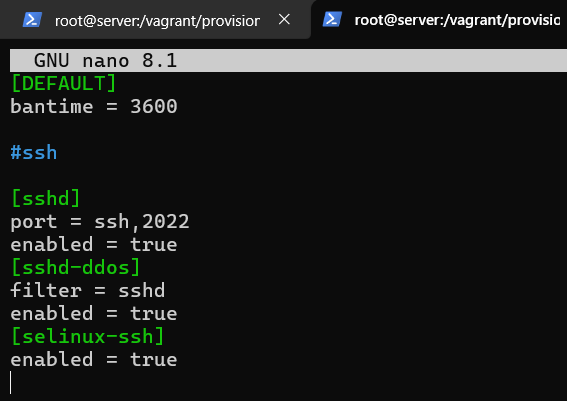
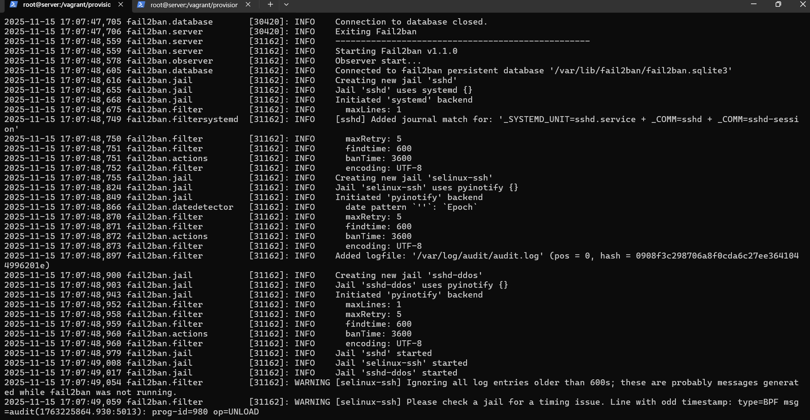
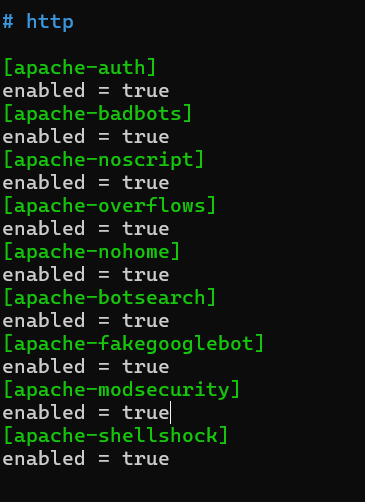
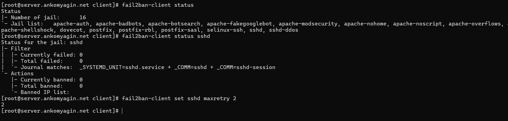
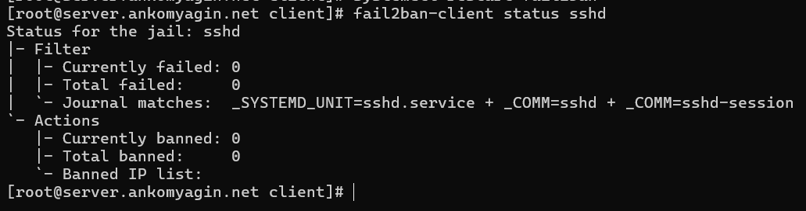

---
## Front matter
lang: ru-RU
title: Лабораторная работа №16
subtitle: Базовая защита от атак типа «brute force»
author:
 - Комягин А.H.
institute:
 - Российский университет дружбы народов, Москва, Россия

## i18n babel
babel-lang: russian
babel-otherlangs: english

## Formatting pdf
toc: false
toc-title: Содержание
slide_level: 2
aspectratio: 169
section-titles: true
theme: metropolis
header-includes:
 - \metroset{progressbar=frametitle,sectionpage=progressbar,numbering=fraction}
---

# Цель работы

## Цель

Получение навыков работы с программным средством **Fail2ban** для обеспечения базовой защиты сервера от атак типа «brute force» (полный перебор паролей).

# Задачи работы

## Основные задачи

1. Установка и базовая настройка Fail2ban.

2. Настройка защиты служб SSH, Web (Apache) и Mail (Postfix/Dovecot).

3. Проверка работоспособности (имитация атаки).

4. Управление блокировками (бан/разбан, белые списки).

5. Автоматизация настройки.

# Настройка Fail2ban

## Конфигурация SSH

Создание локального файла конфигурации `/etc/fail2ban/jail.d/customisation.local`.

Включение защиты для SSH и установка времени блокировки (`bantime`).



## Запуск службы

Запуск службы и проверка инициализации "тюрем" (jails) в логах.



## Защита веб-сервера и почты

Добавление правил для Apache (auth, badbots, noscript) и почтовых сервисов.



## Проверка инициализации правил

В логах видно, что Fail2ban начал отслеживать логи веб-сервера и почты.


# Тестирование защиты

## Подготовка к тесту

Изменение параметра `maxretry` (количество попыток) на 2 для быстрой проверки.



## Имитация атаки

Попытка подключения с клиента с неверным паролем. Результат: разрыв соединения (`Connection refused`) после превышения лимита.


# Управление блокировками

## Статус и разблокировка

Просмотр заблокированных IP-адресов и ручная разблокировка клиента командой `unbanip`.


## Белые списки (IgnoreIP)

Добавление IP-адреса клиента в `ignoreip` для исключения из блокировок.



# Контрольные вопросы

## Вопрос 1

**Принцип работы Fail2ban**

Программа сканирует лог-файлы на наличие паттернов неудачных попыток входа и блокирует IP-адреса атакующих через Firewall (iptables/firewalld).

## Вопрос 2

**Приоритет конфигураций**

Файлы с расширением `.local` имеют приоритет над файлами `.conf`.

## Вопрос 9

**Разблокировка IP**

Используется команда клиента:

```bash
fail2ban-client set <jail_name> unbanip <IP-адрес>
```

# Выводы

## Итоги

- Развернут сервис Fail2ban.

- Настроена защита ключевых служб (SSH, HTTP, SMTP/IMAP).

- Протестирован механизм автоматической блокировки злоумышленников.

- Изучены инструменты управления банами и белыми списками.

