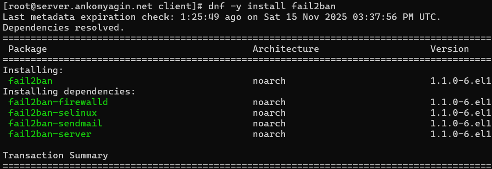
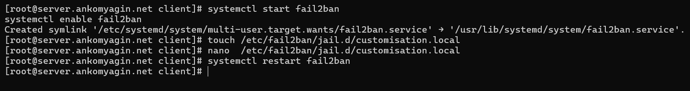
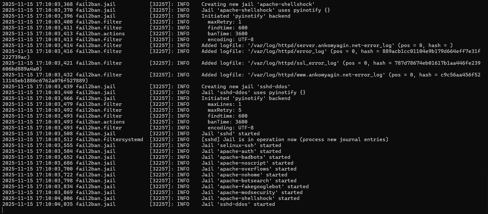
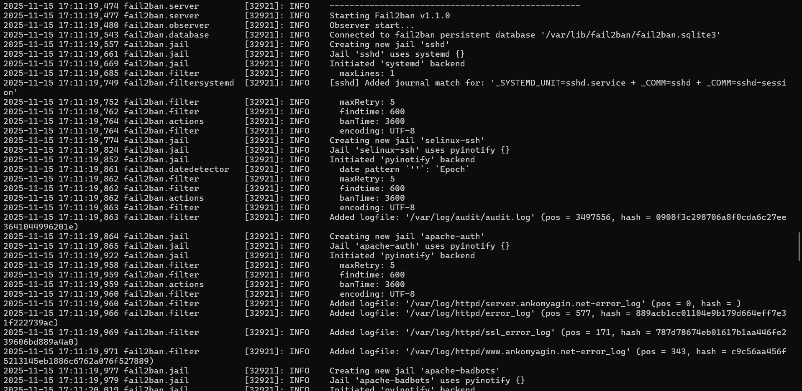
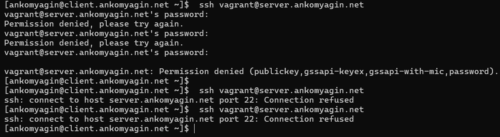
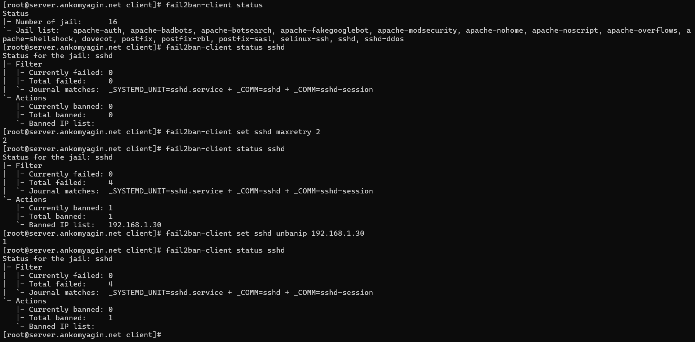

---
# Front matter
title: "Лабораторная работа №16"
subtitle: "Дисциплина: Администрирование сетевых подсистем"
author: "Комягин Андрей Андреевич"

# Generic options
lang: ru-RU
toc-title: "Содержание"

# Bibliography
bibliography: bib/cite.bib
csl: pandoc/csl/gost-r-7-0-5-2008-numeric.csl

# Pdf output format
toc: true # Table of contents
toc-depth: 2
lof: true # List of figures
lot: true # List of tables
fontsize: 12pt
linestretch: 1.5
papersize: a4
documentclass: scrreprt

# I18n polyglossia
polyglossia-lang:
  name: russian
  options:
  - spelling=modern
  - babelshorthands=true
polyglossia-otherlangs:
  name: english

# I18n babel
babel-lang: russian
babel-otherlangs: english

# Fonts
mainfont: IBM Plex Serif
romanfont: IBM Plex Serif
sansfont: IBM Plex Sans
monofont: IBM Plex Mono
mathfont: STIX Two Math
mainfontoptions: Ligatures=Common,Ligatures=TeX,Scale=0.94
romanfontoptions: Ligatures=Common,Ligatures=TeX,Scale=0.94
sansfontoptions: Ligatures=Common,Ligatures=TeX,Scale=MatchLowercase,Scale=0.94
monofontoptions: Scale=MatchLowercase,Scale=0.94,FakeStretch=0.9
mathfontoptions: []

# Biblatex
biblatex: true
biblio-style: gost-numeric
biblatexoptions:
  - parentracker=true
  - backend=biber
  - hyperref=auto
  - language=auto
  - autolang=other*
  - citestyle=gost-numeric

# Pandoc-crossref LaTeX customization
figureTitle: "Рис."
tableTitle: "Таблица"
listingTitle: "Листинг"
lofTitle: "Список иллюстраций"
lotTitle: "Список таблиц"
lolTitle: "Листинги"

# Misc options
indent: true
header-includes:
  - \usepackage{indentfirst}
  - \usepackage{float} # keep figures where they are in the text
  - \floatplacement{figure}{H}
---

# Цель работы

Получить навыки работы с программным средством Fail2ban для обеспечения базовой защиты от атак типа «brute force».

# Выполнение лабораторной работы

## Защита с помощью Fail2ban

### Установка и базовая настройка

На сервере установлен пакет `fail2ban`.

{#fig:001 width=70%}

Создан файл локальной конфигурации `/etc/fail2ban/jail.d/customisation.local`. В нем задано время блокировки (`bantime = 3600`) и активирована защита для SSH (`[sshd]`, `[sshd-ddos]`, `[selinux-ssh]`).

{#fig:002 width=70%}

Служба `fail2ban` запущена и добавлена в автозагрузку.

{#fig:003 width=70%}

В логах `/var/log/fail2ban.log` проверено корректное создание "тюрем" (jails) для SSH.

{#fig:004 width=70%}

### Настройка защиты Web и Mail сервисов

В конфигурационный файл добавлены секции для защиты веб-сервера Apache (группы правил `apache-auth`, `apache-badbots`, `apache-noscript` и др.) и почтовых служб Postfix и Dovecot.

{#fig:005 width=70%}

После перезапуска службы в логах зафиксировано создание соответствующих jail'ов.

{#fig:006 width=70%}

{#fig:007 width=70%}

## Проверка работы Fail2ban

Для тестирования защиты SSH выполнен просмотр текущего статуса с помощью `fail2ban-client status`.
Количество допустимых попыток ввода пароля (`maxretry`) для теста временно изменено на 2.

{#fig:008 width=70%}

С клиента выполнены попытки подключения по SSH с неверным паролем. После превышения лимита попыток соединение было разорвано (`Connection refused`), что свидетельствует о блокировке IP-адреса межсетевым экраном сервера.

{#fig:009 width=70%}

На сервере проверен статус jail `sshd`: видно, что один IP-адрес находится в бане.
Затем выполнена ручная разблокировка IP-адреса клиента командой `set sshd unbanip`. Повторная проверка показала отсутствие заблокированных адресов.

{#fig:010 width=70%}

После этого в конфигурационный файл был добавлен параметр `ignoreip` с адресом клиента, чтобы исключить его из блокировок. Повторные попытки подбора пароля с клиента больше не приводили к бану.

{#fig:011 width=70%}

## Автоматизация (Provisioning)

Создан скрипт `protect.sh` для автоматической установки и настройки Fail2ban в среде Vagrant. Скрипт копирует подготовленные конфигурационные файлы и запускает службу.

# Контрольные вопросы

1.  **Поясните принцип работы Fail2ban.**

    Fail2ban сканирует лог-файлы (например, `/var/log/secure` или `/var/log/httpd/error_log`) и ищет записи, соответствующие заданным шаблонам (регулярным выражениям), свидетельствующим о злонамеренной активности (неудачные попытки входа, поиск уязвимостей и т.д.). При обнаружении совпадений Fail2ban обновляет правила межсетевого экрана (iptables, firewalld, nftables) для блокировки IP-адреса источника на определенное время.

2.  **Настройки какого файла более приоритетны: jail.conf или jail.local?**

    Настройки в файлах `.local` имеют приоритет над настройками в файлах `.conf`. Файл `jail.conf` содержит настройки по умолчанию и может быть перезаписан при обновлении пакета, поэтому пользовательские изменения следует вносить в `jail.local`.

3.  **Как настроить оповещение администратора при срабатывании Fail2ban?**

    В конфигурационном файле необходимо настроить параметр `destemail` (адрес получателя), `sender` (адрес отправителя) и `action` (действие). Обычно используется действие `%(action_mw)s` или `%(action_mwl)s`, которое отправляет уведомление с whois-информацией и логами.

4.  **Поясните настройки по умолчанию для веб-служб.**

    Секции типа `[apache-auth]`, `[apache-badbots]`, `[apache-overflows]` и т.д. в `jail.conf` предназначены для защиты веб-сервера.

    *   `enabled = true` — включает правило.

    *   `port = http,https` — указывает порты для блокировки.

    *   `logpath` — путь к лог-файлу веб-сервера, который анализируется.

    *   `maxretry` — количество попыток перед баном.

5.  **Поясните настройки по умолчанию для почтовой службы.**

    Секции `[postfix]`, `[dovecot]`, `[postfix-sasl]` защищают почтовые сервисы.

    *   `filter` — указывает имя фильтра (regex) в `/etc/fail2ban/filter.d/`.

    *   `port` — порты SMTP, SMTPS, POP3, IMAP.

    *   `logpath` — обычно `/var/log/maillog`.

6.  **Какие действия может выполнять Fail2ban? Где посмотреть их описание?**

    Fail2ban может блокировать IP через firewall, добавлять записи в hosts.deny, отправлять e-mail уведомления, писать в собственные логи. Описание действий (action scripts) находится в каталоге `/etc/fail2ban/action.d/`.

7.  **Как получить список действующих правил Fail2ban?**

    С помощью команды `fail2ban-client status`. Для детальной информации по конкретной тюрьме: `fail2ban-client status <jail_name>`. Также можно посмотреть правила firewall: `firewall-cmd --list-all` или `iptables -L`.

8.  **Как получить статистику заблокированных Fail2ban адресов?**
    Команда `fail2ban-client status <jail_name>` показывает количество текущих ("Currently banned") и общих ("Total banned") блокировок для конкретного jail.

9.  **Как разблокировать IP-адрес?**

    Используется команда:
    `fail2ban-client set <jail_name> unbanip <IP-адрес>`.

# Выводы

В ходе выполнения лабораторной работы было развернуто программное средство Fail2ban для защиты сервера от атак методом перебора паролей. Выполнена настройка правил блокировки для служб SSH, Apache, Postfix и Dovecot. Проведено тестирование работы защиты: продемонстрирована автоматическая блокировка атакующего узла и последующая ручная разблокировка, а также настройка белых списков. Написан скрипт для автоматизации настройки.

# Список литературы{.unnumbered}

1.  Официальная документация Fail2ban.
2.  Руководство `man fail2ban-client`, `man jail.conf`.
3.  Королькова А. В., Кулябов Д. С. Администрирование сетевых подсистем. Учебно-методическое пособие.
