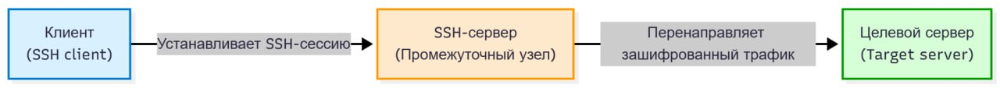
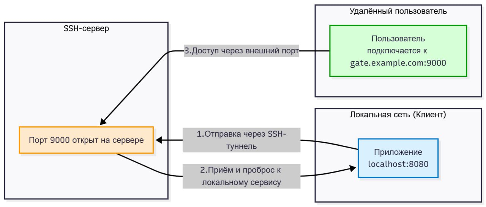

---
## Front matter
lang: ru-RU
title: SSH Port Forwarding
subtitle: Настройка и применение SSH-туннелей
  - Комягин А.Н.
institute:
  - Российский университет дружбы народов, Москва, Россия


## i18n babel
babel-lang: russian
babel-otherlangs: english

## Formatting pdf
toc: false
toc-title: Содержание
slide_level: 2
aspectratio: 169
section-titles: true
theme: metropolis
header-includes:
 - \metroset{progressbar=frametitle,sectionpage=progressbar,numbering=fraction}
 

## Fonts
mainfont: IBM Plex Serif
romanfont: IBM Plex Serif
sansfont: IBM Plex Sans
monofont: IBM Plex Mono
mathfont: STIX Two Math
mainfontoptions: Ligatures=Common,Ligatures=TeX,Scale=0.94
romanfontoptions: Ligatures=Common,Ligatures=TeX,Scale=0.94
sansfontoptions: Ligatures=Common,Ligatures=TeX,Scale=MatchLowercase,Scale=0.94
monofontoptions: Scale=MatchLowercase,Scale=0.94,FakeStretch=0.9
 
---

# Информация

## Докладчик

::::::::::::::{.columns align=center}
:::{.column width="65%"}

* Комягин Андрей Николаевич

* Студент

* Российский университет дружбы народов им. П. Лумумбы 

* Тема: SSH Port Forwarding. Настройка

:::
:::{.column width="35%"}

:::
::::::::::::::


# Введение

## Актуальность

- Безопасный доступ к ресурсам в закрытых сетях — важная задача в современной ИТ-инфраструктуре. 

- Протокол **SSH** обеспечивает защищённый канал передачи данных. 

- **SSH Port Forwarding** (туннелирование) — механизм для безопасного перенаправления трафика. 

- Позволяет:

  - Обходить межсетевые экраны;
  
  - Подключаться к внутренним базам данных и веб-интерфейсам;
  
  - Шифровать трафик приложений, не поддерживающих HTTPS.

## Цель и задачи

**Цель:** 

Рассмотреть принципы работы и настройку SSH Port Forwarding.

**Задачи:** 

- Изучить типы проброса портов: локальный, удалённый и динамический; 

- Разобрать синтаксис и практические примеры; 

- Рассмотреть аспекты безопасности и конфигурации.

# Основная часть

## Общие сведения

**SSH Port Forwarding** — механизм, позволяющий направлять сетевой трафик между хостами через защищённый SSH-канал.

**Компоненты:**

1. **SSH-клиент** — инициирует соединение; 

2. **SSH-сервер** — промежуточный узел; 

3. **Целевой сервер** — конечный ресурс.

{width=80%}

Трафик шифруется и инкапсулируется, обеспечивая конфиденциальность данных.

## Локальный проброс портов (Local Port Forwarding)

Используется для доступа к удалённому ресурсу через локальный порт. 

- Схема:

{width=90%}

- Команда:

  ```bash
  ssh -L [локальный_IP]:локальный_порт:
  целевой_хост:целевой_порт user@ssh-сервер
  ```
  
## Локальный проброс портов (Local Port Forwarding)

{width=90%}
  
- Пример:

  ```bash
  ssh -L 8000:db.internal:5432 user@gate.example.com
  ```
  
  После этого `localhost:8000` перенаправляет запросы в удалённую базу данных PostgreSQL.

## Удалённый проброс портов (Remote Port Forwarding)

Делает локальный сервис доступным с удалённого сервера. 

- Схема:

{width=50%}
  
- Команда:

  ```bash
  ssh -R [удаленный_IP]:удаленный_порт:локальный_хост:
  локальный_порт user@ssh-сервер
  ```

## Удалённый проброс портов (Remote Port Forwarding)  
  
{width=50%}  
  
- Пример:

  ```bash
  ssh -R 9000:localhost:8080 user@gate.example.com
  ```
  
  Позволяет коллеге открыть локальный сайт по адресу `gate.example.com:9000`.

  Чтобы порт был доступен извне, в `/etc/ssh/sshd_config` требуется:
  
  ```bash
  GatewayPorts yes
  ```

## Динамический проброс портов (Dynamic Port Forwarding)

Создаёт **SOCKS-прокси**, через который приложения могут направлять трафик.

Универсальный способ защищённого выхода в интернет.

- Команда:

  ```bash
  ssh -D [локальный_IP]:локальный_порт user@ssh-сервер
  ```
  
{width=100%}

## Динамический проброс портов (Dynamic Port Forwarding)
  
- Пример:
  
  ```bash
  ssh -D 1080 user@gate.example.com
  ```
  
- Настроив браузер на SOCKS5-прокси `localhost:1080`, получаем зашифрованный доступ через SSH-сервер.

{width=100%}

## Настройка и безопасность

- Основной параметр в `/etc/ssh/sshd_config`:

  ```bash
  AllowTcpForwarding yes
  ```
  
- Рекомендации:
  - Использовать **SSH-ключи** вместо паролей;
  - Ограничивать доступ через **firewall**;
  - При необходимости — использовать `autossh` для восстановления туннеля.

# Заключение

## Итоги

- **SSH Port Forwarding** — мощный инструмент защиты и удалённого доступа. 

- Позволяет:
  - Создавать зашифрованные туннели;
  - Обходить сетевые ограничения;
  - Защищать приложения без встроенного шифрования.
   
- Владение этим инструментом — важный навык системного администратора и разработчика.

# Список литературы

* [SSH тоннели - пробрасываем порт](https://habr.com/ru/articles/81607/) (дата обращения 05.11.2025)

* [OpenSSH Project. Official Documentation](https://www.openssh.com/manual.html) (дата обращения: 06.11.2025).

[Arch Linux Wiki. SSH tunnels](https://wiki.archlinux.org/title/SSH_tunnels) (дата обращения: 05.11.2025).

* [DigitalOcean Community. How To Set up SSH Tunneling on a VPS](https://www.digitalocean.com/community/tutorials/how-to-set-up-ssh-tunneling-on-a-vps) (дата обращения: 06.11.2025).

* Документация по SSH в Linux: man ssh, man ssh_config.


