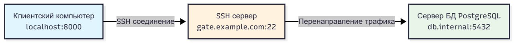
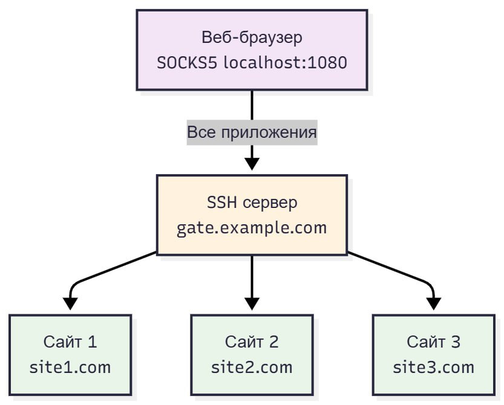

---
# Front matter
title: "Доклад"
subtitle: "по теме SSH Port Forwarding. Настройка"
author: "Комягин Андрей Николаевич"

# Generic options
lang: ru-RU
toc-title: "Содержание"
number-sections: true

# Bibliography
bibliography: bib/cite.bib
csl: pandoc/csl/gost-r-7-0-5-2008-numeric.csl

# Pdf output format
toc: true                # Table of contents
toc-depth: 2
lof: true                # List of figures
lot: true                # List of tables
fontsize: 12pt
linestretch: 1.5
papersize: a4
documentclass: scrreprt

# I18n polyglossia
polyglossia-lang:
  name: russian
  options:
    - spelling=modern
    - babelshorthands=true
polyglossia-otherlangs:
  name: english

# I18n babel
babel-lang: russian
babel-otherlangs: english

# Fonts
mainfont: IBM Plex Serif
romanfont: IBM Plex Serif
sansfont: IBM Plex Sans
monofont: IBM Plex Mono
mathfont: STIX Two Math
mainfontoptions: Ligatures=Common,Ligatures=TeX,Scale=0.94
romanfontoptions: Ligatures=Common,Ligatures=TeX,Scale=0.94
sansfontoptions: Ligatures=Common,Ligatures=TeX,Scale=MatchLowercase,Scale=0.94
monofontoptions: Scale=MatchLowercase,Scale=0.94,FakeStretch=0.9
mathfontoptions: []

# Biblatex
biblatex: true
biblio-style: gost-numeric
biblatexoptions:
  - parentracker=true
  - backend=biber
  - hyperref=auto
  - language=auto
  - autolang=other*
  - citestyle=gost-numeric

# Pandoc-crossref LaTeX customization
figureTitle: "Рис."
tableTitle: "Таблица"
listingTitle: "Листинг"
lofTitle: "Список иллюстраций"
lotTitle: "Список таблиц"
lolTitle: "Листинги"

# Misc options
indent: true
header-includes:
  - \usepackage{indentfirst}
  - \usepackage{float}        # keep figures where they are in the text
  - \floatplacement{figure}{H}
---


# Введение

В современных сетевых инфраструктурах часто возникает необходимость безопасного доступа к ресурсам, расположенным в закрытых или недоверенных сетях. Протокол **Secure Shell (SSH)** предоставляет мощный механизм для решения этой задачи — **SSH Port Forwarding**, также известный как **SSH-туннелирование**. Этот механизм позволяет создавать зашифрованный канал между двумя точками, внутри которого можно безопасно передавать трафик других приложений.

SSH Port Forwarding позволяет обходить межсетевые экраны, обеспечивать безопасный доступ к удаленным базам данных или веб-интерфейсам, а также шифровать трафик приложений, которые изначально не поддерживают шифрование. По сути, проброс портов является одной из ключевых практических реализаций SSH-туннелей и может служить основой для создания простого прокси-сервера.

Целью данного доклада является подробное рассмотрение механизма SSH port forwarding, его основных разновидностей и практических аспектов настройки. Будут проанализированы локальный, удаленный и динамический типы проброса портов, их синтаксис и типовые сценарии использования.

# Основная часть

## Общие сведения о SSH Port Forwarding

SSH Port Forwarding (проброс портов SSH) — это функция протокола Secure Shell, позволяющая перенаправлять сетевой трафик с определенного порта локальной или удаленной машины на порт другой машины через защищенное SSH-соединение. Этот процесс создает зашифрованный туннель, который инкапсулирует данные других протоколов (например, HTTP, VNC, MySQL), обеспечивая их конфиденциальность и целостность при передаче по незащищенной сети.

Для организации проброса портов необходимы три компонента:

- **SSH-клиент** — компьютер, с которого инициируется соединение.

- **SSH-сервер** — промежуточный узел, к которому подключается клиент и через который проходит туннелированный трафик.

- **Целевой сервер (Destination Server)** — конечный узел, на котором расположен сервис, к которому необходимо получить доступ.

В зависимости от задачи и направления трафика выделяют три основных типа проброса портов.

## Локальный проброс портов (Local Port Forwarding)

Локальный проброс используется для получения доступа к ресурсу на удаленном сервере (или в его сети) так, как если бы он был доступен на локальной машине. Трафик, отправленный на локальный порт, перенаправляется через SSH-сервер к целевому сервису.

Схема работы (рис. \ref{fig-001}): Клиент -> SSH-сервер -> Целевой сервис.

{#fig-001 width=90%}

Синтаксис команды:

```bash
ssh -L [локальный_IP]:локальный_порт:целевой_хост:целевой_порт user@ssh-сервер
```

-L — ключ, указывающий на локальный проброс.

локальный_порт — порт на машине клиента, который будет прослушиваться.

целевой_хост: целевой_порт — адрес и порт сервиса, к которому нужно получить доступ с точки зрения SSH-сервера.

Пример: Доступ к базе данных PostgreSQL, которая работает на сервере db.internal (порт 5432) и доступна только из внутренней сети. SSH-сервер gate.example.com имеет доступ в эту сеть.

```bash
ssh -L 8000:db.internal:5432 user@gate.example.com
```

После выполнения этой команды можно подключиться к удаленной БД, обращаясь к localhost:8000 на своей машине.

## Удаленный проброс портов (Remote Port Forwarding)

Удаленный проброс решает обратную задачу: делает сервис, работающий на локальной машине, доступным на удаленном SSH-сервере. Это полезно, когда нужно предоставить доступ к локальному веб-серверу или приложению из внешней сети.

Схема работы (рис. \ref{fig-002}): Целевой сервис <- SSH-сервер <- Клиент.

{#fig-002 width=90%}

Синтаксис команды:

```bash
ssh -R [удаленный_IP]:удаленный_порт:локальный_хост:локальный_порт user@ssh-сервер
```

-R — ключ, указывающий на удаленный проброс.

удаленный_порт — порт на SSH-сервере, который будет прослушиваться.

локальный_хост:локальный_порт — адрес и порт сервиса в локальной сети клиента.

Пример: Показать коллеге веб-сайт, запущенный на локальной машине на порту 8080.

```bash
ssh -R 9000:localhost:8080 user@gate.example.com
```

Теперь коллега сможет открыть сайт, обратившись к адресу gate.example.com:9000. Для того чтобы порт был доступен не только с localhost сервера, на сервере в файле /etc/ssh/sshd_config должна быть установлена опция GatewayPorts yes.

## Динамический проброс портов (Dynamic Port Forwarding)

Динамический проброс создает на локальной машине SOCKS-прокси, который направляет трафик от любого приложения через SSH-сервер. В отличие от локального и удаленного проброса, он не привязан к конкретному целевому хосту и порту, а позволяет гибко направлять трафик к разным ресурсам через туннель.

Синтаксис команды:

```bash
ssh -D [локальный_IP]:локальный_порт user@ssh-сервер
```

-D — ключ, указывающий на динамический проброс.

локальный_порт — порт на локальной машине, который будет действовать как SOCKS-прокси.

Пример: Безопасный веб-серфинг через удаленный сервер.

```bash
ssh -D 1080 user@gate.example.com
```

После выполнения этой команды необходимо настроить браузер или другое приложение на использование SOCKS5-прокси по адресу localhost:1080 (рис. \ref{fig-003}). Весь трафик этого приложения будет зашифрован и перенаправлен через gate.example.com. Этот метод является основой для создания простого персонального прокси-сервера.

{#fig-003 width=70%}

## Аспекты настройки и безопасности

Для корректной работы проброса портов может потребоваться настройка SSH-сервера. Ключевым параметром в файле /etc/ssh/sshd_config является:

AllowTcpForwarding: должен иметь значение yes (по умолчанию) для разрешения проброса портов.

При использовании удаленного проброса следует помнить о безопасности, так как он открывает доступ из внешней сети к вашему локальному компьютеру. Рекомендуется использовать SSH-ключи для аутентификации и ограничивать доступ с помощью файрволов. Для поддержания постоянного туннеля можно использовать утилиты вроде autossh, которые автоматически восстанавливают соединение при обрыве.

# Заключение

SSH Port Forwarding — это гибкий и мощный инструмент для решения широкого круга задач, связанных с безопасностью и сетевым доступом. Он позволяет организовывать защищенные каналы для передачи данных, обходить сетевые ограничения и получать доступ к изолированным ресурсам.	

Понимание различий между локальным, удаленным и динамическим пробросом портов, а также знание синтаксиса команд и особенностей настройки, является важным навыком для системных администраторов и разработчиков. Правильное использование этого механизма значительно повышает уровень безопасности и удобства при работе в распределенных и гетерогенных сетях.

# Список литературы {.unnumbered}

[SSH тоннели - пробрасываем порт](https://habr.com/ru/articles/81607/) (дата обращения 05.11.2025)

[OpenSSH Project. Official Documentation](https://www.openssh.com/manual.html) (дата обращения: 06.11.2025).

[Arch Linux Wiki. SSH tunnels](https://wiki.archlinux.org/title/SSH_tunnels) (дата обращения: 05.11.2025).

[DigitalOcean Community. How To Set up SSH Tunneling on a VPS](https://www.digitalocean.com/community/tutorials/how-to-set-up-ssh-tunneling-on-a-vps) (дата обращения: 06.11.2025).

Документация по SSH в Linux: man ssh, man ssh_config.

